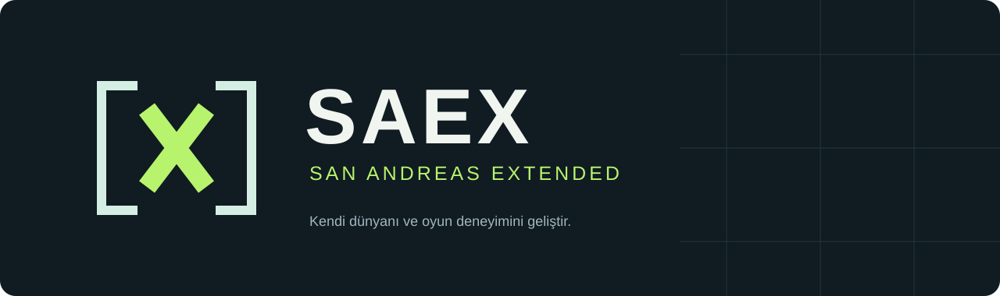

# SAEX — San Andreas Extended



**GTA: San Andreas üzerinde kendi dünyanı ve oyun deneyimini geliştir.**

SAEX; dünya, oyun kuralları, içerik ve arayüzlerini tanımlayabilmek için geliştirilen modüler bir platformdur. C++20 çekirdek ve C#/.NET 10 araçları üzerine kuruludur.

**D1 geliştirme aşamasında · Kod 0.1.11 · Mimari v0.18**

Çekirdek temeli ve doğrulama araçları mevcuttur. Oynanabilir multiplayer istemcisi/sunucusu, production SDK ve launcher henüz yayımlanmadı. [Uygulama durumu](docs/development/status.md), kodlanmış ve doğrulanmış kapsamı ayrı gösterir.

[Dokümantasyon](docs/README.md) · [Derleme](docs/development/workflow.md) · [Yol haritası](docs/roadmap.md) · [Katkı](CONTRIBUTING.md) · [Değişiklikler](docs/development/change-log.md)

## Bugün depoda bulunanlar

| Bileşen | Mevcut kapsam |
|---|---|
| C++ çekirdek | Tür güvenli kimlikler, sınırlı kuyruk, monoton saat, lease ve fixture codec |
| C# araçları | Şema üretimi, WorldPlan metadata doğrulaması, PE/profil ve native sembol envanteri |
| Native doğrulama | SDK bağımsız preflight, oyun dışı x86 bootstrap testleri ve kontrollü süreç gözlem araçları |
| Test ve sözleşmeler | Native/managed/Python testleri; kaynak ile dokümanın birlikte değişmesini denetleyen kapı |
| Mimari | Dünya/otorite, resource, asset, replikasyon, yaşam döngüsü ve kabul senaryoları |

Fixture ve gözlem araçları production IPC veya güvenlik sandbox'ı değildir. Gerçek GTA üzerinde sınanan her alt davranışın sınırı ilgili kanıt belgesinde yazılıdır; D1 tamamlanmadan D2 multiplayer hazır ilan edilmez.

## İlk derleme

Windows'ta **Visual Studio 2022 C++ Build Tools**, **CMake 3.25+**, **Python 3** ve `global.json` ile uyumlu **.NET SDK 10.0.300 feature band** gerekir.

```powershell
git clone https://github.com/saex-platform/saex.git
cd saex
./tools/build.ps1 -Architecture x64 -Configuration Debug
./tools/build.ps1 -Architecture x86 -Configuration Debug
```

Release için `-Configuration Release`, Python seçimi için `-Python` kullanın. Standart build GTA kurulumu istemez ve oyunu başlatmaz. [Ayrıntılı kurulum, Linux ve opt-in SDK akışı](docs/development/workflow.md).

## Platformun yönü

Sunucu geçerli dünya durumunu belirler. Oyun trafiği **GameNetworkingSockets**, asset trafiği **HTTPS** üzerinden tasarlanır. GTA x86 adapter, x64 host/server ve C# resource sınırları ayrıdır. Geniş dünya/asset/oyun kontrolü, test edilmiş capability ve otorite kurallarıyla açılır.

WorldPlan, değiştirilebilir harita ve prefab'lar, ortak yıkım, C# resource'lar, nüfus/trafik ve hayvan sistemleri mimari yol haritasındadır. Bunlar bugünkü kodun tamamlanmış özellik listesi değildir. [Platform tasarımı](docs/platform-blueprint.md) · [Aşama kapıları](docs/roadmap.md).

## Depo haritası

```text
contracts/   Ortak şema, gözlem profilleri ve dependency lock
include/     C++ arayüzleri ve üretilen tipler
src/         Çekirdek, codec ve native doğrulama kaynakları
managed/     C# sözleşmeler ve geliştirme araçları
tests/       Native, managed ve tooling testleri
tools/       Derleme, üretim ve doğrulama girişleri
samples/     Sentetik foundation fixture'ları
docs/        Mimari, geliştirme, araştırma ve kanıt belgeleri
```

## Katkı, destek ve lisans

[Küçük ve doğrulanabilir katkılar](CONTRIBUTING.md) ile ilerliyoruz. Hata ve öneriler issue, sorular [Discussions](https://github.com/saex-platform/saex/discussions), güvenlik açıkları [özel bildirim süreci](SECURITY.md) üzerinden iletilir. [Topluluk kuralları](CODE_OF_CONDUCT.md).

SAEX'e ait kaynaklar **[MIT](LICENSE)** lisanslıdır. [Üçüncü taraf bildirimleri](THIRD_PARTY_NOTICES.md) ayrıca geçerlidir. GTA oyun dosyaları değiştirilmez veya dağıtılmaz. Bu proje Rockstar Games ile bağlantılı değildir.

[Mimari sürüm geçmişi ve önceki kapsam açıklamaları](docs/development/readme-history-v0.18.md) · [GitHub yayın kaydı](docs/development/github-publication.md)
