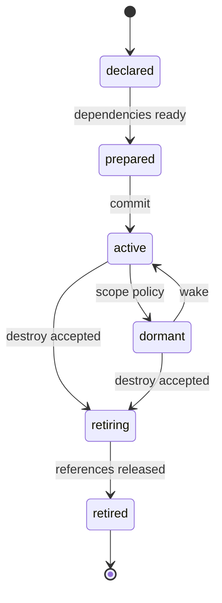

# Entity, component ve world instance modeli

Durum: sözleşme taslağı. [Terimler](../glossary.md) · [Replikasyon](../networking/replication.md)

## Kimlik ve yaşam döngüsü

`EntityRef = WorldId + WorldEpoch + EntityId + Generation`. EntityId tek world epoch içinde tekrar kullanılabilir ancak generation artırılır. Yeni sunucu/world epoch'u eski referansları geçersiz kılar. Kalıcı gameplay kimliği ve PlacementId oturum referansından ayrıdır.

Sunucuda active bir entity istemcide hiç materialize edilmeyebilir. “Stream out” entity silme komutu değildir. İstemcinin geçici handle'ı serbest bırakılırken sunucu kimliği ve kalıcı kayıt yaşar.

## Component sözleşmesi

| Alan | Gereklilik |
|---|---|
| TypeId / SchemaVersion | Çakışmasız ad alanı, açık sürüm |
| Mutator | Sunucu, owner proposal veya cosmetic client |
| Replication | reliable state, sampled motion, private veya local |
| Persistence | `none`, `checkpointed` veya `durable` |
| Visibility | public, owner-only, role-filtered, server-only |
| Budget | Üst byte sınırı, değişim hızı, entity başına adet |
| Migration | Desteklenen önceki şema ve dönüştürme yolu |

Örnek component aileleri: Transform, ModelBinding, ColliderBinding, PhysicsBody, DamageState, DestructionState, Attachment, AnimationState, Interaction, InventoryReference ve Lifetime. Envanter veya hesap sırrı public state'in bir parçası yapılmaz.

Değişken anahtar/değer alanları mümkün olsa da sınırsız nesne grafiği gönderilemez. Her ağ component'i boyut, alan görünürlüğü ve yazma yetkisi ilan eder; belirtilmeyen alan varsayılan replike edilmez, client yazımı varsayılan kapalıdır. Subscription'ı sunucu yetkilendirir; client'ın yakınlık veya isim bilmesi private veriye erişim vermez. MTA'nın element-data subscription/client-change denetimleri [referans alındı](../references/mtasa-architecture.md). Tam CLR nesnesi veya kullanıcı tanımlı executable deserialization ağdan kabul edilmez.

## Prefab ve aggregate

Prefab başlangıç değerleri, component seti ve asset bağımlılıklarını tanımlar. Örnek bir lamba; direk mesh'i, ışık bileşeni, collision, yıkım profili ve interaction içerir. Kopma işlemi ışığı kapatır, ana collision'ı değiştirir ve gerekirse ayrı debris entity'si oluşturur.

Bu çoklu değişiklik bir `WorldTransaction` içinde atomik kabul edilir. İstemci destekleyici artifact'ler hazır olana kadar transaction'ı hazırlar; bütçe veya içerik eksiğinde yarım collision seti oluşturmaz. Ağdaki fizik hareketi daha sonra ayrı sampled stream ile güncellenebilir.

Attachment ağacı döngüsüzdür. Parent yokken child world transform ile gizlice başka yere düşmez: bağımlılık hazırlanır veya child bekletilir. Parent silme politikasını prefab `cascade`, `detach-preserve` veya `reject-if-children` olarak belirtir; varsayılan cascade'dir.

## World instance ve portal

World; katalog lock seti, gameplay profili, authority policy, visibility ve persistence namespace taşır. İç mekân fiziksel sahne parçası olabilir; her interior için ayrı instance zorunlu değildir. Portal görünürlük, ses geçirgenliği, geçiş noktası ve gerekiyorsa hedef world belirtir.

Instance'lar arasında görünürlük varsayılan kapalıdır. Her komut ve event dünya kapsamını taşır. Aynı koordinatta duran iki farklı world entity'si çarpışmaz, ses iletmez ve hit doğrulamasında eşleşmez.

World geçişi: hedef katalog/native closure hazırlama → Ready → kaynak aksiyonları ve owner lease'lerini durdurma → sunucuda geçiş commit → yeni scope epoch/baseline/catch-up → JoinApplied → giriş. Commit öncesi hata kaynak dünyayı korur. Commit sonrası baseline/apply hatası hedefte fence edilmiş staging/resync'e gider; kaynak dünyaya dönüş ayrı yetkilendirilmiş geçiştir. Eski scope paketleri reddedilir. [Ortak aktivasyon sözleşmesi](activation-contracts.md)

Silmede önce `retiring` işareti ve mutasyon engeli konur, sonra tek destruction callback'i üretilir. Gerçek native handle free, GPU fence ve referans bitişiyle frame sonunda olur. Aynı callback içinde ikinci destroy çağrısı çift free üretmez. Kaynak/resource grubu ile entity attachment ağacı farklı ilişkilerdir; attachment kurmak lifecycle veya oyuncu yetkisini kendiliğinden devretmez.

## Hata, genişleme ve kabul

Resource owner durduğunda entity'nin `resource`, `session` veya `persistent-world` ömrü esas alınır. Kalıcı entity yönetimsiz bırakılmaz; temel world service devralır veya uygun yönetici gelene kadar sınırlı/pasif duruma geçer.

Yeni component eklemek core belleğini veya wire biçimini keyfî genişletemez; schema registry ve capability anlaşması gerekir. Kabul: AC-04 sonradan katılım, AC-05 kalıcılık, AC-10 instance izolasyonu, AC-12 attachment ve eski referans.

## Şemalı bileşim ve temsiller

Component alanları [ContractSchema](execution-contracts.md) üzerinden mutator, visibility ve persistence kuralı alır. Birden fazla resource aynı alanı bağımsız authoritative yazamaz; WorldPlan tek domain provider veya açık reducer seçer. Authoring trait/socket bileşimi [prefab kurallarına](../assets/composition-variants.md) tabidir. Runtime EntityRef ve kalıcı PlacementId bu kaynak alanlarından ayrı kalır. Network interest ile client RepresentationSet ayrımı [projection sözleşmesinde](../networking/world-change-projections.md) tanımlıdır.

## Agent kimliği, kontrol sınıfı ve kalıcı birey

[Agent](../gameplay/agents-navigation.md) mevcut EntityRef'i kullanır; AnimalInstance yeni bir ağ kimlik alanı açmaz. Species/Breed/AnimalDefinition AssetRef'tir. PersistentEntityId kalıcı bireyi tanır; SpawnSlotId bir üretim yerini, SpawnGeneration slotun yeni üretim neslini tanır. Bunlar PlacementId veya EntityId yerine kullanılamaz.

PopulationOrigin kökeni, ControlClass ise ambient/mission/player-engaged/owned/service yönetim sınıfını taşır. ControlClass, resource/session/persistent-world Lifetime ve none/checkpointed/durable persistence'den bağımsızdır. Araç çalma/evcilleştirme sırasında sınıf, koltuk/sahiplik, slot disposition ve kota aynı yetkili işlemle uyarlanır. Sosyal sürü, parent-child DAG veya physics authority group değildir. Dünya geçişinde kalıcı birey tek yerde aktif olur; yeni EntityRef ve izinli hedef closure gerekir. AC-49/59/60/63/66/68.

## Writer ve transfer nesillerinin ayrımı

WorldEpoch eski runtime referansı, OwnerEpoch simülasyon grant'i, WriterTerm kalıcı world yazarı, TransferGeneration kalıcı bireyin taşınma denemesidir. Hiçbiri PersistentEntityId yerine geçmez. [Tekil transfer](../networking/consistency-recovery.md) source fence → canonical location commit → target Applied sırasını aynı core/backend içinde yürütür. Hedef kapanınca postcommit birey kaynakta yeniden yaratılmaz. Aggregate/group sınırları ve kota rezervleri bounded kalır; transfer için transient ambient bireyin açıkça kalıcı kimliğe yükseltilmesi veya ret gerekir. AC-75/76/77/87.

Entity lifecycle active/dormant/retiring modeli, operation veya health state modeli değildir. `fenced/recovering` bir bireyin ölüm/retire state'ini sıfırlamaz. Eski sayaç wrap ederek yeni bireyle eşleşemez; [checked epoch/zaman kuralı](time-fencing.md), AC-86.
