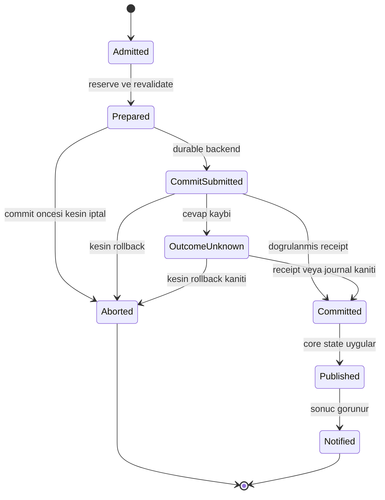

# Arıza sınırları, işlem sonucu ve kurtarma sözleşmesi

Durum: v0.5 normatif taslak, ADR-30; R-21/22 uygulama kapısı. [Aktivasyon](activation-contracts.md) · [Execution](execution-contracts.md) · [Kalıcılık](../networking/persistence.md) · [Stabilite denetimi](../validation/stability-audit.md)

## Sorumluluk ve hata kapsamı

Core, bir resource'un ömründen bağımsız admitted operation registry'sini ve geçerli dünya state'ini tutar. Supervisor yaşam belirtisini izler; operation coordinator durable sonucu uzlaştırır; adapter kendi native state'ini doğrular. Supervisor'ın restart kararı dünya state'i hakkında yeni bir otorite oluşturmaz.

| Health state | Anlam | İzin verilen işlem |
|---|---|---|
| healthy | Önkoşullar ve ölçüm bütçeleri sağlanıyor | Plan sınırındaki admissions |
| degraded | Kritik doğruluk korunuyor, kapasite/opsiyonel servis azalmış | Yeni ambient üretimini azaltma, opsiyonel işi erteleme |
| draining | Yeni admission kapalı; var olan işler sonuçlandırılıyor | Bounded completion ve güvenli release |
| fenced | Otorite, commit sonucu veya kritik native state belirsiz | İlgili aggregate/scope üzerinde gameplay mutasyonu yok |
| recovering | Receipt/journal, baseline veya artifact closure yeniden kuruluyor | Hazırlama ve doğrulama; henüz gameplay kabulü yok |
| failed | Recovery sınırı aşıldı veya zorunlu bağımlılık yok | Açıklanmış hata, tanı kaydı, kontrollü kapatma |

Bu durumlar world, resource ve client scope için ayrı tutulur. Fence kapsamı dependency graph'tan çıkarılır: pet envanteri işlemi belirsizken tüm unrelated yarış dünyasını durdurmak gerekmez. Ancak karışık collider state'i birden çok oyuncuyu etkiliyorsa yalnız hatalı client'ın UI'sini kapatmak yeterli değildir; etkileşim alanı karantinaya alınır veya participant world'den çıkarılır. Recovery süresinin dolması otomatik başarı değildir. Açılmak için writer ownership, çözülmüş operation sonucu, güncel revision ve gerekli `Applied` kanıtı gerekir.

## Geçici sonuç ile kesinleşmiş sonucu ayırma

`JobResult` henüz commit edilmemiş pathfinding, cook adayı veya resource önerisidir. Epoch/read revision/cancellation uyuşmazlığında atılabilir. `CommitReceipt` ise `OperationKey, PayloadHash, TransactionId, JournalSequence, WriterTerm, affected aggregates, result digest` taşır; server core'un sahip olduğu kayıtla doğrulanır. Worker'ın gönderdiği “commit oldu” metni receipt sayılmaz.

İşlem kabulünde kaynak ResourceEpoch audit için saklanır; resource durdu diye `Committed` sonucu atılmaz. Aynı world epoch'ta coordinator sonucu sırasıyla yayımlar. World yeniden başladıysa eski runtime callback'i uygulamak yerine yeni world state'i journal/receipt'ten kurulur. UI sonucu daha sonra sorgulayabilir; durmuş worker'a callback gönderilmez. Reload migration snapshot'ı, ilgili eski committed sonuçlar core'a uygulanmadan alınamaz.

`Cancel` yalnız iptal isteğidir. `CommitSubmitted` sonrasında ağ timeout'u, process kill veya cancellation token sonucu rollback kanıtı değildir. Sonuç bilinmiyorsa aggregate rezervi mantıksal olarak korunur, çelişen mutations reddedilir/bekleme bütçesine alınır; DB transaction'ı client yanıtı için açık tutulmaz. Coordinator aynı OperationKey/PayloadHash ile receipt ve backend sonucu sorgular. Kesin rollback veya henüz commit submission olmadığının kanıtı varsa retry yeniden revalidate edilir. Commit belirsizken yalnız receipt'in henüz görünmemesi rollback kanıtı sayılmaz. Backend aynı işlem için unique receipt ve koşullu state commit'ini birlikte garanti etmelidir; bunu sunamayan provider durable sınıfını açamaz.

Bir işlem sonucu cevaplanmadan commit olmuş olabilir; idempotency “her mesaj tam bir kez gelir” iddiası değildir. Durable state/receipt/outbox atomikliği, tekrar teslim karşısında aynı etkiyi korur. Microsoft'un bağlantı dayanıklılığı belgesi commit sırasında kopan bağlantının sonucunun bilinmeyebileceğini açıklar; burada kullanılan receipt yaklaşımı SAEX tasarımıdır, EF Core bağımlılığı kararı değildir. [Kaynak](https://learn.microsoft.com/en-us/ef/core/miscellaneous/connection-resiliency)

## Tek world writer ve fencing

WorldEpoch runtime stale referansları ayırır; tek başına iki server'ın aynı kalıcı dünyaya yazmasını engellemez. Backend `WorldWriterRecord(WorldPersistentId, WriterTerm, ownerInstance, status)` tutar. Claim işlemi atomik compare-and-set/row lock ile artan WriterTerm üretir. Her durable transaction bu kaydı aynı transaction içinde kilitleyip terimi ve yetkili owner'ı doğrular; journal/receipt'e WriterTerm yazılır. Guard dışından gameplay tablolarını yazabilen resource bağlantısı verilmez. PostgreSQL ve SQLite provider eşdeğer garantilerini ayrı kanıtlar; yalnız uygulama içi mutex yeterli değildir.

**V1 otomatik yüksek erişilebilirlik/failover içermez.** Timeout tek başına ikinci process'i authoritative writer yapmaz. Yönetilen takeover için önceki writer process'inin kesin durdurulduğu ve eski client oturumlarının revoke edildiği doğrulanır; sonra claim alınır ve yeni WorldEpoch açılır. Önceki writer'ın durmuş olduğu kanıtlanamıyorsa world kapalı kalır. Network partition'da DB erişimini kaybeden world yeni durable/non-durable gameplay kararlarını fence eder; eski lease'ler control timeout ile söner. Veritabanı ve sunucu değişikliği sırasında bu operasyonel sınır açıkça görünür.

Backend guard, eski WriterTerm ile geç gelen transaction'ı reddeder. İlk writer'ın guardı aldığı transaction bitmeden takeover yeni claim alamaz; sonucu belirsiz transaction recovery protokolüne girer. DB ownership doğrulaması yokken “DB down ama oyun sürsün” modu authoritative persistent world için v1 seçeneği değildir. Tamamen geçici, persistence kullanmayan bir world ayrı planla tek process altında çalışabilir; failover yeteneği kazanmaz.

PostgreSQL advisory lock'ları uygulama tarafından uyulması gereken kilitlerdir; session lock başka bağlantılardaki row mutation'ı kendiliğinden korumaz. Yardımcı advisory lock kullanımı durable guard yerine geçmez. Lock/transaction timeout vardır; client Ready/Applied beklerken DB lock tutulmaz. [PostgreSQL kilitler](https://www.postgresql.org/docs/current/explicit-locking.html)

## Bounded admission, yeniden deneme ve kapanış

RecoveryProfile, per-operation sınırının yanında actor/resource/world/process toplamlarını tanımlar. Bellek, item sayısı ve elapsed time birlikte sınırlandırılır. Bir operation; inflight slot, reserve slot ve receipt/response kapasitesi ayrılmadan kabul edilmez. Kimlik/izin/boyut denetiminde reddedilen rastgele OperationId'ler limitsiz durable receipt yaratmaz; güvenlik audit'i de sınırlı ve rate-limited olur. Kabul edilmiş committed kayıtlar “kuyruk doldu” diye silinmez; teslim bildirimleri birleştirilebilir, sonuç journal/receipt üzerinden tekrar bulunur.

Başlangıç P0/P1 recovery ölçüm profili aşağıdaki tavanları kullanır. Bunlar kapasite garantisi veya minimum tahsis değildir; en dar actor/resource/world/process ve cihaz sınırı birlikte uygulanır. Daha yüksek değer yeni ölçüm ister. Payload decode, native staging ve .NET heap bunların dışında ayrıca toplam bellek hesabına girer.

| Kaynak | İlk tavan | Taşma / muhasebe |
|---|---|---|
| Admitted durable operation | Actor 32, resource 128, world 1.024, process 4.096 | Tüm fazlardaki unresolved işlemler sayılır; world komut buffer'ı ayrıca en çok 8 MiB, process 32 MiB |
| Completion notification | World 8 MiB, process 32 MiB | Full payload kopyalamak yerine receipt reference; taşan bildirim için journal pull |
| Aynı anda baseline staging | World 8 peer, process 16 peer; peer 8 MiB açılmış logical state | Process logical staging toplamı 128 MiB; native/asset closure kendi bütçesinde |
| Baseline sayfası | En çok 256 sayfa; uygulama mesajı 32 KiB ve açılmış sayfa en çok 32 KiB | Sıkıştırılmış/açılmış boyut ayrı; toplam peer 8 MiB sınırı ayrıca |
| Repair ve catch-up history | Peer 4 MiB, process 64 MiB logical retained state | GNS pending reliable 4 MiB/peer ve 64 KiB kontrol rezervine ek ayrı maliyet; history yoksa resync |
| Eşzamanlı worker restart | Process 2 | Resource circuit/pencere kotası ve mevcut toplam worker RAM admission ayrıca |

Reservation sayısı kabul edilmiş işlemin referans verdiği bounded write/group set'e dahildir; tek istek sınırsız aggregate ayıramaz. Exact set/cardinality sınırı ContractSchema'da zorunludur. Yeni world açmak process toplamını sıfırlamaz. Queue age kontrolü ControlTime kullanır; unresolved committed kayıt yaşlandı diye drop edilmez, affected scope health'i düşürülür.

| Kuyruk / iş | Taşma davranışı | Korunan sınır |
|---|---|---|
| Gameplay ingress | Admission öncesi `overloaded` ve retry-after; actor/resource kota | Kabul edilmemiş iş için başarı dönülmez |
| Motion | Eski self-contained örnekler birleştirilir | Entity/owner sırası ve kontrol mesajı rezervi |
| Durable completion | Bellekte bildirim coalesce; registry/journal'dan bounded pull | Committed sonucun kaybolmaması |
| Projection / AI | Öncelik ve bounded batch; stale critical consumer fence | Sonsuz job/event fan-out olmaması |
| Baseline / resync | Peer/global byte ve süre sınırı, bounded restart | Yavaş katılımcının aktif dünyayı tüketmemesi |
| Spawn / transfer reserve | Sınırlı kota ve ControlDeadline; phase'e göre release | Commit belirsizliği sonrası çift üretim olmaması |

Başlangıç ölçüm profili resource başına 5 dakikada en fazla 3 otomatik restart, 1/2/4 saniyelik artan bekleme ve jitter kullanır. Sonra circuit açık kalır; en erken 30 saniye sonra izinli tek probe veya operatör incelemesi gerekir. Probe yeni bir sınırsız restart dizisi başlatmaz; pencere bütçesi geçerlidir. Process geneli eşzamanlı restart tavanı ve toplam worker RAM bütçesi WorldPlan'da zorunludur. Resource adını/sürümünü değiştirerek bütçe sıfırlanmaz; installed provider lineage ve world üzerinden tutulur. Bunlar benchmark sonucu değil, R-22 ile sınanacak varsayılanlardır.

Kapanış sırası: admissions kapat → yeni lease/iş verme → transient işleri iptal et → admitted durable işleri deadline içinde uzlaştır → checkpoint/son JournalSequence'i kaydet → client scope ve worker grantlerini revoke et → writer çıkışını doğrula → claim'i bırak. Deadline sonunda belirsiz işlem rollback diye raporlanmaz; recovery kaydı bırakılır ve yeniden açılış reconcile kapısına gider. Süreç öldürmek durable receipt'i yok etmez. Writer claim, hâlâ mutasyon yapabilen process varken erken bırakılmaz.

## Backup, retention ve kurtarma sınırı

Artifact GC kökleri yalnız aktif RAM referansları değildir: persistent snapshot/journal, yedek restore noktaları, offline AnimalInstance/corpse, transfer/operation kayıtları, migration ve izinli rollback sürümleri de exact catalog/schema/controller closure'ını pin eder. Referans sayıları crash sonrası mark-and-sweep ile doğrulanır; gecikmiş delete için grace period ve tekrar reachability denetimi gerekir. “Son iki release'i sakla” tek başına güvenli retention değildir. Yedekler catalog lock, schema/migration version, journal sınırı, artifact envanteri ve bütünlük doğrulamasıyla manifestlenir. Şifreleme anahtarı kurtarma bağımlılığı da işletim envanterinde korunur; sırlar tanı paketine girmez.

Tamamlanmış tarihsel receipt sadece kimlik/sonuç özetiyle sorgulanabiliyorsa audit digest'i tutmak bütün eski runtime artifact'lerini sonsuza kadar tutmayı gerektirmez. Artifact pin'i replay/restore/migration için gerçekten gereken closure'a bağlıdır. Compaction; current state ve idempotency sonucunu korur, retained backup'ların closure köklerini yeniden hesaplar. OperationId tekrarını mümkün kılan receipt silme yasaktır; [watermark/domain uniqueness](../networking/persistence.md) şartı sürer.

Durable ACK için process crash altında veri kaybetmeme hedefi backend'in kabul edilmiş flush/transaction garantisine bağlıdır. Disk kaybı, tüm host kaybı veya yedekten dönüş için RPO/RTO ayrı yayınlanır; replication/backup deneyi olmadan sıfır RPO vaat edilmez. Eksik eski tür/controller artifact'i bulunan sahipli hayvan sessizce varsayılan modele dönüştürülmez; restore etkilenen bireyi karantinaya alır, eksik içeriği bildirir. Kritik world closure eksikse world açılmaz.

## Arayüzler, genişleme ve kabul

Kavramsal servis yüzeyi `AdmitOperation`, `QueryOperation`, `RequestCancel`, `ReconcileReceipt`, `ClaimWorldWriter`, `GetHealth`, `BeginDrain`, `ValidateRestoreClosure` işlemleridir. Hepsi typed schema, grant ve bounded queue kurallarına uyar. Yeni persistence/worker/controller provider aynı hata sınıflarını ve scope sınırını bildirir; hata politikası boş bırakılarak WorldPlan derlenemez.

AC-73/74 durable sonucu; AC-75 writer yarışını; AC-82/83 restart/admission bütçesini; AC-85/86 backup/kapanışı; AC-87 rezervleri; AC-88 uzun süreli arıza doğrulamasını kapsar. Sonuçlar [conformance](../validation/conformance-contracts.md) kayıtlarında engine/backend/build/profile'a bağlanır. Bu doküman hiçbir recovery mekanizmasının bugün çalıştığı iddiasını içermez.
