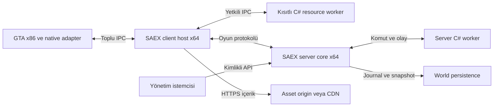

# Mimari, süreç sınırları ve veri akışı

Durum: tasarım kararı. [İndeks](../../README.md) · [ADR](../decisions/architecture-decisions.md)

## Sorumluluk

Platform çekirdeğini GTA bağımlılığından, oyun paketlerinden ve indirilen koddaki arızalardan ayırır. İlk sunucu tek authoritative dünya sürecidir; dağıtık simülasyon, shard sınırı üzerinden fizik veya otomatik çoklu bölge failover ilk gereksinim değildir.

## Süreç görünümü

Aşağıdaki şekil tasarlanacak süreçleri gösterir; bugün çalışan servisleri göstermez. IPC komut ve snapshot taşır. Ağ oturumu istemcinin güvenilen host sürecindedir.

| Birim | İçerik | Hata ve genişleme sınırı |
|---|---|---|
| GTA adapter | Native havuzlar, render/input hook'ları, frame güvenli komut uygulama | Yalnız güvenilen platform kodu; sürüm profiliyle açılır |
| Client host | Ağ, katalog, cache, session, worker gözetimi | GTA'nın x86 adres alanının dışındadır; oyunun pool sınırını kaldırmaz |
| Client worker | C# resource kodu ve sınırlı SDK proxy'leri | Varsayılan resource başına süreç; yetki ve CPU/RAM limiti |
| Server core | Authoritative state, tick, replication, persistence koordinasyonu | Ağ/worker verisini doğrular; tek writer mantığı |
| Server worker | Oyun mantığı, izinli DB/HTTP servis erişimi | Native pointer veya core belleğine erişim yok |
| Asset origin | Değişmeyen artifact ve manifestler | Merkezi SAEX hizmeti zorunlu değil |

V0.7/ADR-35, GTA adapter'ını **SDK bağımsız bootstrap** ve **private x86 Plugin-SDK binding** sorumluluklarına ayırır. Bootstrap bilinmeyen image'e SDK erişimini engeller; binding yalnız doğrulanmış profil/symbol/hook kapsamını açar. Ayrı DLL sınırı ve başlatma sırası ilk native kesitte kanıtlanır. C++20 core, x64 Host/server ve .NET 10 resource API vendor sınıflarından bağımsızdır. [Normatif sınır](native-sdk-integration.md), [uygulama sırası](../development/d1-engine-integration.md). [D1-N1](../development/d1-native-dependency.md) yalnız private SDK build probe'unu uygular; bu bootstrap/adapter/Host bileşenleri henüz kodlanmadı.

Resource sayısı ile süreç maliyeti ölçülür. İlk güvenlik modeli süreç başına resource'tur. Aynı güven alanındaki kaynakları gruplamak ileride profil olabilir; aynı süreç içindeki resource'lar için sert güvenlik izolasyonu iddia edilemez.

## Çekirdek içindeki modüller

Session/auth, capability broker, world registry, entity registry, command scheduler, resource supervisor, asset catalog, replication planner ve telemetry ortak sürümlü sözleşmelerle konuşur. Bunların ayrı servis olması gerekmez. Her komut bir sahibi, dünya bağlamı ve izlenebilir sonuç taşır.

Authority state yalnız sunucu tick sınırında mutasyona uğrar. I/O ve pathfinding işleri arka planda yürür; sonuçlar entity generation ve beklenen revision ile kuyruğa döner. Eski dünya veya entity için gelen transient JobResult uygulanmaz. Backend'de kesinleşmiş CommitReceipt ise core operation registry/journal ile uzlaştırılır; eski worker epoch'u committed state'i düşürmez.

## Bir dünya değişikliğinin yolu

1. Resource veya oyuncu intent üretir; gönderen kimliği host tarafından eklenir.
2. Sunucu session, capability, dünya, mesafe, sıra ve bütçe denetimi yapar.
3. İlgili simulation/gameplay sistemi komutu değerlendirir.
4. Kalıcı etki varsa journal transaction'ı async commit edilir; core sonucu tick'te uygulayıp canlı WorldRevision verir. JournalSequence ve OperationId ayrı izlenir.
5. Interest planner görünürlük ve bağımlılığa göre güncellemeyi seçer.
6. İstemci eksiksiz katalog ve baseline ile durumu hazırlar.
7. Adapter güvenli frame sınırında uygular; isteğe bağlı efektleri başlatır.

Görsel geçici tepki ilk adımdan sonra oynatılabilir; authoritative collision ve ödül commit öncesi kesinleşmez.

## Public arayüz aileleri

`WorldService`, `EntityCommands`, `AssetCatalog`, `ResourceLifecycle`, `CapabilityBroker`, `ReplicationSchema`, `PersistenceProvider` ve `TelemetrySink` kavramsal arayüzlerdir. C++ ile .NET arasında ortak bellek adresleri yerine sürümlü mesaj/handle kullanılır. ABI major uyuşmazlığı yükleme hatasıdır.

GNS [kabul edilmiş oyun taşımasıdır](../decisions/network-transport.md). ClientHost ve server ağ servisi transport adapter'ını kullanır; GTA adapter ve C# SDK GNS handle'ı taşımaz. MTA'nın engine/mod, resource/element ve syncer ayrımları [kaynak seviyesinde referans alındı](../references/mtasa-architecture.md). SAEX'teki süreç yalıtımı ve kalıcı transaction davranışı ayrıca [ortak aktivasyon sözleşmesine](activation-contracts.md) bağlıdır.

SDK erişimi “istenen değeri belleğe yaz” modeli değil, mutasyon komutu + sonuç modelidir. Salt okunur snapshot bir sonraki frame/tick'te eskiyebilir. UI ve async işlerin revision kontrolü bunu hesaba katar.

## Hata, bütçe ve kabul

Worker ölürse yeni yetkili admission ve transient öneriler resource epoch'u ile geçersiz olur; admitted durable işlemin sonucunu core recovery izler. Asset origin erişilemezse mevcut doğrulanmış cache kullanılabilir; bilinmeyen içerik etkinleşmez. Persistence admission öncesinde erişilemezse yeni durable işlem reddedilir. Submission sonrasındaki bağlantı kaybı OutcomeUnknown olabilir: aggregate fence edilir ve receipt sorgulanır; kesinleşmiş sonuç kaybedilmez veya körlemesine tekrar yürütülmez.

GTA süreci ölürse reconnect yeni client session gerektirir; server entity'lerinin yaşaması gameplay/persistence politikasına bağlıdır. Host çökerse adapter yeni gameplay komutu uygulamayı durdurur ve oturum kapanışını gösterir.

Kabul: [AC-08, AC-09, AC-15](../validation/scenarios.md). Süreç ABI ve AppContainer uygulanabilirliği [R-03](../decisions/research-register.md) geçmeden otomatik indirilen C# kodu etkinleştirilmez.

## WorldPlan ve execution bağlantısı

V0.3 ile resource/asset lock, provider/mutator seçimi, ContractSchema ve çalışma sırası [WorldPlan](world-plans.md) içinde çözümlenir. [Execution sözleşmesi](execution-contracts.md) immutable read snapshot, bounded job sonuçları ve tek authoritative publish yolunu tanımlar. Bu alt modüller ayrı mikroservis zorunluluğu getirmez; C++20 core portları ve C# worker sınırı korunur. [Platform tasarımı](../platform-blueprint.md) katmanların ürün iş akışını gösterir.

## Population, Agent ve Animals yerleşimi

[PopulationService](../gameplay/population-traffic.md) kanallar için tek üretim/kota koordinatörüdür; C# yaya/kara/hava/wildlife provider'ları öneri üretir. [AgentService](../gameplay/agents-navigation.md) ortak task/nav/controller sözleşmesini taşır. [Animals](../gameplay/animals-species.md) aynı altyapıda Species/Breed/Morphology/Rig/Behavior verilerini kullanır. Bir NPC veya tür başına process kurulmaz; resource worker grupları mevcut supervision ve toplam bütçeyi paylaşır.

Core, spawn reservation/epoch/lifetime ve accepted transaction'ın tek denetleyicisidir. Nav/algı işleri snapshot okuyup bounded sonuç döndürür; GTA task/motion adapter'ı güvenli frame'de uygular. Worker çökmesi native rastgele trafiği açmaz; tested fallback veya etkileşimi sınırlandırılmış durum kullanılır. AC-48/50/51/62/65.

## Stabilite servislerinin yerleşimi

V0.5'te ClockProvider/control watchdog, core-owned OperationCoordinator, WriterTerm guard, ReplicationRepair ve TransferCoordinator mevcut C++20 portlarına eklenir; ayrı mikroservis veya yeni oyun transport'u zorunlu değildir. [Zaman](time-fencing.md), [arıza sınırı](failure-recovery.md) ve [onarım/transfer](../networking/consistency-recovery.md) veri akışı ile hatanın yayılma kapsamını tanımlar. Worker önerisi atılabilir; backend'de committed sonuç resource ölünce kaybolmaz. V1 tek core/atomik backend dışına canlı entity transferi ve otomatik world failover açılmaz. AC-71–88, R-21–23.
