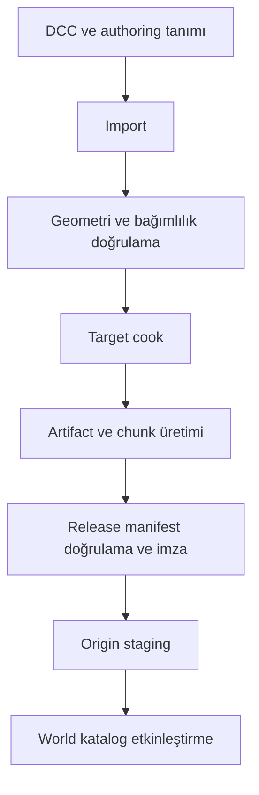

# Asset üretim hattı ve içerik doğrulama

Durum: tasarım; burada converter veya asset dosyası yoktur. [Manifest](manifest-identity.md) · [Dağıtım](distribution-cache.md)

## Kaynaktan çalışmaya



Her adım farklı çıktı ve hata üretir. Cook başarılı diye world kataloğu otomatik aktive olmaz. Yeni release'in dosyaları tamamlanmadan manifestin aktif sürüme alınması yarım güncelleme doğurur.

## İlk girdi biçimleri

| Girdi | İlk kullanım | Ek doğrulama |
|---|---|---|
| DFF | Statik/skinned geometri | Vertex/index sınırı, bounds, material referansı, skeleton |
| TXD | Texture dictionary | Boyut, mip zinciri, format, tahmini decode/GPU bellek |
| COL | Collision ve server sorgu girdisi | Kapalı/geçerli hacim gerektiği yerler, ölçek, aşırı karmaşıklık |
| IFP | Animasyon kütüphanesi | Desteklenen format, klip/kemik eşleşmesi, süre ve event aralığı |
| Harita yerleşim girdisi | IDE/IPL veya editör import adapter'ı | Stable PlacementId, LOD/portal ve dependency closure |
| Ses / görüntü / font | Destekli decoder üzerinden prepared içerik | Süre/ölçü/boyut ve lisans metadata |
| JSON tanım | Prefab, material, destruction ve controller | Şema, referans, yetki ve compatibility |

glTF gibi modern formatlar doğrudan GTA içinde yükleniyor kabul edilmez; ileride offline converter ile hedef artifact'e dönüştürülür. DCC native dosyaları üretim kaynağı olarak tutulabilir, oyuncuya dağıtılmaz.

## Üretici paket taslağı

Aşağıdaki dizin yalnız belgesel örnektir:

```text
sandbox.props/
  package.json
  source/
    models/
    textures/
    collision/
    animations/
    audio/
  definitions/
    prefabs/
    physics-materials/
    destruction/
  maps/
  provenance/
  previews/
```

Build çıktısı kaynak dizinine yazılmaz; toolchain sürümü, target, dependency lock ve source digest ile ayrı immutable artifact kümesi oluşur. Platform paketi “source” altında native çalıştırılabilir dosya bulursa bunu normal görsel içerik saymaz.

## Geometri ve davranış kontrolü

Pivot ve bounds görünür mesh ile collision arasında anlamlı olmalı; bir duvar görseli 2 metre, collision'ı 20 metre olamaz. Mesh LOD düşüşü gameplay collision'ını değiştirmemelidir. Render material değişimi fizik sürtünmesini dolaylı değiştirmemelidir.

Yıkım profili için her hasar state'inde görünür mesh, collision replacement/removal ve fragment listesi çözülebilir olmalıdır. Kırık parça tekrar aynı parent yıkımını tetikleyerek sınırsız spawn zinciri üretemez. Chain reaction derinliği ve işlem başına entity sayısı limitlidir.

Animation event zamanı klip süresi içindedir; bilinmeyen kemik ve root motion modu validation hatasıdır. Kesilmiş klipte server cooldown/hasar olayı client'ın frame hızına bırakılmaz.

## Üretim deterministikliği

Aynı kaynak + toolchain + target + lock aynı artifact byte'larını üretmeyi hedefler. Timestamp, mutlak kullanıcı yolu ve düzensiz dosya sırası çıktı hash'ini değiştirmemelidir. Deterministik cook henüz kanıtlanmamıştır; R-04 acceptance'ı iki temiz build digest karşılaştırmasıdır.

Üçüncü taraf dönüştürücü deterministik değilse toolchain o çıktı için bunu açıkça işaretler; içerik adresleme yine gerçek byte hash'i kullanır. “Aynı source adı” cache doğruluğuna yeterli değildir.

## Resource tüketimi ve güvenli parser

İlk politika: manifest 4 MiB, tek sıkıştırılmamış artifact 256 MiB, paket açılmış toplamı 4 GiB üst sınır. Büyük dünyalar hücre/paketlere bölünür. Decompress oran sınırı ve toplam byte limiti birlikte uygulanır; yalnız oran kontrolü yeterli değildir.

Windows absolute path, drive/UNC, `..`, symbolic link dışına kaçış, case collision ve reserved dosya adları reddedilir. Parse işlemleri ayrı hazırlama sürecinde süre/bellek kotasıyla yürür. Native client parser'ına gitmeden önce validation yapılması bütün engine decoder açıklarını ortadan kaldırmaz.

## Çıktı ve kabul

Build raporu asset ID → source → toolchain → artifact → closure zincirini; tahmini RAM/VRAM; collision/animation uyarılarını ve redistribution metadata'sını içerir. Hata alan asset aktif kataloğa alınmaz.

Kabul: AC-14 malformed/decompression; AC-16 prefab bütünlüğü; R-04 tekrarlanabilir cook ve R-12 server collision üretimi. Üretici rehberi “yükleniyor” ile “tüm hedeflerde doğru çalışıyor” sonuçlarını ayırır.

## Bileşim ve dünya planına bağ

Prefab trait/socket/variant/patch tanımları [composition kurallarıyla](composition-variants.md) düzleştirilir. Field provenance build raporuna girer; çözülmemiş conflict runtime seçimine bırakılmaz. Asset cook tek başına bütün world uygunluğunu kanıtlamaz: [WorldPlan](../architecture/world-plans.md) schema, provider, mutator, gameplay digest ve capability gereksinimlerini birlikte çözer. Release kimliği yalnız asset bloblarını değil ilgili resource/schema/plan locklarını da bağlar.

## Hayvan ve trafik içeriği hazırlama

[Hayvan paketi](../gameplay/animals-species.md) build'i species/breed/morphology uyumu, rig/bind pose/skin weight, gerekli gait/action klipleri, root motion sahibi, hit/collision bounds, socket ve target controller capability'yi doğrular. Zorunlu klibi eksik beden için rastgele insan animasyonu seçilmez. Client görsel/animasyon ve server query/hit/traversal çıktıları ayrı closure üretir; gameplay anlamı aynı compatibility kaydında birleştirilir.

Yol şeridi yönü/bağlantısı, sinyal conflict zone'ları, uçuş koridoru ve habitat spawn aralıkları map/collision revision'ına bağlanır. Statik build geçişi native yürüme/çarpışma/uçuş kanıtı değildir; R-17/18/19 conformance gerekir. AC-53/55/56/57/67.
