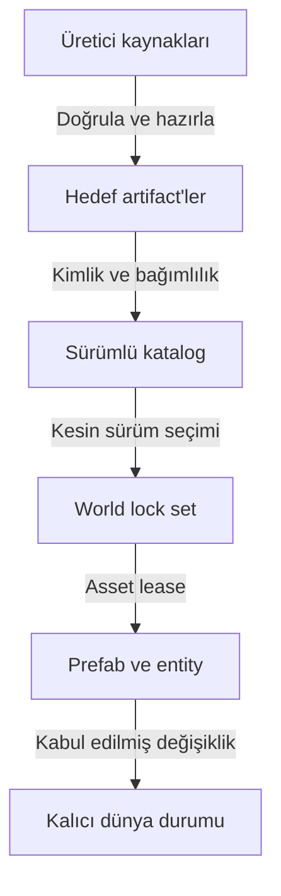

# Asset sisteminin kavramsal modeli ve kapsamı

Durum: tasarım kararı. [İndeks](../../README.md) · [Manifest](manifest-identity.md)

## Asset dosyadan ve entity'den farklıdır

Bir ahşap kasa için üç ayrı şey vardır: üreticinin DFF/TXD/COL dosyaları; platformun `sandbox.props:crate/wood` prefabı ve ilişkili artifact'leri; dünyada hasar almış belirli kasa entity'si. Prefab değişmez başlangıç tanımıdır, hasar entity state'idir. Dosyayı yeniden yüklemek hasarı sıfırlamaz.

## Birinci sınıf asset türleri

| Tür | İçeriği | Ağ / motor bağı |
|---|---|---|
| static-mesh | Geometri, pivot, bounds, LOD | Yerel model handle; transform entity'den |
| skinned-mesh | Skeleton bağı ve skin ağırlıkları | Ped/vehicle/özel rig adapter capability |
| texture-set | Mip, format, semantic slot, boyut | GPU lease; collision değişmez |
| render-material | Shader parametreleri, alpha, yüzey görünümü | Destekli render backend; fizik malzemesinden ayrı |
| collision-shape | Sorgu ve fizik geometrisi | Client ve server aynı collision revision'ı |
| physics-material | Temas yüzeyi, sürtünme/esneklik ve malzeme tepkileri | BodyProfile'dan ayrı native/solver surface mapping |
| body-profile | Kütle, inertia, kaldırma kuvveti ve gövde/constraint ayarları | Collision ve PhysicsMaterial referansları; simulation mode |
| destruction-profile | Hasar durumları, parça seti, collision değişimi | Authoritative state machine |
| skeleton | Kemik isimleri, hiyerarşi, bind pose | Klip/mesh uyumluluğu |
| animation-library | IFP/klip, olay işaretleri, timing | Clip reference ve authoritative başlangıç |
| audio-bank | Klip, loop, attenuation metadata | Ses olayı / instance kapsamı |
| effect | Parçacık, ışık ve iz tanımı | Cosmetic veya açık gameplay bileşeni |
| map-cell | Yerleşimler, portal, LOD grupları | Streaming ve kalıcı placement override |
| nav-data | Ped yolu, araç şeridi, bağlantı ve engeller | Server AI sorguları; runtime güncelleme |
| prefab | Bileşen bileşimi ve asset closure | Entity oluşturma ve sürümlü migration |
| controller-profile | Hareket/kamera/input davranışı tanımı | Onaylı controller capability |
| weapon/vehicle-definition | Davranış/hasar/handling veri tanımı | Gameplay ve adapter yetenekleri |
| ui-scene | Layout, font, ikon, tema ve action şeması | Client UI broker |

Özel içerik bu türlerden birini genişletebilir. Yeni native decoder gerektiren tür normal asset paketiyle gizlice çalıştırılamaz; adapter sürümü gerektirir.

## Dört katmanın ayrımı

**Source:** DCC proje dosyaları ve orijinal import girdileri. Client'a varsayılan olarak dağıtılmaz.

**Definition:** İnsan tarafından düzenlenen mantıksal manifest/prefab/profil. Referanslar ad alanlarıyla çözülür.

**Cooked artifact:** Belirli target/cook sürümü için hazırlanmış immutable çıktı. Hash byte içeriğinden hesaplanır.

**Runtime state:** Transform, hasar, current animation, sahiplik, aktif parçalar ve instance bilgisi. Artifact dosyasına yazılmaz.

## Kalite ve kabiliyet varyantları

Düşük/orta/yüksek görsel varyant aynı gameplay collision, hasar profili ve görünür engel anlamını korumalıdır. “Düşük kalite” duvar collision'ını kaldırmak veya görünür duvarı yok etmek değildir. Oynanış farkı olan varyantlar sunucunun seçtiği katalogda ayrı resolved tanımlar olarak ilan edilir; client grafik ayarıyla bunlar arasında geçemez. Aynı dünyada farklı cins/beden/araç tanımları birlikte bulunabilir; tüm client'lar her entity için sunucunun seçtiği aynı gameplay anlamını uygular. Mevcut katalogda izinli seçim runtime state, yeni tanım/uyumluluk kümesi eklemek yeni plan/catalog geçişidir.

Memory sınırlı client daha düşük texture/LOD seçebilir. Collision ve server hit proxy'leri aynı compatibility grubunda sabitlenir. Gerekli varyant bulunamazsa world join reddedilir veya kaynak profiline dönülür.

## Native içerik ile custom içerik

`gta.base` kullanıcı kurulumundaki stok içeriğe salt okunur mantıksal referans sağlar. Custom package yeni içerik ekler. Override, stok referansı açık mapping ile değiştirir. Stok fizik davranışı ve custom hasar profili birbirinden farklı olabilir; [malzeme eşleme](physics-materials.md) ve [motor kabiliyeti](../architecture/engine-adapter.md) belirleyicidir.

## Arayüz ve kabul

AssetCatalog resolve/query, DependencyResolver closure, ArtifactStore fetch/verify ve RuntimeAssetLease acquire/release arayüzlerine ayrılır. Registry'nin “var” cevabı asset'in GTA içinde aktif olduğu anlamına gelmez.

Kabul: AC-06 kimlik/sürüm, AC-11 ready bariyeri, AC-14 kötü içerik, AC-16 farklı materyaller. Referans akış [üretim](build-pipeline.md) → [dağıtım](distribution-cache.md) → [streaming](streaming-budgets.md) → [entity state](../networking/replication.md).

## Population ve canlı tanım aileleri

V0.4 katalog uzantıları: population-profile, spawn-set, traffic-lane/signal-profile, air-corridor, habitat-profile, agent-definition, behavior-profile, perception-profile, locomotion-profile, species-definition, breed-definition, morphology-profile, rig-profile, animal-definition ve hit-profile. Bunlar versioned Definition/Artifact sözleşmeleridir; yeni native decoder izni değildir.

[Animals](../gameplay/animals-species.md), Species/Breed + morphology/rig + animation/locomotion + behavior/appearance birleşimini spawn edilebilir prefab'a çözer. [Population](../gameplay/population-traffic.md) habitat/tür/model seçimini izinli havuzlardan yapar. NPC/animal state, spawn slot ve mutable PopulationPolicy immutable asset'e yazılmaz. Yeni tanım closure/schema/capability doğrulamasını geçmeden dinamik eklenmiş sayılmaz. AC-56/57/62.
