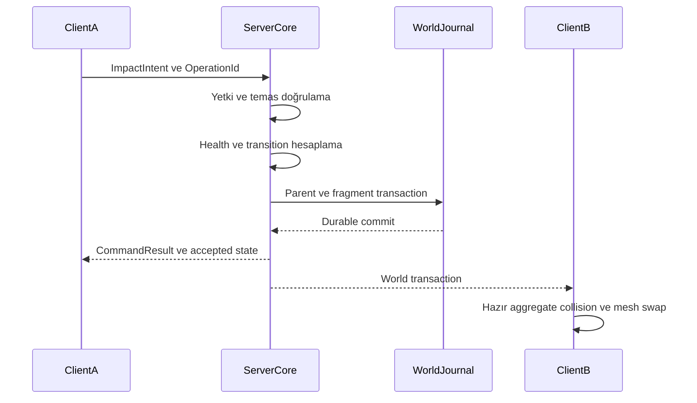

# Tanımlanabilir yıkım ve ortak dünya durumu

Durum: ana sözleşme taslağı. [Fizik malzemeleri](physics-materials.md) · [Replikasyon](../networking/replication.md) · [Kalıcılık](../networking/persistence.md)

## Kapsam ve değişmezler

Stok GTA objeleri ve özel asset'ler; hasar eşiği, aşamalı görünüm, devrilme/kopma, collision değişimi ve önceden hazırlanmış fragment setleri üzerinden tanımlanır. Çalışma anında keyfî mesh kesme, gerçek beton gerilme çözümü veya sınırsız yapısal çökme ilk kapsam değildir.

Bir destruction state yalnız görsel mesh değişimi değildir. Parent collider, body mode, ışık/etkileşim, gameplay fragment'ler ve kalıcı fark kaydı tek transaction'da değişir. Hasar state'inin tek yazıcısı sunucudur.

## DestructionProfile alanları

| Alan | Açıklama |
|---|---|
| maxHealth / damageRules | Başlangıç dayanıklılığı ve damage type çarpan/dirençleri |
| states | Sağlam, hasarlı, kırılmış gibi adlandırılmış durumlar |
| transitions | Hangi server koşuluyla hangi duruma geçileceği |
| visualBinding | Her state için mesh/material/animasyon referansı |
| colliderAction | retain, replace veya remove; referansı zorunlu |
| bodyAction | fixed, dynamic, sleeping veya retired |
| fragmentSet | Hazırlanmış parçalar, başlangıç dönüşümleri ve gameplay/cosmetic sınıfı |
| effects / audio | Commit sonrası olaylarla tetiklenen çıktı |
| repairPolicy | İzin, malzeme, süre, hacim kontrolü ve hedef state |
| persistencePolicy | `none` / `checkpointed` / `durable`; stok kalıcı yerleşim durable |
| budgets | En fazla gameplay parça, zincir derinliği ve TTL |

Authoring'de sağlık veya state eşiği tanımlamak ile ağdan istenen hasarı kabul etmek farklıdır. Server, weapon/body profilinden hasarı hesaplar. Profile'da user code çalıştırılacaksa bu resource capability'si olarak ayrıca ilan edilir.

## Kasa için açıklamalı tanım

Bu JSON mantıksal prefab parçasıdır; referansları gösterilen hasar sürümü, temel katalog örneğinin genişletilmesidir. Burada gerçek asset dosyaları oluşturulmaz.

```json
{
  "schemaVersion": 1,
  "id": "sandbox.props:destruction/wood-crate",
  "maxHealth": 100,
  "damageRules": { "impact": 1.0, "bullet": 0.5, "explosion": 2.0 },
  "states": [
    {
      "id": "intact",
      "mesh": "sandbox.props:crate/mesh",
      "colliderAction": "retain"
    },
    {
      "id": "damaged",
      "mesh": "sandbox.props:crate/damaged-mesh",
      "colliderAction": "retain"
    },
    {
      "id": "broken",
      "mesh": null,
      "colliderAction": "remove",
      "fragmentSet": "sandbox.props:crate/fragments"
    }
  ],
  "transitions": [
    { "from": "intact", "to": "damaged", "healthAtMost": 50 },
    { "from": "intact", "to": "broken", "healthAtMost": 0 },
    { "from": "damaged", "to": "broken", "healthAtMost": 0 }
  ],
  "persistencePolicy": "durable",
  "budgets": { "maxGameplayFragments": 4, "maxChainDepth": 2 },
  "repairPolicy": { "mode": "explicit-command", "requiresClearVolume": true }
}
```

Sağlık tek darbede 100'den 0'a düşerse en ileri geçerli state seçilir; damaged state'in hasar veya ödül yan etkisi ayrıca iki kez çalıştırılmaz. Transition önceliği eşik sonra tanımlı state sırasıyla doğrulanır; belirsiz iki aynı öncelikli geçiş build hatasıdır.

## Runtime DestructionState

`EntityRef/PlacementId`, `profileRevision`, `health`, `stateId`, `stateRevision`, `transitionTick`, `repairGeneration`, aktif gameplay fragment referansları ve isteğe bağlı cosmetic seed tutulur. DestructionState artifact'e veya DFF dosyasına yazılmaz.

Her fragment kimliği parent persistent/entity identity + repair generation + fragment index ile ilişkilendirilir; ağda yine normal EntityRef kullanılır. Onarılıp yeniden kırılmış kasanın eski parçası yeni parçayla karışmaz.

## Impact'ten state'e akış



Pending durable commit sırasında aynı entity aggregate'ına gelen işlemler sıraya alınır. ClientA yerel toz/temas efekti başlatabilir; server reddederse kalıcı mesh/collision ve ödül oluşturulmaz.

## Beş referans nesne

| Örnek | State ve trigger | Ortak sonuç | Parçalar / kalıcılık |
|---|---|---|---|
| Cam panel | intact → broken; yeterli darbe/mermi | Panel collider kaldırılır, cam sesi | Küçük kırıklar cosmetic; panel state durable |
| Ahşap kasa | intact → damaged → broken | Mesh aşaması, sonunda ana collider kalkar | En fazla 4 büyük tahta gameplay; kıymık cosmetic |
| Çit segmenti | fixed → detached → settled | Bağlantı kopar, segment dynamic olur | Tüm segment tek gameplay body; settled transform saklanır |
| Sokak lambası | anchored → uprooted → settled | Sabitleme kopar, ışık kapanır, gövde düşer | Büyük direk ağda body; taban placement farkı korunur |
| Parçalı duvar | whole → cracked → breached | Seçilmiş hazır segment collider'ları değişir | Frag graph ve açıklık state'i durable; rastgele geometri üretimi yok |

Stok lambanın devrilme animasyonunu yakalamak özel duvar solver'ının hazır olduğu anlamına gelmez. Native uyarlama testleri her davranış ailesinde ayrı yapılır. MTA'nın [breakObject](https://wiki.multitheftauto.com/wiki/BreakObject) API'si mevcut kırılabilir objeyi kırmayı sağlar; SAEX'in bu belgede tarif edilen persistence/transaction modeli kendi tasarımıdır.

## Parça politikası

Gameplay fragment collider'ı varsa bütün ilgili oyuncular aynı accepted varlığını görür. Aktif fizik bütçesi dolunca sunucu daha az parça içeren önceden tanımlı eşdeğer profile geçebilir ancak bu profil world kuralları tarafından kabul edilmiş olmalıdır. Runtime client keyfî fragment silemez.

İlk referans sahnede hareketli debris TTL 30 saniye, settled olunca motion örneklemesi durur. TTL sonunda kaldırma sunucu transaction'ıdır. Kalıcı engel olarak tasarlanan direk TTL ile yok olmaz; durable settled entity kalır. Parent broken state, geçici parçalar temizlenince intact'e dönmez.

Cosmetic fragment'ler collision/hit/ödül üretmez; visibility açısından gerekli büyük duvar parçasını cosmetic sayarak gizlemek mümkün değildir. Aynı seed yalnız görsel benzerlik sağlar, fizik deterministikliği iddiası taşımaz.

## Eşzamanlılık ve tekrar

İki oyuncunun kasa sağlığı 20 iken 15 hasarlık kabul edilmiş darbeleri sırayla health 5 ve 0 üretir. Broken transition tek kez commit edilir. Aynı actor/OperationId ve payload tekrar gelirse reconnect sonrasında da yeni hasar eklenmez; farklı payload `operation_conflict` verir. RequestId yalnız çağrı korelasyonudur. Zaten broken entity'ye ikinci transition isteği `already_in_state`/no-op sonucu döner; ödül yeniden verilmez.

Impact pending iken owner koparsa sunucunun doğrulayabildiği komut işlenebilir; sırf owner değişti diye eski yetkisiz state önerisi kabul edilmez. Yeni lease başka owner epoch kullanır.

## Harita streaming'i ve yeniden katılım

Stok placement önce world override tablosunda aranır. Broken/tombstone bulunan yerleşim sağlam model olarak tekrar kurulmaz. Baseline alan client, kırılma olayı hiç gelmese de doğru broken mesh/collider durumunu materialize eder.

Snapshot hazırlanırken meydana gelen kırılma catch-up transaction'ına girer. Yeni oyuncu JoinCommit'in bildirdiği sınıra yetişip kritik collider'ı kurduktan sonra JoinApplied yollar; gameplay kabulü bundan sonra açılır. Stok harita spawn'ını yerleşim bazında bastırma R-05 ile kanıtlanmadan bu garanti tüm harita için ilan edilmez.

MTA native Break/SetBreakable köprüsünün koşulları [kaynak incelemesinde](../references/mtasa-architecture.md) gösterilmiştir. SAEX, current broken state'i native Break olayını tekrar oynatmadan kurabilmelidir. Recreate gerektiren property değişimi frame güvenli staging ve [bounded aktivasyon](../architecture/activation-contracts.md) ister; arbitrary custom model'in native break çağrısını desteklediği varsayılmaz.

## Onarım ve profil değişimi

Onarım ayrı yetkili komuttur; sağlık resetiyle gizlice aynı şey sayılmaz. Gerekli kaynak/ücret domain transaction'ına bağlanır. Yeni collider hacmi doluysa bekletilir veya reddedilir. Eski fragment'ler retire edilir, repairGeneration artar, yeni state commit edilir.

Yeni model/catalog sürümü mevcut hasarı sıfırlamaz. Migration old state → new state eşlemesini ve fragment kimliklerinin ömrünü açıkça tanımlar. Güvenli mapping yoksa world kapısında migration/restart gerekir.

## Kabul ve telemetry

AC-01, AC-02, AC-03, AC-04, AC-05, AC-16, AC-17 ve AC-18 bu sözleşmenin testleridir. Log; request, source entity, target, damage profile, previous/new revision, transition, fragment sayısı, owner epoch ve durability sonucunu içerir. Görsel video destekleyici kanıttır; accepted world state ve collision sorgusu asıl oracle'dır.

## Bağlı dünya etkileri

Damage/collider ve gameplay fragment durumu CriticalSet'tir. Nav-cache, akustik görünüm ve resource follow-up'ları aynı TransactionId'den türetilen [ChangeSet](../networking/world-change-projections.md) üzerinden revision ile izlenir. Bu türevler gecikebilir; eski nav sonucu geçerli collider'ı aşamaz. Onarım gibi uzun etkileşimlerde isteğe bağlı [Actions/Effects](../gameplay/actions-effects.md) süre, rezervasyon, cancel ve tekrar kabulünü yönetir; authoritative yıkım mutator'ünü atlamaz.

## Yaşayan dünya ile yıkım etkileşimi

Çit/duvar onarımı occupied volume denetimine aktif NPC, trafik aracı ve hayvan collider'larını da katar. Güncel engel değişimi road/ground/creature traversal projection'larını invalid eder; yeni path hazır değilken canlı sağlam engelden geçirilmez. Araç kazası veya hayvan saldırısı mevcut Impact/Action doğrulaması ve tek hasar cause'unu kullanır.

Canlı ölümü, corpse ve loot [Animals yaşam sözleşmesidir](../gameplay/animals-species.md); otomatik olarak DestructionProfile fragment zincirine çevrilmez. Yıkım sesi/yangın tehlikesi server stimulus üretir; cosmetic client parçaları AI'a authoritative temas veya ödül bildiremez. AC-53/54/58 ve mevcut AC-17.
