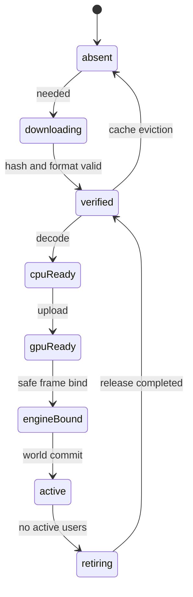

# Runtime streaming, belleğe yerleştirme ve bütçeler

Durum: tasarım; limitler ilk ölçüm varsayılanlarıdır. [Performans](../validation/performance.md)

## Durum makinesi

Her asset GPU kullanmaz: collision ve server query artifact'i cpuReady'den ilgili runtime'a bağlanır. Diyagram görsel asset'in geniş yoludur. GPU-ready olmak entity'nin authoritative state'inin kurulduğu anlamına gelmez.

## Talep ve öncelik

Runtime lease; LeaseId, ResourceEpoch, EntityRef/scene owner, katalog revision, asset closure, kullanım amacı ve son ihtiyaç zamanını taşır. Core lease'i kendi registry'sine kaydeder; requester retire olduktan sonra tamamlanan yükleme başka native handle'a bağlanamaz. Öncelik sırası: mevcut collision/oyuncu bağımlılıkları → hedef portal/world giriş gereksinimleri → yakın oynanış → yakın görsel kalite → uzak LOD → opsiyonel efekt.

Network interest, native materialization ve artifact cache ayrı listelerdir. Hysteresis ve minimum tutma [replikasyon profilinden](../networking/replication.md) gelir. Araç/yolcu/römork ve parent-child closure'ı toplu bütçe rezervasyonu alır; tek başına bir child'ın sığması bütün grubun aktive edilebileceği anlamına gelmez. Bu ayrım MTA streamer ve model request manager [incelemesine](../references/mtasa-architecture.md) dayanır.

Oyuncunun hızından tahmin edilen hücreler prefetch edilir. Teleport normal yürüyüş streaming'i gibi ele alınmaz; hedef kritik closure hazırlanıp sonra teleport commit edilir. Grafik beklerken oyuncuyu collision'sız hedef konuma göndermek geçerli fallback değildir.

## İş bölümü

Dosya okuma/decompress/collision hazırlama worker/host üzerinde yapılabilir. GTA API'sinin ana thread gerektirdiği binding'ler frame bütçeli kuyrukta çalışır. Büyük tek işi “async” olarak adlandırmak native binding'in uzun frame üretmesini çözmez; bölünebilir iş veya sınırlandırılmış artifact gerekir.

İlk frame upload/bind bütçesi ortalama 2 ms'dir; zorunlu içerik eksikse bütçe sessizce 100 ms'ye çıkarılmaz, sahne geçişi bekler. Engine release GPU fence ve native referanslar tamamlanınca yapılır. Worker'ın asset lease'i bitmesi aynı anda güvenli GPU free anlamına gelmez.

## Bütçe defteri

| Kaynak | İlk politika | Taşmada |
|---|---|---|
| Host artifact cache | Diskte 10 GiB varsayılan | Pinli olmayan LRU; yoksa yeni indirme durur |
| Hazırlama staging RAM | Host'ta 256 MiB hedef üst sınır | Decode concurrency azaltılır |
| GPU içerik | Ölçülen kullanılabilir bütçenin en çok %70'i | Texture/LOD düşür, opsiyonel içerik ertele |
| GTA x86 havuzları | Adapter'ın ölçtüğü kapasitenin %80'ine kadar | Kritik yer ayır; yeni spawn/katılımı sınırla |
| Client worker | Basit resource için 128 MiB başlangıç deney bütçesi; .NET başlangıcı ayrıca ölçülür | Kabul edilen manifest limiti/admission veya stop |
| Frame streaming işi | 2 ms hedef | Kuyruk ve prefetch; frame'i sınırsız bloklama yok |

%70/%80 üretim garantisi değildir; R-02/R-04 sonuçlarıyla profil sabitlenir. 128 MiB her C# worker için yeterlilik garantisi değildir; runtime/JIT/heap ile R-03'te ölçülür. Client worker grubu ilk deneyde toplam 1 GiB bütçe kullanır; yeni worker'ın ilan edilmiş rezervi toplamı aşarsa prepare/admission reddedilir. Hot reload sırasında eski ve yeni worker birlikte sayılır. ClientHost, decode staging, GTA ve GPU ayrıca ölçülür; kullanılabilir cihaz belleği 1 GiB worker tavanından önce ret gerektirebilir.

Server worker toplamı operatör world profiliyle sınırlanır; rezerv, gerçek kullanım, process sayısı, JIT/GC ve IPC kuyrukları birlikte raporlanır. Resource sayısı arttıkça maliyetin sıfır kaldığı varsayılmaz. Sanal adres boşluğu, büyük ardışık allocation ve fragmentation toplam RAM sayacıyla ölçülemez. Host'un x64 olması GTA havuzunu büyütmez.

## Collision ve görsel kalite ayrımı

Collision kapanırken mesh'in kalması da mesh kapanırken collision'ın kalması da oyuncu deneyimini bozabilir. Model, body/material, damage stage, collider ve attachment staging'de kurulup bounded aggregate swap ile aktive edilir. Baseline çok karede hazırlanabilir; ilk etkileşim anında zorunlu closure aynı geçerli state'i yansıtmalıdır. Güvenli native swap desteklenmiyorsa geçiş bariyeri gerekir. [Atomiklik sınırı](../architecture/activation-contracts.md). Cosmetic LOD/mip güncellemesi ayrı gerçekleşebilir.

Gameplay collision hazır olmayan client güvenli staging'de kalır. Commit öncesi eski world korunabilir; commit sonrası eski world'e dönüş yeni bir geçiş gerektirir. Kozmetik ses eksikse sessiz kalınabilir; kapının fiziksel engeli eksikse kapıdan geçilebilir hale gelinmez.

## Baskı altında ortak davranış

Sunucu local yoğunluğu bütçelendirir. Gameplay debris azaltılacaksa bütün ilgili client'lara aynı authoritative retire/uyku kararı gönderir. Her client'ın kendi başına farklı fizik parçalarını silmesine izin verilmez.

Pin döngüsü veya sızmış lease profiler'da asset → resource → entity → native handle zinciriyle görünür. Aynı hücreye 100 kez giriş/çıkışta referans ve pool sayısı tabana dönmelidir; GC çalıştırmak native sızıntının kanıtını gizlemez.

Kabul: AC-04 stream dönüş, AC-11 bellek/teleport bariyeri, AC-12 handle tekrar kullanımı, AC-20 uzun oturum. İndirme, decode, upload ve engine bind süreleri ayrı ölçülür.

## Nüfus grupları ve creature hazırlığı

Araç+sürücü+pilot/yolcu, hayvan+rig/klip/hit proxy ve gameplay attachment closure'ı admission'da birlikte ayrılır. Model çeşitliliği, skeleton/clip sayısı, animation blending CPU ve hit/query maliyeti ayrı raporlanır. Bir rig'i paylaşmak CPU/instance sayısını sıfırlamaz. Yeni tür prepare sırasında eski+yeni artifact ve worker rezervleri birlikte sayılır.

[Agent SimulationTier](../gameplay/agents-navigation.md) ve RepresentationSet farklıdır: soyut server state'i interaktif native beden değildir. Uyanma/air prefetch hız ve ölçülen yükleme süresiyle önden hazırlanır; cache'te olmak native-ready demek değildir. Korunan/etkileşilen nüfus yük baskısında keyfî temizlenmez; düşük maliyetli sunum, yeni ambient spawn reddi ve gerekirse admission uygulanır. AC-52/56/62/64/70.

## Kurtarma belleği ve kritik binding

Normal resident asset bütçesine ek baseline staging, catch-up history, eski+yeni release ve native rebind için aynı anda yaşayan referanslar hesaplanır. [RecoveryProfile](../architecture/failure-recovery.md) logical staging sınırları GTA RAM/VRAM havuzunu artırmaz; toplam admission en dar sınırı kullanır. Resync iptali eski BaselineId pin/işlerini retire eder; geç load callback'i yeni binding'e bağlanmaz.

Logical state hash doğru olsa da actual native collider yanlışsa interaction kapısı açılmaz. [Onarım](../networking/consistency-recovery.md) revision/generation doğrulamalı rebind ve bounded retry ister. Zorunlu closure bütçeye sığmıyorsa minimum güvenli scope veya açık admission ret kullanılır; owned birey rastgele düşürülmez. AC-78/80/81/85.
