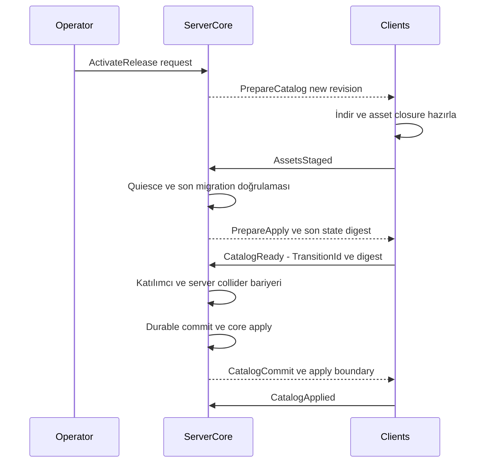

# Asset sürümleri, override ve katalog geçişi

Durum: sözleşme taslağı. [Resource reload](../resources/lifecycle-hot-reload.md) · [Kalıcılık](../networking/persistence.md)

## Dört farklı işlem

| İşlem | Etki |
|---|---|
| Add | Yeni AssetRef ekler; mevcut içerik değişmez |
| Replace | World lock setindeki açık AssetRef mapping'ini değiştirir |
| Prefab variant | Yeni prefab, ilan edilmiş alanları override eder |
| Runtime mutation | Mevcut entity state'ini yetkili komutla değiştirir |

Override yükleme sırasından çıkarılmaz. Dünya profili `gta.base` sağlayıcısını ve değişecek referansları açıkça seçer. Aynı referansı değiştiren iki paket varsa lock çözümünde tek mapping gerekir; aksi halde conflict hatasıdır. Instance override yalnız şemanın izin verdiği alanlarda kullanılabilir.

## Uyumluluk sınıfları

| Değişiklik | Geçiş yöntemi |
|---|---|
| Mip/texture/renk; aynı görünür engel anlamı | Cosmetic katalog güncellemesi |
| Ek opsiyonel ses/efekt | Ön yükleme + capability fallback |
| Collision, mass, hasar eşiği, animasyon timing | Gameplay catalog barrier |
| Skeleton, native ABI, controller major | World restart veya yeni profil |
| PlacementId/schema değişimi | Açık migration ve restore provası |

SemVer tek başına uyumluluk kanıtı değildir. Yanlışlıkla patch numarasıyla collision değiştirilmiş paket, content diff tarafından gameplay migration olarak görülmelidir.

## Canlı katalog geçişi

Sunucu katılımcı listesini TransitionId ile sabitler; bu sırada yeni join bekletilir veya yeni katalog staging'ine yönlenir. Gameplay değişiminde etkilenen entity'ler quiesce edilir; tüm etkin katılımcılar hazır olmadan commit edilmez. İlk timeout 30 saniyedir. Geç kalan oyuncunun server input/lease/hit yetkisi fence edilip scope'u iptal edilerek staging/resync'e alınır veya update iptal edilir. Salt katılımcı listesinden çıkarmak yeterli değildir.

CatalogReady commit öncesi hazırlığı, CatalogApplied commit sonrası yerel uygulamayı bildirir. Apply ACK'ı olmayan client eski collision ile oynayamaz. Quiesce sonrasında migration ve Ready digest tekrar kontrol edilir. Tam sıra, atomiklik ve postcommit hata politikası [ortak aktivasyon sözleşmesindedir](../architecture/activation-contracts.md).

Server simülasyon artifact'i de barrier'a dahildir. Client GPU'su yeni içeriği aldı diye server'ın eski collider'ıyla devam edilmez. Aynı anda iki katalog belleğe sığmıyorsa hot swap zorlanmaz; affected world restart seçilir.

## Kalıcı state migration

Migration; eski/yeni schema, catalog, PlacementId eşlemesi, destruction state geçişi ve fragment retirement'ını tanımlar. Konum yakınlığına göre otomatik hasar transferi yapılmaz. Tanınmayan eski state restore'u durdurur veya önceden ilan edilmiş güvenli migration kuralına gider.

Yeni güzel kasa modeli, eski kırılmış kasayı otomatik sağlam yapmaz. Collision değişimi durable world transaction olarak kayda geçer. Kalıcı dış ekonomi etkileri için [outbox sınırı](../networking/persistence.md) geçerlidir.

## Geri alma

Commit öncesinde yeni katalog bırakılır, eski world devam eder. Commit sonrasında ters state migration kanıtlanmışsa geri dönüş uygulanır; aksi halde forward-fix gerekir. Eski artifact'in cache'te bulunması state'in geri taşınabildiğini göstermez.

Aktif entity ve worker referanslarının yanında persistent birey, snapshot/journal, retained backup, pending operation/transfer ve migration closure'ı eski artifact'leri pinler. [GC/restore sözleşmesi](../architecture/failure-recovery.md) erişilebilirlik kökleri, grace period ve yeniden denetimi belirler. Yalnız son iki release'i tutmak yeterli değildir. Gerekli release manifesti yoksa rollback/restore aracı önkoşul eksikliğini raporlar; sessiz default kullanmaz. AC-85.

## Kabul

AC-06 exact content mismatch, AC-07 yarım/uyumsuz update, AC-08 resource dependency grubu, AC-11 memory barrier ve AC-18 migration crash. Release raporunda content diff, compatibility sınıfı, affected worlds, gerekli restart ve rollback sınırı yer alır.

## Plan ve güvenilir release

Catalog geçişinin üstünde [WorldPlan](../architecture/world-plans.md) code/schema/provider/permission değişimini çözer. [Studio/release](../platform/studio-release.md) prova, içerik diff'i, metadata freshness ve rol ayrımını tanımlar. Planlı rollback yeni yetkili metadata ile eski izinli artifact kümesini hedefleyebilir; eski imzalı metadata replay'ini kabul etmek değildir. Gameplay farklılığı olan canary aynı interaction alanında client bazında uygulanmaz.

## Species ve PopulationPolicy değişiklik sınıfları

İzinli aralıkta nüfus yoğunluğu/aç-kapat, [WorldPlan'ın](../architecture/world-plans.md) mutable ilan ettiği runtime PopulationPolicy state'idir; yeni katalog istemez. Yeni tür/rig/controller veya daha geniş permission/kota tavanı yeni release gerektirir. Aynı rig/hit/timing grubundaki kürk appearance'ı cosmetic olabilir; morphology/growth/hit değişimi gameplay barrier'dır. Uyumsuz skeleton/controller major restart sınıfı olarak kalır.

Aktif ve kalıcı birey, corpse, mission, doğum kaydı ve rollback lease'leri varken Species kaldırma ret veya açık migration ister. Eski DefinitionRevision bitmeden shared IFP/mesh boşaltılmaz; başarısız update health/owner/death state'ini sıfırlamaz. [Animals güncellemesi](../gameplay/animals-species.md), AC-56/61/62/67.
