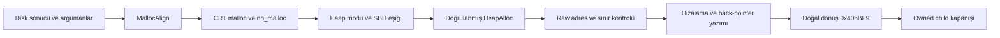

# D1 — Hizalı streaming tamponunun doğal oluşturulması

Kod **0.1.39**, mimari **v0.46**, 14 Eylül 2026. [Durum](status.md) · [Önceki disk kesiti](d1-cd-stream-disk.md) · [Yol haritası](../roadmap.md) · [ADR-74](../decisions/architecture-decisions.md#adr-74--hizalı-allocation-ve-doğal-dönüş)

## Sorumluluk ve kapsam

`--observe-cd-stream-allocation` doğrulanmış disk hazırlığından başlayarak GTA'nın ilk `MallocAlign(2048, bytesPerSector)` çağrısını doğal koduyla yürütür. Yeni sorumluluk: kabul edilen CRT heap yolunu izlemek, başarılı ayırmanın sınırlarını ve hizalamasını doğrulamak, dört byte'lık geri dönüş adresi kaydını denetlemek ve **0x406BF9** adresinde durmaktır. Burası allocation CALL'ının dönüşü, `ADD ESP,12` önüdür.

Bu kesitte tampon gerçekten oluşturulur. Payload büyüklüğü 2048, heap isteği `2048 + alignment` byte'tır. Disk sorgusunun verdiği mantıksal sektör sınırına hizalama doğrulanır; fiziksel storage hizalama gereksinimi, direct I/O uygunluğu veya streaming hazır sonucu bundan çıkarılmaz.

`nativeFreeVerified=false`, `nextInitializationCallAllowed=false`, `streamingReady=false`; `canAttach` ve `initializationVerified` de false kalır. Tampon bu sınırlı denemede owned child sonlandırılınca işletim sistemi tarafından geri alınır. **GTA'nın FreeAlign/HeapFree çağrısı yürütülmüş veya kalıcı oyun oturumunda sızıntısız lifecycle tamamlanmış sayılmaz.** D1, N2/N3, AC-90 bütünü ve D2 açıktır.

## Veri akışı ve arayüzler

Kaynak sözleşmeleri: [public model](../../include/saex/engine/cd_stream_allocation.hpp), [portable kontrol](../../src/engine/loader/cd_stream_allocation.cpp), [observer](../../src/engine/loader/loader_observation.cpp), [policy](../../contracts/engine/cd-stream-allocation-policy.json), [generator](../../tools/cd_stream_allocation_policy.py). C++ girişi `LoaderObservation::run_cd_stream_allocation`; CLI sonucu `cdStreamAllocationObservation` ve başarı nedeni `cd_stream_allocation_verified`, exit code 3'tür. Exit 3 oynanabilirlik değildir.

Yeni modun olay bütçesi **160**, üst sınırı da 160'tır; 161 ve sıfır ret. Diğer modlar 128 üst sınırını korur; legacy moda 129 verildiğinde ret testi vardır. 5000 ms, 64 modül, 16 thread ve 256 MiB girdi bütçeleri değişmez. Bütçe dolarsa owned child kapatılır; tamamlanmamış evre başarılı raporlanmaz.

Trace'e allocation alanı eklendiği için C++ tüketicileri yeniden derlenir. Bootstrap C ABI 1, .NET sözleşmeleri, GNS oyun taşıması, HTTPS asset taşıması ve otorite kuralları değişmez. Native bağımlılık veya ENet fallback eklenmedi. Önceki `cdStreamDiskObservation` ve diğer parent kayıtları **kendi duraklarındaki snapshot'lardır**: eski kayıttaki `allocationCallAllowed=false`, yeni allocation evresinin çalışmadığı anlamına gelmez. En ileri sonucun kapsamı yeni kayıttan okunur; eski CLI modları kendi terminallerinde kalır.

CMake proje sürümü de 0.1.39 olarak eşitlendi; önceki metadata'da kalmış 0.1.37 değeri giderildi. Bu metadata runtime policy veya C ABI sürümü değildir.

## Native kanıt ve izin sınırı

Desteklenen executable SHA-256 `f01a00ce950fa40ca1ed59df0e789848c6edcf6405456274965885d0929343ac`, preferred base 0x400000. Adresler bu kimliğe aittir; bilinmeyen executable'a uygulanmaz. Ghidra bridge'in kilitli yerel proje üzerinden yaptığı ek araştırma **24 fonksiyon**, depth 5/max 48 export içerir. Özel kayıt `out/research/ghidra-bridge/allocation-v1/research-record.json`; 12 genişletilmemiş callee vardır. `completeCallClosure=false`, `runtimePermission=false`: export sayısı bütün CRT veya motor yollarının güvenli yürütülebileceği anlamına gelmez. Runtime izni aşağıdaki açık normal yol ve öncesinde durulan dallarla sınırlıdır. [Araç sözleşmesi](../references/ghidra-bridge.md).

| Yordam/veri | Adres ve izin |
|---|---|
| MallocAlign | 0x72F4C0, tam 35 byte |
| CRT malloc | 0x824257, tam 18 byte |
| nh_malloc | 0x82422B ilk 21 byte ve +43 RET; new-handler/failure dalına izin yok |
| heap_alloc | 0x8241B0 ilk 32 byte ve +70..+110 normal tail; aradaki SBH çağrıları kapalı |
| SEH scope | 0x888048: `{0xFFFFFFFF, 0, 0x82421F}` |
| New-handler mode | 0xC9ADCC, yalnız 0 |
| SBH threshold | 0xC9C2E4 |
| CRT heap handle/mode | 0xC9C2F4 / 0xC9C2F8 |
| HeapAlloc IAT | 0x8581F8; kabul edilen ntdll export'una tam eşitlik |
| OS implementation | Kernel32 forwarder `NTDLL.RtlAllocateHeap`; mevcut kilitli ntdll RVA 0x3F880 |
| Return terminal | 0x406BF9; sonraki komut yürütülmez |

SEH prologue 0x8286E0 ve epilogue 0x82871B önceki sözleşmenin exact code kontrollerini kullanır. Scope cleanup **0x82421F**'tir; +3'teki `PUSH 4` giriş adresi değildir. İlk yerel taslaktaki bu üç byte fark gerçek scope kaydıyla düzeltildi; ret koruması farkı yürütmeden yakaladı. Exception dispatch veya cleanup yürütme izni eklenmedi.

System module hash'i ve export prefix'i relocation bilgisiyle doğrulanır; ntdll prefix HIGHLOW başlangıçları 8 ve 13'tür. Heap modu 1 doğrudan kabul edilir. Mod 3 yalnız `threshold < 2048 + alignment` olduğunda SBH yolunu atlayabilir. Diğer modlar, nonzero new-handler ve eşit/büyük eşik daha allocation çağrısına girmeden ret alır. Buna ek olarak gerçek `JNZ` ve `JA` **önünde** ZF/CF doğrulanır. Bir politika varsayımıyla SBH dalına kontrolsüz geçiş yapılmaz.

## Evreler ve ABI

`A`, 0x406BF4 CALL önündeki ESP; `a` kabul edilen alignment; `n=2048+a` olsun. A'dan başlayan 44 byte argüman/local alanı bütün yeni evrelerde korunur. Dönüş adresi A−4'te 0x406BF9'dur.

| Evre | Durak | ESP | Denetim |
|---|---|---|---|
| 1 | 0x72F4C0 | A−4 | Aligned çağrı girişi, çağıranın register/flags durumu |
| 2 | 0x8241B0 | A−36 | İç içe dönüş adresleri, toplam boyut, new-handler 0 |
| 3 | 0x8241C6 | A−80 | Heap-mode karşılaştırması sonrası, JNZ öncesi |
| 4 | 0x8241CE | A−80 | Yalnız mod 3: threshold karşılaştırması sonrası JA öncesi |
| 5 | 0x824213 | A−92 | HeapAlloc CALL önünde `{heap,0,n}` |
| 6 | RtlAllocateHeap | A−96 | Exact API girişi, return adresi ve stdcall argümanları |
| 7 | 0x824219 | A−80 | API doğal dönüşü; EAX NULL kontrolü, heap bloğu ve ilk hash |
| 8 | 0x72F4D1 | A−12 | CRT doğal dönüşü, raw adres, ECX=0, SEH geri yüklenmesi |
| 9 | 0x72F4DE | A−8 | `[aligned−4]=raw` yazımı **önünde** sınır/metadata/hash |
| 10 | 0x406BF9 | A | Back-pointer yazılmış, doğal dönüş tamamlanmış, son hash |

Mod 1 evre 4'ü atlar. EBX/EDI bütün evrelerde korunur. Aktif heap frame'inde EBP=A−40 ve ESI=n; heap dışındaki kaydedilmiş EBP/ESI uygun evrede geri gelmelidir. Evre 8'de EAX raw ve ECX=0; evre 9'da EAX aligned, ECX raw, ESI=~(a−1); evre 10'da caller ESI geri yüklenmiştir. API'nin değiştirebildiği volatile register'lar dönüşte kaydedilir; sonraki TEST/AND'in etkilediği ve koruduğu EFLAGS bitleri ayrıca kontrol edilir. TF/DF set kabul edilmez.

SEH aktifken FS:[0]=A−56; önceki record, handler, scope, try state −1, saved ESP, EBX/ESI/EDI/EBP denetlenir. TIB'nin diğer alanları ve önceki SEH kaydı korunur; heap dönüşünden sonra orijinal FS:[0] geri gelmelidir. Parent kontrolleri: 2192-byte streaming tablo penceresi, beş disk global'i, 136-byte yol penceresi, initializer ve application stack alanları, localization bayrakları, bırakılmış critical section ve aynı named event.

## Bellek sahipliği ve bütünlüğü

Geçerli hizalama 512..65536 arası ikinin kuvvetidir. Ham pointer x86 HeapAlloc'un en az 8-byte hizalamasına uyar; NULL, düşük/geçersiz adres, 32-bit taşma veya stack/TEB ile kesişme ret. `aligned=(raw+a)&~(a−1)` **bir sonraki** a sınırıdır; raw zaten hizalıysa da ileri gider. Böylece `metadata=aligned−4` bloğun içindedir ve 2048-byte payload `raw..raw+n` aralığını aşmaz.

HeapAlloc flags=0, **zero-initialization istenmez**. İçerik sıfır varsayılmaz. `VirtualQueryEx` üzerinden bütün kapsanan sayfalar MEM_COMMIT/MEM_PRIVATE/PAGE_READWRITE olmalı; parça parça `ReadProcessMemory` ile en fazla 256 byte okunur. Sayfa sorgusu bir heap bloğunun sahipliğini tek başına kanıtlamaz; sahiplik gözlenen exact HeapAlloc çağrısı ve onun başarılı dönüşüyle ilişkilendirilir.

API dönüşünde CNG SHA-256 alınır; yalnız metadata'nın dört byte'ı hash sırasında maskelenir. Evre 8/9/10 aynı hash'i vermelidir. Metadata yazımdan önce ilk değerine eşit, evre 10'da raw adrese eşittir. Uninitialized içerik rapora dökülmez; ham payload saklanmaz. BCRYPT handle her yolda bırakılır. Başarısız API için NULL kontrolü **pointer aritmetiği/dereference önündedir**; başarı register'ı enjekte edilmez.

HeapAlloc başarısızlıkta GetLastError belirlemez. `lastErrorDiagnostic` yalnız başarılı API dönüşünde okunmuş tanı alanıdır; allocation failure nedeni sayılmaz. Kaynaklar: [Microsoft HeapAlloc](https://learn.microsoft.com/en-us/windows/win32/api/heapapi/nf-heapapi-heapalloc), [Microsoft VirtualQueryEx](https://learn.microsoft.com/en-us/windows/win32/api/memoryapi/nf-memoryapi-virtualqueryex).

## Hata davranışı ve teşhis

| Durum | Sonuç |
|---|---|
| Geçersiz RVA, çakışan alan veya export reçetesi | `cd_stream_allocation_invalid_spec`; yeni yürütme yok |
| Code/IAT/scope/export farkı | `precondition_shape` veya `shape_drift`; izin genişletilmez |
| Mod/new-handler/eşik uygun değil | `request_rejected`; aligned çağrı açılmaz |
| Register, argüman, SEH, parent veya global farkı | İlgili `frame`, `arguments`, `seh_drift`, `parent_drift`, `globals_drift` sonucu; child kapanır |
| HeapAlloc NULL | `failed`; header/payload okunmaz |
| Hatalı sınır veya erişilemeyen blok | `block_rejected` / `block_unreadable` |
| Payload veya back-pointer beklenmeyen değişimi | `content_drift`; bir sonraki native komut yürütülmez |
| Olay/zaman bütçesi, exception veya owner ihlali | Ortak loader ret/kapanış sözleşmesi |

`shapeFailure` ilk başarısız alt kontrolü verir: 1 parent disk; 2 allocation spec; 3 aligned; 4 malloc; 5 nh head; 6 nh RET; 7 heap head; 8 heap tail; 9 IAT read; 10 scope read; 11 scope words; 12 sabit API adresi; 13 admitted ntdll/export/prefix. Başarıda 0'dır. Bu alan çalışma izni değildir.

CLI mod dispatch'i her value-returning çağrıyı ayrı `observe_into` frame'ine taşır. İlk Debug GTA çalıştırmasında MSVC /Od'nin tek dispatch lambda içinde çok sayıda büyük geçici sonuç ayırdığı stack taşması görüldü. Stack reserve büyütülmedi; call-frame düzeni düzeltildi. Runner boş veya sonuç alanı eksik JSON halinde süreç exit code'unu bildirir. Eski çıktı üzerine yazılmaz.

## Kabul senaryoları ve kanıt türleri

| Senaryo | Doğrulama düzeyi |
|---|---|
| Mod 1 exact normal yol | Gerçek Windows API kullanan native fixture |
| Mod 3 ve küçük SBH eşiği, atlanan SBH dalı | Ayrı native fixture; dal canary'sine girilmez |
| Eşik istek boyutundan büyük veya new-handler açık | Negatif native fixture; yeni allocation başlamaz |
| Eşik istek boyutuna eşit | Portable request corpus'unda ret |
| Hatalı RVA/operand/prefix/cleanup adresi | Negatif native fixture; ret alanı ve canary yokluğu |
| Bütün 8-byte raw kalıntıları ve desteklenen a değerleri | Portable corpus; metadata/payload sınırı ve overflow/null ret |
| Register/ESP/flags mutasyonları | Portable corpus |
| Mode limiti, eski mod, yabancı owner ve mevcut event | Native negatif/uyumluluk corpus'u |
| Sonraki başlatma canary'si | İki ayrı kontrol gözlemsiz canary'ye ulaşır; observer ulaşmaz |
| Tekrarlı yürütme | 12 warm native çevrim; parent handle önce/sonra eşit |
| Gerçek HeapAlloc NULL veya dış payload bozulması | Guard kodlanmış; gerçek OS failure/tamper enjeksiyonu bu kesitte **yapılmadı** |
| 4K/farklı storage hizalaması | Portable hesap doğrulaması; gerçek storage testi değildir |
| Native FreeAlign/HeapFree | Araştırma var; yürütme ve yaşam döngüsü kabulü açık |

İlk gerçek Debug GTA koşusu 0x406BF9'a ulaştı, 2048-byte payload için 2560-byte heap isteği ve 512-byte hizalama doğrulandı. `out/local-demo/20260914-124922-e89c2c/report.json` **12/12**, **19/19 girdi korunumu** verdi. Bu ilk sonuç final test matrisinin yerine geçmez. İlk compile tür/shadow hataları, fixture export sayısı sınırı, ASLR altında dosya byte karşılaştırması, CLI stack taşması ve scope cleanup taslağı düzeltmeleri özel log'larda korunur.

## Genişleme ve sonraki geçiş

Doğal FreeAlign (0x72F4F0) raw adresi `[aligned−4]` üzerinden CRT free'ye taşır; doğal çağrı CdStreamInit'in daha ilerisindedir. Aradaki LocalAlloc kanal belleği, doğrulanmış GTA3.IMG açma/okuma yönlendirmeleri ve thread/semaphore yolları kapanmadan bu return'den FreeAlign'e atlanmaz. Sonraki kesit bu I/O ve thread önkoşullarını, allocation failure rollback'ini ve native release sahipliğini ele almalıdır. Yeni byte/profil desteği yeniden kanıt ve policy üretimi gerektirir; araştırma snapshot'ı otomatik izin açamaz.

Run-SAEX en ileri allocation modunu kullanır; önce disk policy sonra allocation policy kaynak/probe digest eşitliğini arar. Yedi dosyalı özel çalışma klasörü, 19 hash girdisi ve 12 sonuç kontrolü vardır. Normal build GTA çalıştırmaz. [Çalışma akışı](workflow.md). Renderer, doğal frame, C# sandbox ve GNS multiplayer henüz bu native kesitin çıktısı değildir.

## Nihai doğrulama — kod 0.1.39

Canonical özel kayıtlar `out/verification/engine/stream-allocation-final-verification.json`, `stream-allocation-gta-evidence.json` ve `stream-allocation-metadata-evidence.json` dosyalarıdır.

| Ölçüm | Sonuç ve sınır |
|---|---|
| x86 Debug standart akış | **56 native suite / 79 managed / 322 Python**, tam başarılı koşu |
| x86 Release standart akış | **56 / 79 / 322**, tam başarılı koşu |
| Yeni portable corpus | **32980 kontrol**, iki x86 yapılandırması ve ek x64 Debug hedefli test |
| Yeni native corpus | **19 senaryo, iki post-allocation canary kontrolü, 12 warm**; Debug/Release geçti |
| Parent handle korunumu | Debug **137→137**, Release **144→144** |
| Gerçek GTA matrisi | **27/27**, **14** başarılı allocation/doğal dönüş; iki yapılandırma |
| Süreç ve girdi korunumu | **22/22** owned child çıktı; **140/140** girdi hash'i aynı; beş rette child oluşturulmadı |
| Yol ve eski modlar | 126-byte cwd geçer, 127-byte ret; explicit cwd korunur; disk ve ready terminalleri aynı |
| Ret matrisi | Yanlış context/artifact, eksik ASI, bozuk codec, bilinmeyen exe, mevcut event/mutex beklenen ret |
| PowerShell 5.1 Run-SAEX | Debug/Release **12/12** sonuç, her birinde **19/19** girdi korunumu |
| Kaynak/config | Final **346/346** hash; matrix/runner ve nihai kontrol arasında aynı |

Debug tam test akışından sonra yalnız CMake proje sürümü metadata'sı 0.1.37→0.1.39 eşitlendi; ek configure/build sonrası **216/216 Debug EXE/DLL hash'i aynı** kaldı. Release tam akışı final metadata ile geçti. Kaynak freeze'in metadata öncesi ve sonrası kaydı ayrı saklanır; davranış kaynağı son standart testlerden sonra değiştirilmedi.

Gerçek GTA'da heap mode 1, new-handler 0, 2560-byte allocation, 2048-byte payload ve 512-byte mantıksal hizalama gözlendi. Mode 3 bypass ayrı native fixture kanıtıdır. HeapAlloc NULL, storage 4K/fiziksel hizalama, dış payload tamper ve native FreeAlign/HeapFree gerçek GTA üzerinde zorlanmadı. Host ayarı ve orijinal oyun dosyaları değişmedi. Linux, x64 Release, hosted CI, N1 SDK, renderer/doğal frame ve D2 multiplayer bu çalışmada doğrulanmadı.

| Artifact | Debug SHA-256 | Release SHA-256 |
|---|---|---|
| saex_engine_loader_probe.exe | `4e39f1badfa176eea91bc91ad4dcc3e58020a68d44acccd58287a13b801b6247` | `54708fd421edf6fef7287f0447bea41c3b5839cf56d28f8bd1dccc0303a8a4ae` |
| saex_bootstrap.dll | `76bddbac6984b6f77c8176c5be160ea241724e01bf9ce0dd9d8635248e26acbe` | `eaab67ac564fb52e3db767ec4efbf4c0d3b6ed0aeac64d6c34c35d384d8a3273` |
| saex_bootstrap.map | `79be4aa18b9a0f67f6c29ae2687bfd8cb4a4352f542a144018150f5533c874b0` | `d62c1e2fd00946af04c8af5c29cf1c0631b6ec395fc68f9d068b9d25fdfec241` |

Allocation policy SHA-256: `c0a0bc0d4a617c5b02d44fe54f7639a79a7728fe4aa3ec67160fe8cd2aa31391`.
