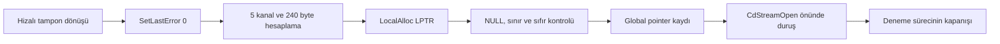

# D1 — Streaming kanallarının sıfırlanmış belleği

Kod **0.1.40**, mimari **v0.47**, 14 Eylül 2026. [Durum](status.md) · [Önceki allocation](d1-cd-stream-allocation.md) · [Yol haritası](../roadmap.md) · [ADR-75](../decisions/architecture-decisions.md#adr-75--streaming-kanal-belleği)

## Sorumluluk ve kapsam

`--observe-cd-stream-channels`, önceki hizalı tampon dönüşü **0x406BF9** sonrasında GTA'nın `SetLastError(0)` ve `LocalAlloc(0x40, 240)` çağrılarını doğal olarak yürütür. Beş kanalın 48'er byte depolaması, sıfır içerik ve global pointer kaydı denetlenir. Terminal **0x406C34**, `CdStreamOpen` CALL önüdür. Kanal sayısı 5 ve etkin kanal sayısı 0, yalnız kontrol belleğinin başlangıç durumudur; çalışan kuyruk, semaphore veya streaming thread anlamına gelmez.

Bu bir D1 gözlem kesitidir. `fileOpenAllowed=false`, `nativeFreeVerified=false`, `streamingReady=false`, `canAttach=false`, `initializationVerified=false` kalır. `MODELS\GTA3.IMG` yalnız doğrulanmış çağrı argümanıdır; dosyanın açıldığı, varlığının sınandığı veya okunduğu iddia edilmez. AC-90 bütünü, D1/N2/N3 ve D2 kapıları açıktır.

## Veri akışı ve arayüzler

[Model ve portable API](../../include/saex/engine/cd_stream_channels.hpp), [portable doğrulayıcı](../../src/engine/loader/cd_stream_channels.cpp), [observer](../../src/engine/loader/loader_observation.cpp), [policy](../../contracts/engine/cd-stream-channels-policy.json) ve [üreteç](../../tools/cd_stream_channels_policy.py) birlikte sürümlenir. Public giriş `LoaderObservation::run_cd_stream_channels`; sonuç `cdStreamChannelsObservation`, neden `cd_stream_channels_verified`, exit code 3. Diğer nedenler başarısızlık verir. Eski CLI modlarında yeni sonuç `null` ve eski terminaller korunur.

C++ trace yerleşimi büyüdüğünden tüketiciler yeniden derlenir. Bootstrap C ABI 1, .NET sözleşmeleri ve OS pinleri korunur. GNS oyun taşıması, HTTPS asset yolu ve sunucu otoritesi değişmez; ENet fallback eklenmez. Yeni native bağımlılık veya indirilen kod için sandbox yetkisi yoktur. CLI her gözlemi ayrı `observe_into` çağrı frame'inde tutar.

Yeni mod önceki allocation gibi **160 olay** üst sınırına sahiptir; 161 ret. Daha eski modların 128 sınırı korunur. Ortak 5000 ms, 64 modül, 16 thread ve 256 MiB girdi bütçeleri genişletilmez. GTA ana iş parçacığına yeni sürekli hook veya C# senkron bekleme eklenmez.

## Kanıtın kaynağı ve adresler

Executable SHA-256 `f01a00ce950fa40ca1ed59df0e789848c6edcf6405456274965885d0929343ac`, preferred base 0x400000. Bilinmeyen executable kapıdan geçmez. Mevcut kilitli Ghidra `snapshot-v1/00406b70.json` kaydı bütünlük denetiminden geçirilip gerçek dosyanın 64 byte devam koduyla karşılaştırıldı. Bu kesit yeni bir Ghidra kurulumu veya tam callee closure iddiası getirmez. Özel araştırma kaydı `out/verification/engine/stream-channels-research.json`; [Ghidra araç sözleşmesi](../references/ghidra-bridge.md).

| Alan | Doğrulanan adres / ilişki |
|---|---|
| Devam gövdesi | 0x406BF9, 64 byte; terminal CALL da imzaya dahil, yürütülmez |
| SetLastError CALL / dönüş | 0x406C00 / 0x406C06; IAT 0x85809C |
| LocalAlloc CALL / dönüş | 0x406C22 / 0x406C28; IAT 0x8580B8 |
| Kanal sayısı / etkin sayı | 0x8E4090=5 / 0x8E4094=0 |
| Pointer | 0x8E3FFC, iki yanındaki DWORD da korunur |
| Dosya adı | 0x858AF4, NUL dahil 16 byte |
| Terminal | 0x406C34; CALL hedefi 0x4067B0, yürütülmez |
| Kernel32 SetLastError thunk | RVA 0x14F00, `FF25`, HIGHLOW +2, slot RVA 0x82014 |
| Ntdll RtlSetLastWin32Error | RVA 401456; 20-byte prefix, HIGHLOW +13 |
| Kernel32 LocalAlloc thunk | RVA 0x1C800; dengeli EBP push/pop, HIGHLOW +8, slot RVA 0x80EB8 |
| Kernelbase LocalAlloc | RVA 1325408; 20-byte prefix, HIGHLOW +8/+13 |

Üç OS modülünün hash/boyut pinleri parent loader policy'den gelir. Dört export prefix'i relocation maskesiyle ve aktif/admitted modül kimliğiyle doğrulanır. GTA IAT girişleri thunk adreslerine, thunk slot'ları implementation adreslerine tam eşit olmalıdır. İlk çözümden sonra adreslerin değişmesi ret verir. Dosya adı, code, export ve binding her yeni evrede yeniden kontrol edilir. OS güncellemesinde yeni pinler ve kaynak kanıtı olmadan izin genişletilmez.

0x4067B0, kurulumun önceden araştırılmış 0x1564A90 yönlendirmesini içerir; bu evrede o hedefin yürütme kanıtı yoktur. Sonraki çalışma için hedef ve tüm gerekli I/O dalları ayrıca incelenecektir.

## Dokuz evre ve ABI

`A`, 0x406BF9'da ESP olsun. `ADD ESP,12` ile serbest kalan ilk 12 byte sonraki çağrılar tarafından yeniden kullanılabilir. **A+12..A+43** çağıran penceresi korunur; A+40'taki kanal sayısı 5 olmalıdır. EDI, önceki allocation'ın aligned EAX sonucuna dönüşür; EBX/ESI/EBP korunur.

| Evre | Durak | ESP | Ek kontrol |
|---|---|---|---|
| 1 | SetLastError CALL | A+8 | Tek argüman 0; ADD'in arithmetic flags sonucu |
| 2 | Kernel32 SetLastError girişi | A+4 | Dönüş 0x406C06, argüman 0 |
| 3 | Ntdll implementation girişi | A+4 | Aynı argüman ve frame |
| 4 | 0x406C06 | A+12 | Child TEB LastErrorValue=0; VOID dönüşün EAX değeri başarı sayılmaz |
| 5 | LocalAlloc CALL | A+4 | `{0x40,240}`, EAX=5, ECX=240; sayılar global'e yazılmış |
| 6 | Kernel32 LocalAlloc girişi | A | Dönüş 0x406C28, `{0x40,240}` |
| 7 | Kernelbase implementation girişi | A | Thunk frame'i dengeli; aynı çağrı argümanları |
| 8 | 0x406C28 | A+12 | NULL ret kontrolü, blok sınırı ve 240 sıfır byte |
| 9 | 0x406C34 | A+4 | `{filename,0}`, yayımlanmış pointer ve hâlâ sıfır bellek |

TF/DF set kabul edilmez. ADD'in CF/PF/AF/ZF/SF/OF etkisi kontrol edilir. SHL için tanımlı CF/PF/ZF/SF ve değişmeyen control flag'leri doğrulanır; shift count 4 olduğundan OF/AF belirsizliği başarı kanıtına dönüştürülmez. Win32 dönüşlerinde volatile register'lar serbesttir; dönüş sonrası push/mov komutlarında kayıtlı volatile değerler ve EFLAGS korunmalıdır.

## Bellek, snapshot ve sahiplik

`0x40 = LPTR = LMEM_FIXED | LMEM_ZEROINIT`. Sonuç doğrudan pointer'dır, movable handle değildir ve LocalLock gerektirmez. NULL başarısızlığı pointer aritmetiği veya yayınından **önce** durdurulur. LastErrorValue evre 4'te ve LocalAlloc dönüşünde doğrudan child TEB'den okunur. LocalAlloc başarısızlığı için hata kodu anlamlıdır; başarılı dönüşteki kod yalnız tanı bilgisidir. Kaynaklar: [Microsoft LocalAlloc](https://learn.microsoft.com/en-us/windows/win32/api/winbase/nf-winbase-localalloc), [Microsoft SetLastError](https://learn.microsoft.com/en-us/windows/win32/api/errhandlingapi/nf-errhandlingapi-setlasterror).

Pointer en az 64 KiB, DWORD hizalı ve 240 byte aralığı 32-bit taşmasız olmalıdır. Önceki raw allocation bloğu, child stack ve TEB ile kesişme reddedilir. Bütün 240 byte tek MEM_COMMIT/MEM_PRIVATE/PAGE_READWRITE region içinde okunabilir ve sıfır olmalıdır. Sayfa sorgusu tek başına heap sahipliği kanıtı değildir; sahiplik gözlenen exact LocalAlloc çağrısı ve doğal dönüşle kurulur. Kontrol yalnız istenen 240 byte içindir; heap metadata'sı veya allocator'ın iç yuvarlama boyutu için iddia içermez.

12-byte pointer penceresinin ortası girişte 0 olmalıdır. Önceden dolu pointer'ı ezmek yerine `precondition_state` ile durulur. Evre 9'a kadar bütün pencere sabit; evre 9'da yalnız orta DWORD LocalAlloc sonucuna dönüşür. Evre 8 ve 9'da sıfır içeriğin tamamı okunur.

2192-byte streaming tablo penceresinde evre 1–4 boyunca değişiklik yoktur. Evre 5–9'da yalnız offset 132..139, `{5,0}` DWORD çifti olur. Diğer byte'lar önceki `cdStreamTablesObservation.after` değerinde kalır. Parent gözlemler **kendi duraklarının tarihsel snapshot'larıdır**; bunlar son global duruma dönüştürülmez. `cdStreamAllocationObservation.nextInitializationCallAllowed=false` parent kesitinin sınırını anlatır; üst modun devamı yeni gözlemden okunur.

Her evrede önceki aligned bloğun maskeli hash'i ve back-pointer'ı, heap/disk global'leri, 136-byte dizin alanı, initializer/application stack'leri, localization, bırakılmış critical section, named event, TIB ve orijinal SEH kaydı korunur.

Bu denemede iki allocation da child sonlandırılınca OS tarafından geri alınır. LocalAlloc'un doğal eşleşmesi **LocalFree**'dir; önceki aligned tamponun doğal yolu **FreeAlign/HeapFree**'dir. Hiçbiri bu kesitte çağrılmaz. Parent heap allocation'a yeni blok gibi davranılıp yanlış allocator ile free yapılmaz. Thread, dosya handle'ı ve gerçek uzun ömürlü leak doğrulaması sonraki kapılardır.

## Hata davranışı ve genişleme sınırı

| Koşul | Sonuç / yürütme sınırı |
|---|---|
| Geçersiz/çakışan RVA, thunk operand veya relocation reçetesi | `cd_stream_channels_invalid_spec`, loader devam etmez |
| Body, dosya adı, API veya binding farkı | `precondition_shape` ya da `shape_drift`; sonraki native komut açılmaz |
| Başlangıç pointer'ı dolu / kanal sayısı yanlış / stack okunamıyor | `precondition_state`; SetLastError henüz çağrılmamıştır |
| ABI/argüman/tablo/pointer/parent/allocation/SEH kayması | İlgili `frame`, `arguments`, `tables_drift`, `pointer_drift`, `parent_drift`, `allocation_drift`, `seh_drift` |
| SetLastError dönüşünde değer sıfır değil | `error_not_reset` |
| LocalAlloc NULL | `allocation_failed`; pointer yayınlanmaz |
| Pointer sınırı veya sayfa uygun değil | `block_rejected` / `block_unreadable` |
| İstenen alanda sıfır olmayan byte | `nonzero_block` |
| Bütçe, owner, exception veya debugger register farkı | Ortak loader ret sözleşmesi ve owned child kapanışı |

Kısa nedenlere `cd_stream_channels_` öneki uygulanır. `shapeFailure`: 1 parent allocation shape, 2 spec, 3 devam gövdesi, 4 dosya adı, 5 dört export, 6 IAT/thunk binding, 7 sabit adres karşılaştırması. Kontrol sırası ilk hatada durur; bu tanı alanı yeni yetki değildir.

Genişleme, platformun streaming arayüzünden ayrı kalır. Başka executable, OS export biçimi, kanal sayısı veya dosya yolu için reviewed policy, normatif belge, ADR ve negatif kabul corpus'u gerekir. Mevcut prototipin 5 kanal kısıtı gelecekteki asset streaming kapasitesi veya multiplayer oyuncu kapasitesi değildir.

## Kabul ve doğrulama düzeyleri

- Portable corpus: bütün 240 byte'ın tek tek bozulması; 2192-byte tabloda her byte'ın bozulması; NULL/taşma/hizalama/kesişme/komşu sınır; dokuz ABI evresinde stack, nonvolatile, volatile ve flag mutasyonları.
- Native fixture: gerçek SetLastError ve LocalAlloc çağrıları; yanlış spec/body/API/filename; önceden dolu pointer; eski allocation terminali; wrong cwd/owner/event/limit. Post-terminal canary bağımsız normal çalıştırmada ulaşılabilir olmalı, observer çalıştırmasında ulaşılamamalıdır. 12 warm çevrimde handle sayısı eşit olmalıdır.
- Python: strict policy'nin sekiz testi; CLI bilinmeyen executable/eksik argüman/relative cwd/legacy null kontrolleri. Generator'ın `--check` sonucu dosyadaki generated header ile eşit olmalıdır.
- Gerçek GTA: iki yapılandırmada normal/uzun yol/explicit cwd ve negatif kapsül/event denemeleri; original oyun ve incelenen girdilerin hash korunumu; child çıkışı ve host ayarı korunumu.

Portable NULL/nonzero/overflow retleri, gerçek OS LocalAlloc failure veya dış bellek bozma enjeksiyonu yapılmış sayılmaz. İlk gerçek GTA ve fixture koşularında LastError zaten 0 olabilir; sıfırdan farklı başlangıç değerinden reset enjeksiyonu bu sonuçtan çıkarılmaz. Native free, arşiv açma/okuma ve thread lifecycle için ayrı kabul gerekir.

İlk Debug native/portable testleri ve gerçek GTA koşusu geçti: **0x406C34**, **144 olay**, **5 × 48 sıfır byte**, yayınlanmış pointer, parent korunumu ve child çıkışı. Nihai toplu sonuç aşağıdadır. Run-SAEX yeni moda geçer; **13 kontrol / 20 hash girdisi** ve disk/allocation/channels policy digest eşitliğini raporlar. Eski HTML çalıştırmaları korunur; yeni rapor multiplayer hazır sonucu vermez.

## Nihai doğrulama — kod 0.1.40

Özel canonical kayıtlar: `out/verification/engine/stream-channels-final-verification.json`, `stream-channels-gta-evidence.json`, `stream-channels-final-review.json`. Başlangıç envanteri ve final source freeze ayrı korunur; final kodla tek başarılı standart koşu her yapılandırma için vardır.

| Ölçüm | Sonuç ve sınır |
|---|---|
| x86 Debug standart akış | **58 native suite / 79 managed / 331 Python**, tam başarılı koşu |
| x86 Release standart akış | **58 / 79 / 331**, tam başarılı koşu |
| Yeni portable corpus | **2585 kontrol**, iki x86 yapılandırması ve ek x64 Debug hedefi |
| Yeni native corpus | **18 senaryo + bir post-terminal canary kontrolü + 12 warm**, iki yapılandırmada geçti |
| Gerçek GTA matrisi | **27/27**, **14** başarılı kanal belleği ve global yayın |
| Süreç/girdi korunumu | **22/22** child çıkışı, **141/141** girdi hash'i aynı; beş ret child oluşturmadan |
| Yol ve eski modlar | 126-byte cwd geçer, 127-byte ret; explicit cwd; allocation 0x406BF9, ready 0x53BB5F terminalleri aynı |
| Ret matrisi | Yanlış context/artifact, eksik ASI, bozuk codec, bilinmeyen exe, event/mutex çakışması beklenen ret |
| Windows PowerShell 5.1 | Debug/Release raporları **13/13**, her birinde **20/20** girdi korunumu |
| Kaynak/config | **354/354** hash; final test, matrix ve runner arasında aynı |

Native parent handle sayıları: Debug **136→136**, Release **143→143**.

Gerçek GTA koşularında 5 kanal / 240 sıfır byte, LastError reset, pointer yayını ve korunmuş parent allocation gözlendi. OS LocalAlloc NULL/nonzero başlangıç error enjeksiyonu, canlı tamper, LocalFree/FreeAlign, arşiv I/O/thread ve renderer çalıştırılmadı. Linux, x64 Release, hosted CI ve multiplayer kanıtı üretilmedi. D1/D2 açık.

| Artifact | Debug SHA-256 | Release SHA-256 |
|---|---|---|
| saex_engine_loader_probe.exe | `57b0ff448bb21e9ca3956c5087b39906fec3c849438833d87fc2f27bdcf133c1` | `a2def62d58143c2d0927d4d2e50c5656fb455018fee0710922d3b5e8b8da139a` |
| saex_bootstrap.dll | `76bddbac6984b6f77c8176c5be160ea241724e01bf9ce0dd9d8635248e26acbe` | `eaab67ac564fb52e3db767ec4efbf4c0d3b6ed0aeac64d6c34c35d384d8a3273` |
| saex_bootstrap.map | `79be4aa18b9a0f67f6c29ae2687bfd8cb4a4352f542a144018150f5533c874b0` | `d62c1e2fd00946af04c8af5c29cf1c0631b6ec395fc68f9d068b9d25fdfec241` |

Channels policy SHA-256: `c9dc144a484de9f9a09a41609018fd7e73b7740972443231c2d520b786437141`.
