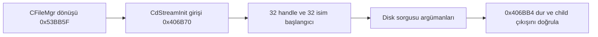

# D1-N2 — Streaming tablo hazırlığı ve toplu native analiz

Kod 0.1.37 / mimari v0.44, 14 Eylül 2026. [Durum](status.md) · [Önceki tamamlanan fonksiyon](d1-file-manager-ready.md) · [Ghidra araçları](../references/ghidra-bridge.md)

## Sorumluluk ve veri akışı

`--observe-cd-stream-tables <exe> <absolute-cwd>` önce tam CFileMgr dönüşünü doğrular; 0x53BB5F noktasından PUSH 5 ve CALL ile CdStreamInit'e girer. GTA'nın 32 dosya handle slotunu sıfırlayan döngüsü ve 32 adet 64-byte isim kaydının ilk byte'ını sıfırlayan döngüsü doğal olarak yürür. Disk sorgusunun beş argümanı hazırlanır. **Terminal 0x406BB4, GetDiskFreeSpaceA CALL önüdür.** Disk API'si, dosya açma/okuma, allocation, streaming thread, CPad ve initializer dönüşü bu iznin kapsamına girmez.

Bu kesit disassembly sayısını artırmak için bağımsız bir mikro hedef değildir: streaming'in bellek tablosu sözleşmesini ve sonraki I/O/thread aşamasının araştırma girdilerini oluşturur. Tam streaming başlatmasını tamamlanmış saymaz. `Run-SAEX.ps1` artık bu en ileri doğrulanmış kesiti çalıştırır; eski `--observe-file-manager-ready` kendi 0x53BB5F terminalinde kalır.

## Kimlik, bellek ve ABI sözleşmesi

[Policy](../../contracts/engine/cd-stream-tables-policy.json) önceki ready policy SHA-256'sına bağlıdır. [Generator](../../tools/cd_stream_tables_policy.py) bütün parent zincirini, section/overlap/range, caller ve 74-byte gövdeyi doğrular. Bu gövdenin son altı byte'ı yürütülmeyen import CALL'dur. Import adı yerel PE ve Ghidra analiziyle GetDiskFreeSpaceA olarak belirlendi; mevcut mod OS fonksiyonuna giriş izni vermediği için yeni OS export reçetesi eklemez.

| Alan | Sözleşme |
|---|---|
| Caller | 0x53BB5F, `push 5; call 0x406B70` |
| Handle tablosu | 0x8E4010, 32 × 4 byte; tamamı sıfırlanır |
| İsim tablosu | 0x8E4098, 32 × 64 byte; yalnız her kaydın ilk byte'ı sıfırlanır |
| Ölçülen bellek | 0x8E400C–0x8E489B, toplam 2.192 byte; iki tablo ve çevre/aralık alanları birlikte |
| Bütünlük | İzin verilen 160 byte dışında her byte önceki snapshot ile aynı kalır |
| Bellek erişimi | Aynı admitted image, COMMIT, yazılabilir tek region; guard/no-access reddi; bounded readback |
| Durak 1 | CdStreamInit girişi 0x406B70; tablolar henüz değişmemiştir |
| Durak 2 | 0x406BB4; tablolar ve argümanlar doğrulanmıştır |

C, 0x53BB5F caller ESP'sidir. İlk durakta ESP=C−8, stack `[0x53BB66,5]`, register ve flags (RF hariç) korunur. İkinci durakta ESP=C−48; beş disk argümanı `[0,C−12,C−24,C−16,C−20]`, ardından kaydedilmiş EDI bulunur. EAX=C−12, ECX=C−16, EDX=C−24, EDI=0x8E4090; EBX/ESI/EBP korunur. Son döngü karşılaştırmasında ZF/PF set, CF/SF/OF clear; AF tanımsız, RF breakpoint'e aittir; TF/DF reddedilir. Disk sonuç local'leri henüz OS tarafından yazılmamıştır; başlangıçta sıfır varsayılmaz.

Dış return adresi, 32-byte initializer parent ve 156-byte application caller korunur. Önceki root directory/suffix, normal SEH zinciri, bırakılmış CRT kilidi, yerelleştirme ve last-error yeniden okunur. Named event kimliği ve mevcut DR1/DR2/DR3 guard'ları korunur. Native araştırma aracı bu denetleyicinin bağımlılığı değildir.

## Arayüz, hata ve yaşam döngüsü

[C++ spec ve trace](../../include/saex/engine/cd_stream_tables.hpp), `run_cd_stream_tables` ve CLI ayrı izin yüzeyleridir. Yeni `cdStreamTablesObservation` stage/stop, beforeHex/afterHex, shape/frame/memory/arguments/parent korunumlarını ve `verified` sonucunu verir. `diskQueryCallAllowed`, `streamingThreadStarted`, `streamingReady`, root `canAttach` ve `initializationVerified` false kalır. Parent kayıtları tarihsel checkpoint snapshot'ıdır; onların eski terminali final EIP olarak yorumlanmaz.

Başarı native exit 3 + `cd_stream_tables_verified` + doğrulanmış child çıkışıdır. Ret 1, kullanım 2. Policy/spec retleri başlamadan; gövde farkı CFileMgr dönüşünde streaming CALL önünde; runtime memory/frame/args/parent farkları bulundukları durakta güvenli ret verir. Başarı veya hata sonrasında owned child sonlandırılır; bellek snapshot'ına rollback yapılmaz. Başka süreçlere attach, oyun dosyasını patch etme veya indirilen resource için native adres API'si yoktur. DR write watchpoint bütün thread'leri koruyan sandbox sayılmaz.

C++ `LoaderTrace` genişlediği için tüketiciler yeniden derlenir. Bootstrap C ABI 1, GNS, otorite, OS hash izinleri aynı kalır. Özellik kaldırılmadı; kalıcı veri migration'ı yok. PowerShell raporuna streaming tablo satırı eklendi; önceki sekiz kontrol korunarak dokuz kontrol oluşur. Rapor halen `playable=false`, `multiplayerReady=false` taşır.

## Kabul ve doğrulama

Portable suite her 2.192 bellek byte'ına ayrı bozulma uygular; range/overflow/overlap/caller, register, flags ve stage retlerini kapsar. Native fixture bütün tablo penceresini **0xA7** ile doldurur; böylece sıfır başlangıcı nedeniyle atlanan store'un gizlenmesi engellenir. 12 senaryo: pozitif, üç spec ret, iki runtime shape ret, parent query ret, event kotası, eski ready terminali, yabancı owner/recovery, yanlış cwd ve event çakışması. Disk CALL canary'si normal gözlemde çalışmaz; ayrı kontrol koşusunda marker ve exit 92 üretir. 12 warm çevrim handle eşitliğini sınar.

İlk derlemede fixture'daki CRT `tables` değişkeniyle yeni spec adı çakıştı; ikinci düzeltmede fazla geniş metin değiştirme iki fonksiyon adını bozdu. İki başarısız derleme log'u korundu; `stream_spec` ve doğru API adlarıyla üçüncü derleme geçti. İlk native test çalıştırması iki yeni suite'i geçirdi. İlk Debug gerçek GTA denemesi 0x406BB4 terminalinde dokuz rapor kontrolünü ve 17 girdi hash korunmasını doğruladı. Final build/matris sonuçları aşağıda ayrıca kaydedilir; bunlar N2/N3/D1/D2 bütünü için kapanış değildir.

## Sonraki aşama: disk ve thread için gerçek bağımlılık haritası

Yerel Ghidra projesi exact `f01a00ce…343ac` executable'dan üretildi. Bridge'in sınırlı export'u 15 fonksiyon içeriyor; **0x406560 thread girişini otomatik analiz fonksiyon olarak tanımadı**. Eksik root kayıtlıdır; varmış gibi üretilmedi. CdStreamOpen 0x4067B0 ve CdStreamRead 0x406A20, yerel dosyada sırasıyla **0x01564A90** ve **0x0156C2C0** gövdelerine yönlenir. Topluluk kaynağı bu dosya için tek başına eşdeğerlik kanıtı değildir. Unknown ABI, decompile/CFG/P-code eksikleri ve thunk'lar [araç snapshot'ında](../references/ghidra-bridge.md) açık kalır.

| Sonraki bütün | Kapanmadan gereken kanıt |
|---|---|
| Disk sorgusu ve allocation | GetDiskFreeSpaceA hata/başarı, geçerli sektör/alignment, native allocator ve LocalAlloc null yolları |
| İlk I/O denemesi | MODELS/GTA3.IMG erişilebilirliği ve özel kopya politikası, patched Open/Read hedeflerinin gövde/çağrı analizi, pending I/O ve completion |
| Thread başlangıcı | 5 kanal + kuyruk allocation, altı semaphore, `CdStream` adlı nesne çakışması, CreateThread/priority/resume, entry keşfi ve owned cleanup |
| CPad başlangıcı | Initialise/Clear ve klavye/controller helper'ları, iki pad'in bellek sınırları; input polling ile karıştırılmaz |
| İlk initializer dönüşü | Önceki bütünler + boolean/AL dönüş ABI'si ve RsInitialize'e güvenli geçiş |

Ghidra'nın prototip veya C kodu çıktısı otomatik native izin üretmez. Keyfî geometri yıkımı, multiplayer senkronizasyonu, trafik/hayvan AI'sı veya production sandbox bu çalışma ile hazır hale gelmez; mimari hedefleri ve GNS seçimi korunur.

CLI corpus ayrıca yeni modun bilinmeyen executable, eksik/fazla argüman ve relative cwd retlerini; eski ready çıktısında yeni gözlemin null kalmasını sınar. Bu retler GTA başlatmadan çalışır ve girdi dosyasını korur.

## 0.1.37 — Bootstrap fixture stack regresyonu

İlk tam Debug kontrolünde 51/52 suite geçti; bootstrap lifecycle fixture çalıştırıcısı **0xC00000FD (stack overflow)** ile çıktı. Ortak trace'e tablo snapshot'ları eklenince eski testteki çok sayıda değer olarak tutulan büyük sonuç ve ternary temporary x86 stack sınırını aştı. Test çalıştırıcısı sonuçları heap üzerinde tutacak ve tek dispatch return slot'u kullanacak şekilde düzeltildi. Test senaryoları, üretim stack reserve, native izinler ve doğrulamalar gevşetilmedi. Hata `cd-stream-bootstrap-failure.json` ve ilk tam Debug log'unda korunur; hedefli tekrar ve tam sonuçlar final kanıtta kaydedilir.

## Araştırmadan çıkan iki davranış önkoşulu

Yerel 0x406BBA sonrası komutlar GetDiskFreeSpaceA BOOL sonucunu kontrol etmeden sektör local'ini okuyor; bu local prologue'da sıfırlanmıyor. Topluluk CdStreamInfo kaynağındaki sıfır local initialization bu executable'a aktarılmış varsayılamaz. Sonraki API dönüşü izninde başarısız sorgu, alanlar kullanılmadan observer tarafından sonlandırılmalı; sıfır/geçersiz sektör veya allocation null yolu başarı sayılmamalıdır.

CdStreamInit, `gStreamingInitialized=1` yazımını CdStreamInitThread çağrısından önce yapıyor; thread helper semaphore/thread hatalarında void dönüyor. Bu nedenle tek bayrak veya initializer RET'i streaming hazır kanıtı değildir. Beş kanal semaphore'u, kuyruk, ortak semaphore, doğru thread entry/ID/handle ve yaşam döngüsü ayrı doğrulanmadan `streamingReady` açılmayacaktır. Bu çıkarımlar Ghidra decompile ile exact disassembly birlikte incelenerek sonraki aşamaya kondu; mevcut runtime sınırı değişmedi.

## Nihai doğrulama — kod 0.1.37

Canonical kayıtlar `out/verification/engine/cd-stream-tables-final-verification.json` ve `cd-stream-tables-gta-evidence.json`; araştırma çıktısı `out/research/ghidra-bridge/snapshot-v1/snapshot.json`.

| Ölçüm | Sonuç ve sınır |
|---|---|
| x86 Release standart akış | **52 native / 79 managed / 304 Python**, tek tam başarılı build |
| x86 Debug | İlk tam native 51/52; stack overflow düzeltmesinden sonra ilgili suite 1/1 geçti; kalan standart akış 79 managed / 304 Python geçti. Birleşik doğrulamadır; tek temiz full koşu değildir |
| Yeni portable suite | **2.231 kontrol**, x86 Debug/Release ve ayrıca x64 Debug geçti |
| Yeni Windows fixture | **12 senaryo + disk-call canary + 12 warm**; Debug 145→145, Release 144→144 handle |
| Bootstrap regresyon onarımı | Test runner heap'e taşındı; 31 lifecycle senaryosu ve 12 warm korundu; üretim stack reserve değişmedi |
| Gerçek GTA matrisi | **60/60** beklenen sonuç, **20** pozitif tablo hazırlığı; 123–126 ANSI-byte cwd geçer, 127 byte önceden reddedilir |
| Süreç ve girdiler | **55/55** oluşturulan child kapandı, **178/178** girdi hash'i aynı; beş preflight rette child yok |
| Orijinal/host durum | Oyun dosyaları değişmedi; foreground timeout 2147483647→2147483647 (SPI_GET). Önceki CALL suppression kanıtının yerine geçmez |
| Tek komutluk rapor | Windows PowerShell 5.1 Debug ve Release **9/9**, her koşuda **17/17** girdi korunumu |
| Kaynak/config freeze | Son düzeltme sonrasındaki **330/330** dosya hash'i final kontrolde aynı |
| Ghidra/bridge | 15 export, bir eksik root, 15 açık issue; verify exit 3, decompile/context CLI exit 0. Native permission ve full closure false |

İlk freeze, yalnız bootstrap test onarımı nedeniyle değişti; `cd-stream-final-source-inputs.json` tarihsel, `cd-stream-final-source-inputs-2.json` son kaynak girdisidir. İlk başarısız Debug tam log'u ve `cd-stream-bootstrap-failure.json` saklandı. Hedefli onarım `cd-stream-bootstrap-fix-test.log`; kalan standart kontroller `cd-stream-debug-remaining.log`; temiz Release `cd-stream-build-x86-Release-final.log`. Hiçbir başarısızlık başarılı koşu sayısına eklenmedi.

X64 Release, Linux, hosted CI ve N1 SDK yeniden çalıştırılmadı. Private kopyalar ve önceki kanıtlar korunur; hiçbir orijinal dosya silinmedi/patch edilmedi. Bu kesit streaming tablolarını doğrular; disk sorgusu, allocation, I/O, thread ve CPad/initializer dönüşü, renderer/doğal frame, production IPC/sandbox ile D1/D2 açık kalır.

| Artifact | Debug SHA-256 | Release SHA-256 |
|---|---|---|
| saex_engine_loader_probe.exe | `a069fc48961b8bb6e883f6936c0a1dc673ebdc445dd1b1dc59b8a4329244aa88` | `56b0b331084ffa9c811c1a25c54fa787fc59f217890370864eeb1dc9086fb7d3` |
| saex_bootstrap.dll | `76bddbac6984b6f77c8176c5be160ea241724e01bf9ce0dd9d8635248e26acbe` | `eaab67ac564fb52e3db767ec4efbf4c0d3b6ed0aeac64d6c34c35d384d8a3273` |
| saex_bootstrap.map | `79be4aa18b9a0f67f6c29ae2687bfd8cb4a4352f542a144018150f5533c874b0` | `d62c1e2fd00946af04c8af5c29cf1c0631b6ec395fc68f9d068b9d25fdfec241` |

Policy SHA-256: `cf13c6732681f4b2a33f0e8c74c1f12d2a1f5c37975dd9c387ebec361b477aa3`. Araştırma lock SHA-256: `03d999f9b72fbcbdf23d55b310ab1d8d7d98f4e7085643a100551a17bdc37ac6`. Doküman güncellemesi bu artifact hash'lerini değiştirmez.
