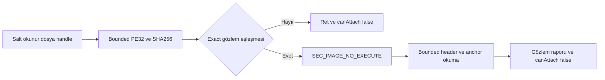

# D1-N2 executable gözlemi ve çalıştırılmayan image doğrulaması

Tarih: 13 Eylül 2026. Mimari v0.9 / kod 0.1.2. Durum: **N2 dosya ve çalıştırılmayan image alt kümesi uygulandı; gerçek process/bootstrap kapıları açık**. [Durum](status.md) · [Uygulama sırası](d1-engine-integration.md) · [Normatif sözleşme](../architecture/native-sdk-integration.md) · [ADR-37](../decisions/architecture-decisions.md)

## Sorumluluk ve uygulanan sınır

`saex_engine_preflight` C++20 static library'si PE32 sınırlarını, exact gözlem profilini ve sınırlı image okumalarını denetler. Plugin-SDK'ye, core scheduler'a veya oyun DLL'sine bağlı değildir. Windows `saex_engine_image_probe`, kendi sürecinde salt okunur dosya ve çalıştırılmayan image eşlemesi oluşturur. C# `engine inspect` aynı JSON kaynağını assembly içine gömerek dosya hash/layout/anchor eşleşmesini raporlar; image eşlemesi yapmaz.

Bu kesitte `LoadLibrary`, GTA başlatma, DllMain, TLS callback, oyun fonksiyonu çağrısı, hook yazımı ve capability açma yolu yoktur. `canAttach=false` her sonuçta sabittir. Başarılı gözlem, gelecekteki `mapped_image_verified` runtime geçişi değildir. Gerçek GTA'nın unpack/başlatma fazı, function ABI ve callback yaşamı henüz gözlenmedi.

## Kaynaklar ve veri akışı

| Kaynak | Sorumluluk / arayüz |
|---|---|
| [Gözlem kaydı](../../contracts/engine/observed-profile.json) | `observationOnly=true`; dosya kimliği, PE düzeni, indeksli bölümler, en fazla 32 kısa anchor, kaynak/kanıt sınırı |
| [Generator](../../tools/engine_profiles.py) | JSON → [constexpr native veri](../../include/saex/engine/observed_profile.generated.hpp); kaynak SHA-256 ve `--check`; duplicate key ve runtime yükseltme ret |
| [PE parser](../../src/engine/bootstrap/pe_image.cpp) | `parse_pe32` → hata veya checked `PeLayout`; RVA → raw offset dönüşümü |
| [Profil kapısı](../../src/engine/bootstrap/profile_gate.cpp) | `match_file_observation`, `check_mapped_observation`; vendor adresi çağırmadan sonuç |
| [Windows reader](../../src/engine/bootstrap/windows_image_reader.cpp) | `ImageReader.copy`: sınır, `VirtualQuery`, kendi process'ine `ReadProcessMemory`, eksik okumada ret |
| [Native CLI](../../src/engine/bootstrap/image_probe.cpp) | Aynı salt okunur handle'dan dosya okuma/CNG SHA-256 → parser → profil → OS image eşlemesi → header/anchor karşılaştırma → JSON |
| [C# gözlemi](../../managed/Saex.Tools/EngineObservation.cs) | Gömülü JSON kaynağı; PEReader metadata ve disk anchor karşılaştırması; verified runtime kimliği vermez |



`match_file_observation` hash'i kendi hesaplamaz; CLI aynı handle'dan okuduğu byte'ların hash'ini hesaplar ve parser sonucuyla birlikte verir. Bu internal test seam'i client'ın iddia ettiği hash'i güvenilir sayan ağ arayüzü değildir. Reader hedef PID almaz; yalnız probe'un sahip olduğu image görünümü okunur. Ham pointer public SDK/IPC'ye taşınmaz.

## PE ve bellek kuralları

Native giriş 64 byte–256 MiB dosya, I386/PE32, executable/non-DLL/non-CLR ve 1–96 bölümle sınırlıdır. DOS/PE/optional header ve section table aralıkları, declared directory boyutu, hizalama, image-base taşması, raw/virtual sınırlar ve çakışmalar kontrol edilir. Entry point yürütülebilir ve dosya karşılığı olan bölümde olmalıdır. Zero-fill alanı raw dosya byte'ı sayılmaz. Bölüm adları tekil olmak zorunda değildir; index/RVA kimliktir.

Bu SAEX adaylarına yönelik sınırlı uyumluluk parser'ıdır; bütün geçerli PE çeşitlerini destekleme veya imports/TLS/relocation/Authenticode doğrulama iddiası yoktur. C# PEReader incelemesi bunun birebir genel PE decoder'ı değildir: bilinen dosyada aynı exact hash/layout/anchor sözleşmesini kontrol eder. Native mapping girişinde native parser tekrar zorunludur; managed rapor native kapıyı atlatamaz.

Profilde 1–32 anchor, anchor başına 1–16 byte ve geçerli executable section index gerekir. Image okumaları en fazla 1024 byte; başlıklar parça parça, anchor'lar kendi RVA'larında karşılaştırılır. Reader `MEM_COMMIT`, `MEM_IMAGE`, doğru AllocationBase ve okunabilir sayfa ister; guard/no-access/aralık dışı sayfa veya eksik okuma başarısızdır. Query ile okuma atomik değildir; gerçek okuma sonucu ayrıca kontrol edilir. Düşmanca process'e karşı anti-cheat güvencesi çıkarılmaz.

Dosya `GENERIC_READ/FILE_SHARE_READ` ile açılır. Exact dosya eşleşmesi olmayan giriş OS image eşlemesine ulaşmaz. Windows `PAGE_READONLY | SEC_IMAGE_NO_EXECUTE` eşlemesi kod çalıştırmadan RVA düzenini verir; bu SDK yükleme yöntemi değildir. Probe, CNG `BCryptHash` kullanımı nedeniyle Windows 10+ hedefidir. [PE biçimi](https://learn.microsoft.com/en-us/windows/win32/debug/pe-format), [CreateFileMapping](https://learn.microsoft.com/en-us/windows/win32/api/winbase/nf-winbase-createfilemappinga), [VirtualQuery](https://learn.microsoft.com/en-us/windows/win32/api/memoryapi/nf-memoryapi-virtualquery), [ReadProcessMemory](https://learn.microsoft.com/en-us/windows/win32/api/memoryapi/nf-memoryapi-readprocessmemory), [BCryptHash](https://learn.microsoft.com/en-us/windows/win32/api/bcrypt/nf-bcrypt-bcrypthash).

## Gözlemlenen yerel dosya

Kullanıcının verdiği kurulumdaki `gta_sa.exe`: **14.383.616 byte**, SHA-256 `f01a00ce950fa40ca1ed59df0e789848c6edcf6405456274965885d0929343ac`. Gözlem kimliği `gta-sa.observed.f01a00ce950fa40c`; tam hash kontrolü kısaltılmış kimlikten bağımsız zorunludur. JSON kaynak digest'i `0653426a913c3fdef809ea9e6a614fca7d26498e66cb63148d7073fe8d965436`.

PE timestamp `0x427101ca`, preferred base `0x400000`, entry RVA `0x424570`, SizeOfImage `0x1177000`, SizeOfHeaders `1024`, 11 bölüm gözlendi. `.text` ve `.data` tekrarlı adları kabul edildi. `.HOODLUM` ve SDK version marker eşleşmesi **Hoodlum adayı** bulgusudur; bu ad bir doğrulanmış GTA 1.0 US/runtime destek profili değildir.

| Anchor | RVA / bölüm indeksi | Disk byte'ları | Diskte çözülen göreli hedef RVA |
|---|---|---|---|
| version-marker | `0x1000` / 0 | `e97b191601` | `0x1162980` |
| game-process-call | `0x13e981` / 0 | `e85ad5ffff` | `0x13bee0` |
| init-game-call | `0x348cfb` / 0 | `e88058dfff` | `0x13e580` |
| shutdown-rw-call | `0x13d910` / 0 | `e86be2ffff` | `0x13bb80` |

Adres adayları pinned SDK [GameVersion.cpp](https://github.com/Dryxio/plugin-sdk-sa/blob/b55e89b336a81448c1aa1a5b188431c9845ebaa9/shared/GameVersion.cpp) ve [Events.h](https://github.com/Dryxio/plugin-sdk-sa/blob/b55e89b336a81448c1aa1a5b188431c9845ebaa9/shared/Events.h) ile karşılaştırıldı. Kısa çağrı/jump byte'larından göreli hedef hesabı, bütün fonksiyonun disassembly/ABI kanıtı değildir. Hedefler çağrılmadı; runtimeVerified her anchor'da false. Kaynak araştırması N1'in 23 dosyalı derleme envanterine yeni SDK dosyası eklemez.

## Çıktı ve hata davranışı

Native CLI başarı gözleminde `scope=non-executing-image-observation`, `fileProfileMatched=true`, `mappedHeadersAndAnchorsMatched=true`, dört anchor, process pointer genişliği ve profil/source digest'lerini verir. **Exit 3**: gözlem tamamlandı, runtime destek kapalı. **Exit 1**: dosya/PE/hash/layout/anchor/okuma/mapping reddi; **exit 2**: kullanım hatası. Mevcut sürümde exit 0 yolu yoktur.

C# CLI başarılı dosya incelemesinde exit 3 verir; `fileProfileMatched`/`observedProfileId` yeni alanları dosya gözlemini, `recognizedProfile=false` ve `canAttach=false` ise runtime sınırını gösterir. Eski `unverified_engine_profile` nedeni bilinen gözlem için `observed_profile_runtime_unverified`, bilinmeyen native dosya için `unknown_fingerprint` oldu. Otomasyonlar neden adını buna göre günceller; tek başına yeni alan varlığı attach izni değildir. Native CLI bozuk/bilinmeyen dosyada exit 1, C# geçerli ancak bilinmeyen PE gözleminde exit 3 kullanır; iki CLI'nin çıkış sözleşmesi ayrıdır.

## Doğrulama ve yeniden üretim

Standart [build script'i](workflow.md) iki generator'ın drift kontrolünü, native CTest'i, managed fixture'ları ve tooling testlerini çalıştırır. Yerel GTA hiçbir standart testin zorunlu girdisi değildir.

- Native yeni suite: 18 PE alan mutasyonu (ikisi geçerli sınır örneği), 1.536 eksik dosya prefix'i, RVA/zero-fill/overflow, dosya hash/layout/anchor, bozuk/unreadable mapped image ve Windows reader retleri. Mevcut 16 foundation testi ayrı suite'tir; prefix sayısı bağımsız test sayısına eklenmez.
- Managed: 26 test; yeni bilinmeyen native hash reddi ve mevcut PE testinde gömülü JSON kaynak digest kontrolü.
- Python: 8 generator profil testi, 4 gerçek native CLI ret testi, mevcut 5 belge tooling testi. Aynı marker'ı taşıyan sentetik PE doğru hash olmadan reddedilir; fixture dosyasının değişmediği kontrol edilir.
- Gerçek dosya gözlemi: x64 Debug, x86 Debug ve x86 Release CLI çalıştırılmayan image üzerinde tüm başlıkları ve dört anchor'ı eşleştirdi. C# aynı dosya ve JSON kaynak digest'ini doğruladı. `canAttach=false` ve exit 3 korundu; dosya SHA-256'sı öncesi/sonrası aynı kaldı. Bu kayıt gerçek oyunun açıldığına kanıt değildir.

13 Eylül 2026 yerel koşusu (UTC 12 Eylül 22:23): **Windows x64 Debug, x86 Debug ve x86 Release** için standart build'in iki generator, iki CTest suite'i, 26 managed ve 17 Python testi geçti. Windows sürümü 10.0.26200; MSVC 19.44.35228.0, Windows SDK 10.0.26100.0, CMake 4.3.3 ve .NET SDK 10.0.300 kullanıldı. Linux ve bu yeni kesitin x64 Release koşusu yapılmadı. N1 source/patch/recipe salt okunur verify yeniden geçti; kilidi değişmedi ve SDK yeniden derlenmedi.

| Gözlem artifact'i | SHA-256 | Sonuç |
|---|---|---|
| x86 Debug probe | `8dd79418805b7938340e9f82ed07a63591fc7c4a4cf1b56b5f9ee60720a1d451` | 32 bit, header + 4 anchor, exit 3 |
| x64 Debug probe | `6ddedb7852fc3fafe3807d4d4d2d8a8b2c6750db7c996347fd230e65699ca2de` | 64 bit, header + 4 anchor, exit 3 |
| x86 Release probe | `cacfb307afbba0f49dc6080f91c6fd2cda46d23e69abdae6293bd7f47280d2d4` | 32 bit, header + 4 anchor, exit 3 |

Bunlar bu koşunun artifact kimlikleridir; yeniden derlemenin aynı hash'i üretme garantisi değildir. `image-observation-x86-Debug.json`, `image-observation-x64-Debug.json`, `image-observation-x86-Release.json` ve `file-observation-managed.json` yerel doğrulama dizininde tutulur. Belge gate'i 69 Markdown, 801 yerel bağlantı ve 6 JSON örneğinde sıfır hata raporladı; anlamsal/native runtime doğruluğu bu sayılardan çıkarılmaz.

Yerel, açık dosya gözlemi için derlemeden sonra:

```powershell
./out/windows-x86/Debug/saex_engine_image_probe.exe "C:\Program Files (x86)\Rockstar Games\GTA San Andreas\gta_sa.exe"
# Beklenen exit 3: observation-only; sıfır exit bekleyen otomasyonda bunu açık işle.
dotnet managed/Saex.Tools/bin/Debug/net10.0/Saex.Tools.dll engine inspect "C:\Program Files (x86)\Rockstar Games\GTA San Andreas\gta_sa.exe"
```

JSON koşu kayıtları `out/verification/engine/` altında yerel kanıt olarak tutulur. Probe kendi handle/view kaynaklarını bütün çıkışlarda bırakır; oyun dosyası ve kurulumuna çıktı yazmaz. Başka binary'yi gözlem profiline eklemek exact kaynak/byte incelemesi, generator, negatif test ve belge güncellemesi ister; runtime aktivasyonu yeni sözleşme/kanıt gerektirir.

## Kalan kapılar ve kabul

AC-90/R-01a'nın dosya ve çalıştırılmayan image alt kanıtı oluştu. R-01a hâlâ kullanılan function ABI/instruction kapsamını, unpack/başlatma fazını ve **gerçek GTA process'inde** mapped hook koşullarını bekler. R-01b için SDK bağımsız gerçek bootstrap modülü, load sırası ve statik initializer/TLS envanteri yoktur. N2 tamamlandı veya N3'e geçiş açıldı denmez.

Bir sonraki kesit bu aday executable'ın runtime/symbol faz kanıtı ve bootstrap girişidir; ardından N3 init/frame/stop observer ve temiz kapanış gelir. GNS, sandbox, entity/asset binding, multiplayer, trafik veya hayvan capability'si bu gözlemden açılmaz. [AC-90](../validation/scenarios.md) ve [araştırma kaydı](../decisions/research-register.md) bu ayrımı korur.

## Kod 0.1.3 devamı

Kod 0.1.4'ün [askıdaki process gözlemi](d1-suspended-process.md), aynı dosya kapısını ayrı CLI'den kullanır; mevcut SEC_IMAGE_NO_EXECUTE CLI davranışı değişmedi. İki CLI'nin negatif testleri aynı [sentetik PE yordamını](../../tests/engine/pe_fixture.py) paylaşır; synthetic dosya çalıştırılmaz. Yeni observer ilk create-debug olayında gerçek owned image'i okur, oyun kodu yürütülmeden çıkışı doğrular. Bu raporun eski “GTA process gözlemi yok” sınırı tarihsel 0.1.2 kapsamıdır; güncel alt kanıt ayrı rapordadır. Unpack/başlatma fazı, function ABI ve gerçek DLL load sırası hâlâ açıktır.

Bu raporun artifact kimlikleri ve ilk sonuçları kod 0.1.2'ye aittir. Kod 0.1.3, CLI'nin salt okunur dosya/hash kontrolünü [WindowsFileObservation](../../src/engine/bootstrap/windows_file_observation.cpp) içine ortaklaştırdı; CLI JSON/exit sözleşmesi ve observation-only profili değişmedi. Aynı yordam yeni [başlangıç DLL'sinde](d1-bootstrap-module.md) kullanılır. Yeni DLL'nin yüklenmesi ve export çağrıları ayrı oyun dışı test kapsamıdır; önceki çalıştırılmayan-image kanıtı gerçek GTA bootstrap kanıtına yükseltilmedi. Yeni kaynak digest'i veya profil kaydı oluşturulmadı.

## Kod 0.1.6 ile ilişki

[Yeni loader gözlemi](d1-loader-observation.md), bu exact dosya/image kapısını değiştirmeden çağırır; root executable profile ve dört anchor geçmeden loader ilerlemez. Ortak include ailesine eklenen LoaderFile/LoaderObservation yalnız ayrı x86 observer'a aittir. ObservedProfile JSON/digest, native parser kuralları ve bootstrap DLL C ABI aynı kalır. Disk/image gözlemi initial breakpoint veya initializer kanıtı sayılmaz.

## Kod 0.1.7 ile ilişki

[Yeni mapping recipe](d1-loader-policy.md), ObservedProfile JSON'u/engine digest'ini değiştirmez. Loader policy kendi engineSha256 bağı ve source digest'iyle ayrı generated header taşır. Exact dosya ve create-debug image kontrolü yine ilk kapıdır; yalnız bu kapıyı geçmek doğru DLL çevresi veya launch context onayı değildir. Private kopyadaki bit eşitliği, orijinal kurulumun compatibility sonucunu değiştirmez.

## Kod 0.1.8 devamı — Preflight ve context ayrımı

[Yeni LaunchContext](d1-launch-context.md) dosya/image kanıtına runtime izin eklemez. Loader CLI executable absolute yolunu bir kere çözerek WindowsFileObservation, yerel modül kökü ve SuspendedImage'a aynı yolu geçirir. Unknown hash için explicit cwd/environment hazır olsa bile child açılmaz. Eski engine image/process CLI sözleşmesi değişmedi.

0.1.8 explicit context gözleminde beklenmeyen OS debug olayının tanısı için loader çıktısına lastEventCode/lastEventThreadId eklendi. Son alınan olay metadata'sıdır; initialization kanıtı veya olayın devamına izin değildir. Child öncesi retlerde ikisi de sıfırdır. Unknown event terminal ret davranışı ve incelenmiş DLL policy değişmedi.

## Kod 0.1.9 devamı — Dosya kanıtının mapping'e taşınması

[Loader ledger](d1-loader-lifecycle.md) native dosya/image preflight kapısını değiştirmez. Her LOAD pinleri yeniden doğrular; geçmişte aynı base'te görülen dosya, şu anki eşlemenin kanıtı değildir. Header/anchor observation ve bootstrap C ABI aynı kalır; runtime function/ABI açılmaz.

## Kod 0.1.11 — EntryStopSpec observation profilinden üretilir

[Yeni sınırlı entry komutu](d1-entry-boundary.md) mevcut WindowsFileObservation sonucunun validated PeLayout.entry_rva ve raw_offset ile ilk 16 dosya byte'ını kullanır. Bilinmeyen profile runtime izni verilmez; gözlem JSON'u, generator, kısa anchor'lar ve bootstrap C ABI değişmez. Dosya/image/ilk-create preflight sonucu ile DLL/TLS sonrası entry byte mutation ayrı kanıttır; unpack/function ABI hakkında çıkarım yapılmaz.

## Kod 0.1.11 — Entry supplement bağı

Entry supplement observed engine SHA ve base policy SHA’sını birlikte doğrular; generated header static_assert’i base drift’ini reddeder. Engine observation/anchor/support ve bootstrap C ABI değişmez. [Ayrıntı](d1-entry-boundary.md).

## GitHub kaynak yayını — taşınabilirlik düzeltmesi

Portable bootstrap session fallback türü GCC -Werror uyumu için uint32_t olarak açıklaştırıldı. PE parser, observation source/anchor/hash ve invalid reason reddi değişmez. Yeni bir executable veya capability onayı verilmedi.

## Kod 0.1.12 — Proxy dönüş sınırı

[ProxyReturn alt kesiti](d1-proxy-return.md) preflight sonrası açık yürütme modudur; observed-profile, dört file/create-time anchor ve unknown-exe kapısı değiştirilmez. Yeni proxy RVA’ları exact dosya incelemesinden türetilir ve entry-policy digest bağı taşır. Giriş baytlarının geri gelmesi bütün mapped image’ın unpack/ABI eşitliği değildir.

## Kod 0.1.13 — Startup çağrı sınırı

[Üçüncü runtime durak](d1-startup-call.md) observed profile’ın dört anchor’ını yeniden okur. Girdi 1–4 adet, 1–16 byte uzunluk, geçerli RVA, çakışmama ve create-time expected byte eşitliği ister. Runtime değişim tanısal match=false; okunamama incomplete ret. Profile JSON/engine hash ve dört anchor değiştirilmedi; initialized profile veya canAttach onayı oluşmaz.
