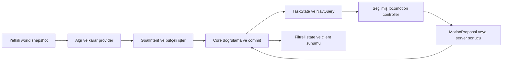

# Ortak Agent altyapısı, AI, navigasyon ve hareket

Durum: v0.4 temel tasarım, v0.5 zaman/kurtarma düzeltmeleri; ADR-26/28/29. [PopulationService](population-traffic.md) · [Hayvan tanımları](animals-species.md) · [Execution](../architecture/execution-contracts.md)

## Sorumluluk ve katmanlar

AgentService; insan NPC, sürücü, pilot ve hayvan için ortak kimlik, görev ve controller sözleşmesini sağlar. Karar politikaları C# provider'larda veya doğrulanmış veri grafiklerinde bulunur. C++ core scheduling, mutator denetimi, state yayımı ve lease gözetimi yapar. GTA x86 adapter yalnız desteklenen native görev/hareket/sunum komutlarını uygular. Her ajan için process/worker oluşturulmaz; bir resource worker bütçeli ajan gruplarını yönetir.

| Katman | Girdi → çıktı | Otorite / hata sınırı |
|---|---|---|
| Perception | Yetkili world snapshot ve stimulus → sınırlı algı kayıtları | Server filtre/query; client gözlemi doğrulanacak adaydır |
| Decision | Algı, ihtiyaç, ilişki, schedule → GoalIntent | Server provider; deadline/izin sınırlı |
| Task | Kabul edilen goal → görev aşaması ve hedef | Tek mutator; interrupt/cancel sözleşmesi |
| Navigation | Hedef + traversability + revision → PathResult | Async server query; stale sonuç ret |
| Locomotion | Yol/görev + accepted state → hareket önerisi/sonucu | Seçilmiş native veya server controller |
| Presentation | Accepted motion/action/animation state → görüntü ve ses | Client; gameplay hasarı veya ödülü kesinleştirmez |

Bu diyagramdaki çevrim tick'ler arasında bounded çalışma akışıdır; WorldPlan schedule DAG'ında aynı tick içi sonsuz callback döngüsü değildir.

## Şemalı ortak veriler

| Component / kayıt | Asgari alanlar | Paylaşım |
|---|---|---|
| AgentIdentity | EntityRef, AgentKind, DefinitionRef, DefinitionRevision | İzinli public tür/model bilgisi |
| AgentTaskState | TaskInstanceId, definition, phase, target refs, startTick, deadline, cancellation generation | Gösterim için gereken alt küme; gizli hedefler server-only |
| AgentLocomotionState | ControllerRef, mode, path progress, accepted velocity, motion mode | Public motion + gereken state |
| AgentVitals | Health/life state ve profile bağlı ihtiyaçlar | Alan bazında görünürlük; tek vitality mutator |
| AgentRelations | GroupRef, role, owner/bond/mission ilişkileri | Kapsama göre public/private |
| AgentBlackboard | Şemalı anahtarlar, typed bounded değerler, TTL | Varsayılan server-only; CLR nesne grafiği yok |
| PerceptionMemory | StimulusId, kaynak/sınıf, gözlem tick'i, güven düzeyi ve expiry | Varsayılan server-only; sınırlı kayıt |
| PathResult | QueryId, EntityRef, TaskInstanceId, ControllerRef, read revision set, path/corridor ve status | Server iş sonucu; client'a gereken rota alt kümesi |

StateRevision aggregate için mevcut sayaçtır; task fazı veya controller değişimi bunu artırır. MotionSequence sampled akış içindir. TaskInstanceId bir görev yürütümüdür; native task pointer'ı, kalıcı birey kimliği veya OperationId değildir. Aynı enum/kimlik başka anlamla kullanılmaz.

## Karar modeli ve görev yaşamı

İlk referans davranış modeli sınırlı hierarchical state machine ile typed koşul/action düğümleridir. Utility seçimi veya behavior tree alternatif provider olabilir; çekirdek belirli editör veya ağaç kütüphanesine bağlanmaz. Behavior graph döngüsü ilan edilmiş tick yield, max transitions ve cancel noktası olmadan çalışamaz. İndirilmiş graph native fonksiyon adresi veya serbest ifade değerlendirmesi açmaz.

Görev `requested → accepted → running → succeeded/failed/cancelled` aşamalarını taşır; `suspended` ancak tanım destekliyorsa kullanılır. Her görev timeout, interrupt policy, temizlenecek rezervler ve provider kaybı sonucunu ilan eder. Öncelik aynı kaynaktan doğrulanan life-state/emergency, mission/player interaction ve ambient hedef sınıflarıyla çözülür; tasarımcı ilan edilmiş sıralamayı profil içinde değiştirebilir. İstemci priority sayısını yükselterek görevi devralamaz.

Ölüm önce accepted life state'i değiştirir, saldırı/rota/koltuk/etkileşim işi iptal veya devretme kurallarına girer. Eski bite/strike/enter-vehicle tamamlanması cancellation generation ve StateRevision ile reddedilir. Kalıcı sonuç doğuran adımlar OperationId ile tekilleşir. Uzun görev restart'ta native stack'ten devam etmez; saklanmış domain aşamasından yeni TaskInstanceId ve doğrulanmış rota ile kurulur.

## Algı, ihtiyaç ve sosyal davranış

Görüş, işitme, temas, tehlike ve isteğe bağlı koku farklı PerceptionProfile kanallarıdır. Algı aralığı, görüş konisi, sorgu sıklığı, hatırlama süresi ve hedef filtreleri veriyle tanımlanır. Tüm ajanları tüm diğer ajanlarla her tick karşılaştıran sınırsız O(n²) tarama kullanılmaz; mekânsal aday seçimi, sabit kota ve olay birleştirme vardır.

Silah sesi server'ın kabul ettiği olaydan stimulus üretir. Client ses seviyesini kısması hayvanın duymamasına yol açmaz. İnsan mikrofonunun içeriği AI girdisi değildir; proximity voice otomatik algıya bağlanmaz. Koku, görüş ve işitme oyun tasarımı modelleridir; gerçek biyolojik doğruluk iddiası taşımaz.

Hunger/fatigue/bond/threat gibi değerler ayrı isteğe bağlı component'lerdir. Bir türün “aggressive” etiketi doğrudan hasar izni vermez; target, world, cooldown ve action koşulları geçerlidir. Private hedef/algı hafızası observer'lara veya debug yetkisi olmayan oyuncuya gönderilmez.

## Navigasyon sözleşmesi

| Traversal sınıfı | Veri ve kısıt |
|---|---|
| Ground pedestrian / creature | Gövde yarıçapı/yüksekliği, slope, step, clearance, yüzey ve geçiş etiketleri |
| Road vehicle | Yönlü şeritler, dönüş yarıçapı, araç boyutu, kavşak/ışık/rezervasyon |
| Aircraft | 3B koridor/irtifa, hız/dönüş sınıfı, yaklaşma/iniş alanı ve hava sahası |
| Aquatic | Su hacmi/derinlik/yüzey sınırı; yüzme controller capability'si |
| Special traversal | Zıplama, tırmanma, binme veya uçuş geçişi; ayrı destekli bağlantı/action |

Bir navmesh bütün hayvan ve araçlara otomatik uymaz. Büyük sığırın geçemediği açıklıktan küçük köpek geçebilir; test edilmiş ölçü profili gerekir. Kuş uçuşu ile uçak şerit/koridor mantığı farklı controller ve collision sınıfları kullanır. Native GTA path nodes import'u bir adapter araştırmasıdır; özel haritalar kendi kaynağı doğrulanmış nav verisini üretebilir. R-10 kütüphane/algoritma ve format seçimini kanıtla sabitler; bu belgede hazır solver seçilmez.

Path query immutable snapshot'tan EntityRef, TaskInstanceId, world/resource epoch, task cancellation generation, nav cell generation, collider/catalog ve agent traversal digest'ini alır. Sonuç uygulanmadan hepsi gerekli read set kapsamında doğrulanır. Query `complete`, `partial`, `unreachable`, `cancelled`, `budget-exceeded` veya `stale` olabilir. Partial path hedefe ulaşıldı demek değildir.

Dinamik engel eklendiğinde güncel collision yolu hemen kapatır; nav rebuild bitene kadar güvenli bekleme veya güncel collider ile sınanmış kısa avoidance kullanılır. Engel kaldırıldığında yeni yol açılması gecikebilir. Yıkımın [ChangeSet](../networking/world-change-projections.md) invalidation'ı kaçırılırsa cell generation uyuşmazlığı cache'i reddeder. İlan edilen nav-cache hedefi 500 ms'dir, stale yolu kabul etme süresi değildir.

## Native hareket, sahiplik ve temas

MTA `setPedControlState` girdilerinin server ped'lerinde otomatik senkronize edilmediğini belirtir. Bu nedenle SAEX task, controller, animasyon ve motion state'ini açıkça taşımalıdır. [MTA referansı](https://wiki.multitheftauto.com/wiki/SetPedControlState)

Server hedef/görevi belirler. `validated-native` modunda atanan client destekli native locomotion'u yürütür ve öneri gönderir; server sınır/query kontrolleri yapar. Observer aynı AI'ı bağımsız çalıştırıp yeni hedef/hasar oluşturmaz. Controller destekliyorsa remote presentation görevleri accepted timeline'ı gösterir, authoritative karar vermez. `server-simulated` yalnız o controller/shape için kanıt varsa seçilir; bütün GTA AI sunucuda çalışıyor sayılmaz.

Araç/sürücü/yolcu ilişkisi, gerekli motion grubunda tek owner epoch ile tutarlı kurulur. Sürücünün AI hedef sahipliği server'da kalır. Hayvan sürüsü sosyal gruptur; tüm sürü tek fizik ownership grubu olmak zorunda değildir. İp/çekme/binme gibi fizik bağları yalnız cross-body capability varsa desteklenir. Owner, hayvanın gameplay sahibi değildir.

Owner kaybı: lease revoke → eski epoch sonuçlarını ret → son accepted task/motion'dan yeni uygun owner'a prepare/ready → yeni epoch'ta devam. Arada yalnız doğrulanmış server controller veya sınırlı geçiş durumu kullanılır. Havada kontrolsüz devam etmek ya da yolcuyu sessiz silmek fallback değildir. Flight profili, owner yokken davranışını ve yeni owner alınamazsa kontrollü tahliye/retire veya güvenli askıya alma sınırını kanıtlamalıdır; yoksa ilgili hava görevi production için kapalıdır. Geçişte fence edilen bedenin diğer oyuncularla etkileşimi de server tarafından kontrol edilir.

Native task komutu lease/TaskInstanceId, cancellation generation ve clock-kind belirlenmiş süre bağlamı taşır. Oyun içi bitiş tick'i ile monoton ControlDeadline farklı alanlardır. Adapter yerel watchdog ile host/lease kaybında test edilmiş sınırlı moda geçer; son aldığı sür/ısır komutunu süresiz yürütmez. [Zaman sözleşmesi](../architecture/time-fencing.md) yerel hata payı, stale renewal ve suspend/resume revoke kuralını tanımlar. Client watchdog dürüstlük kanıtı değildir; server stale motion/hit sonucunu yine reddeder. R-17/18/19 owner-loss fixture'ı R-21 saat kanıtını kullanır; AC-71/72.

Temas, saldırı ve devrilme ImpactIntent/ActionIntent üzerinden mevcut hasar mutator'üne gider. Native otomatik hasar ile accepted hasar iki kez uygulanmaz. Hız/menzil doğrulaması, modifiye edilmiş native controller'ın tüm hilelerini yakaladığımız anlamına gelmez; yüksek güven isteyen profil destekli server controller/query gerektirir.

## Simülasyon ayrıntısı ve uyanma

`interactive`, `reduced`, `abstract` ve `suspended` SimulationTier değerleridir; fizik simulation mode'u veya persistence sınıfı değildir. İlk deneyde interactive decision 10 Hz'e kadar, reduced 2 Hz, abstract 0,2 Hz hedeflenir; accepted hareket ve world logic mevcut 20/30 Hz profillerine tabidir. Bunlar üst hedef frekanslardır, her ajana ayrılan sınırsız CPU hakkı değildir. Stimulus/deadline işleri de toplam scheduler kotasını kullanır.

Aktif combat, oyuncu takip/taşıma bağı, yaklaşan temas veya görünür etkileşim closure'ı olan ajan abstract'a indirilemez. Uzakta soyut ilerleyen ajan için görevin aşaması ve rota ilerlemesi server'da tutulur. Uyanma aday konumu mevcut collision/nav ile yeniden doğrular; yanlış hacme veya oyuncunun önüne ışınlanmaz. Gerekli içerik/owner hazır değilse giriş ertelenir veya alan admission/fence edilir. Abstract ajan yakın aktöre görünmez collision/hasar gönderemez. Yeniden üretilecek dekoratif nüfus ile kalıcı birey ayrı yaşam politikalarına sahiptir.

Hiç client yokken native controller kendiliğinden çalışmaz. Ajan explicit tier geçişiyle soyut server ilerlemesine veya suspended'a geçebilir; bu native fiziğin arka planda devam ettiği anlamına gelmez. Döndüğünde yeni motion başlangıcı ve owner epoch kurulur; eski paketler atılır. Offline yaşlanma/üreme ayrı zaman politikasıdır.

## Arayüzler, hata ve genişleme

Kavramsal SDK: `Agents.RequestTask`, `CancelTask`, `ReadAgentSnapshot`, `Perception.SubmitCandidate`, `Navigation.QueryPath`, `Groups.AssignRole`, `InspectAgent`. Her komut taraf, grant, epoch/read set, bounded payload, timeout ve yan etki/OperationId kuralı taşır. C# controller policy native pointer'a erişmez ve GTA frame'inde senkron cevap bekletmez. Yeni native locomotion, normal resource DLL'iyle açılamaz; güvenilen platform adapter güncellemesi gerekir.

Worker crash'inde yeni karar üretimi durur; core grant/job/rezervleri iptal eder. Test edilmiş fallback controller varsa kullanılır; yoksa etkilenen ajan güvenli sınırlı duruma alınır. Core'a bütün AI kodunun kopyası gömülmez. Başka provider'ın devralması schema/state/capability uyumlu kontrollü geçiştir. CPU/backlog baskısında cosmetic ve uzak decision sıklığı azaltılır, yeni spawn reddedilir; aktif kritik collider client bazında silinmez.

Kabul: AC-50/51/54/58/60/62/64/65/70 ve mevcut AC-23/36/40/45. Ölçümler; decision/query CPU, deadline miss, perception fan-out, stale path, task cancel, owner handoff, tier wake süresi ve native temas farkıdır. R-10/14/17/18/19 ilgili capability için birlikte değerlendirilir.
