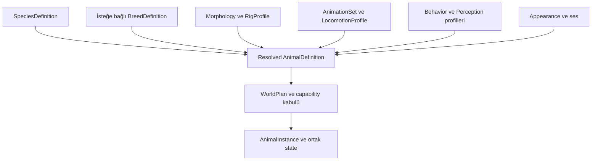

# Modüler hayvan türleri, bedenler, AI ve yaşam döngüsü

Durum: v0.4 temel tasarım, v0.5 transfer/restore düzeltmeleri; ADR-27/28/32. İleride geliştirilecek sistemin sözleşmesidir. Hiçbir hayvan modeli, animasyonu, paketi veya native controller bu teslimatta üretilmedi. [Agent altyapısı](agents-navigation.md) · [Nüfus](population-traffic.md) · [Asset kataloğu](../assets/catalog.md)

## Sorumluluk ve hedef

Animals paketi, AgentService üzerinde farklı türlerin, cinslerin/ırkların ve bireysel varyantların veri paketleriyle eklenmesini sağlar. WildlifeProvider vahşi nüfusu üretir; Companion, Husbandry, Ecology ve Mounts paketleri sırasıyla evcil takip, çiftlik/bakım, ekolojik ilerleme ve binme kurallarını isteğe bağlı ekler. Köpek eklemek çiftlik ekonomisini veya at binmeyi zorunlu yapmaz.

“Kusursuz” desteği önceden ilan etmek yerine her tür için model, rig, animasyon, hareket, collision, hit, network ve yaşam döngüsü kabulü aranır. Yeni görünüm eklemek çoğu zaman içerik işidir; yeni beden topolojisi veya hareket biçimi native adapter araştırması gerektirebilir. R-19 temel hayvan uyarlaması, R-20 ileri yaşam/ekoloji kapısıdır.

## Kimlik ve tanım katmanları

| Tanım | Sahip olduğu anlam | Birbirine karıştırılmayacak konu |
|---|---|---|
| SpeciesDefinition | Mantıksal tür ailesi, izinli beden/duyu/davranış/life-stage sınıfları | Model numarası veya biyolojik simülasyon iddiası değildir |
| BreedDefinition | Tür içi oyun cinsi/ırkı, izinli morphology/appearance seçimi ve parametre aralığı | Her türün ırk tanımı zorunlu değildir; gerçek taksonomi veritabanı değil |
| MorphologyProfile | Boyut aralığı, gövde oranı, collision/hit proxy, kütle, traversal sınıfı | Yalnız texture/renk değişimi değildir |
| RigProfile | Skeleton/bind pose, kemik eşlemesi, socket ve adapter sınıfı | Aynı kemik adı aynı topoloji/uyum garantisi vermez |
| AnimationSet | Idle, gait, turn, action, reaction ve life-state klip/graph'ları | IFP dosyası tek başına tam hareket sistemi değildir |
| LocomotionProfile | Ground/flying/aquatic hareket kısıtları, controller ve root motion sahibi | Davranışın hangi hedefi seçtiği değildir |
| BehaviorProfile | Algı, hedef seçimi, görevler, social/needs kuralları | Ham native kod veya görünüm varyantı değildir |
| AppearanceVariant | Mesh/texture/material/izinli aksesuar seçimi | Aynı gameplay grubunda hit/collision/timing değiştiremez |
| AnimalDefinition | Yukarıdaki kesin referansları birleştiren, spawn edilebilir resolved prefab | Mutable birey durumu değildir |
| AnimalInstance | EntityRef, DefinitionRevision, güncel state ve gerekirse PersistentEntityId | Tür tanımı veya native handle değildir |

Bu kimlikler AssetRef ad alanını kullanır; `SpeciesId`/`BreedId` yeni global sayısal registry değildir. Örneğin `fauna.canine:species/dog`, `fauna.canine:breed/shepherd`, `fauna.canine:animal/shepherd-adult` mantıksal referanslardır. Geyik veya kuş bir breed tanımlamadan doğrudan species + morphology + appearance bileşimiyle eklenebilir. Hayvanın adı, sağlık ve eğitimi paket dosyasını değiştirmez.



## Veri bileşimi ve örnek tanım

Tek species tabanı, isteğe bağlı breed, izinli trait/variant ve açık world patch sırası [bileşim kurallarını](../assets/composition-variants.md) kullanır. Aynı alanı çelişkili değiştiren trait'ler build hatasıdır. Habitat ile species'in birbirini hard dependency olarak referanslaması graph döngüsü oluşturamaz: habitat provider türleri resolve eder, species habitat etiketleri taşır. Avcı/av ilişki tablosu runtime sorgu verisidir; birbirine hard asset bağı eklenmez.

Aşağıdaki JSON bir authoring taslağıdır; referans verilen bağımlılıklar ayrıca hazırlanacak paket kataloğunda tanımlanmalıdır. Hazır yüklenebilir paket veya sabitlenmiş SDK şeması değildir.

```json
{
  "schemaVersion": 1,
  "id": "fauna.canine:animal/shepherd-adult",
  "type": "animal-definition",
  "species": "fauna.canine:species/dog",
  "breed": "fauna.canine:breed/shepherd",
  "morphology": "fauna.canine:morphology/medium-adult",
  "rig": "fauna.canine:rig/quadruped-a",
  "animationSet": "fauna.canine:animations/ground-a",
  "locomotion": "fauna.canine:locomotion/ground-a",
  "behavior": "fauna.canine:behavior/companion",
  "perception": "fauna.canine:perception/basic",
  "appearance": "fauna.canine:appearance/shepherd-dark",
  "hitProfile": "fauna.canine:hit/medium-adult",
  "requiredActions": ["idle", "walk", "run", "turn", "react", "die"],
  "optionalActions": ["sit", "bark"],
  "requiredCapabilities": ["creature.ground.quadruped.v1"],
  "defaultLifetime": "session",
  "defaultPersistence": "none"
}
```

Bu köpeğin saldırı action'ı tanımlı değildir; paket adı veya companion profili otomatik ısırma yeteneği vermez. Tür, yetenek listesi ve requiredActions arasında uyuşmazlık validation hatasıdır. `requiredCapabilities` engine desteğidir; resource grant değildir. Referans alanlarından mandatory dependency closure üretilir, authoring `requires` kullanılıyorsa aynı closure ile tutarlılığı kontrol edilir.

## Yeni tür veya cins ekleme yolu

1. Species/Breed ve izinli morphology/behavior aralıklarını tanımla; package namespace ve sürüm sahipliğini doğrula.
2. Mesh/texture, skeleton/bind pose, animasyon, hit/collision, locomotion, ses ve varsa attachment kaynaklarını hazırla.
3. Content build; geometri, rig/clip eşleşmesi, bounds, ölçek, süre, zorunlu action ve dependency closure'ını doğrulasın.
4. Sunucu query/hit/traversal artifact'lerini ve istemci render/animation/controller closure'ını ayrı üret; exact digest'lerle bağla.
5. Engine/rig/controller capability raporunu gereken model/ölçü aralığına eşle. Eksik kanıt experimental'dır; başka köpeğin geçmiş testi yeni topolojiyi doğrulamaz.
6. WorldPlan türü izinli havuza eklesin; resource/asset/şema ve toplam native bütçe doğrulansın. Hazır dünya için release prepare/Ready/commit/Applied gerekir.
7. Ancak bundan sonra `Animals.Spawn` veya WildlifeProvider mevcut tanımı seçebilir. Aynı WorldPlan içindeki hazır tür havuzu seçimleri runtime policy'dir.

Yeni bir kürk rengi aynı rig/shape/timing grubunda içerik güncellemesi olabilir. Büyük gövde, farklı bacak yapısı, uçma/yüzme veya yeni kemik düzeni yeni compatibility/capability kapsamıdır. Asset manifesti yeni native controller kodunu güven sınırını aşarak yükleyemez.

## GTA uyarlaması ve dürüst destek sınıfları

MTA, ped modellerini değiştirme ve özel IFP yükleme yüzeyleri sunar. Bunlar model/animasyon araçlarına örnektir; keyfî hayvan iskeletinin collision, AI veya network desteğini kanıtlamaz. [Model değiştirme](https://wiki.multitheftauto.com/wiki/EngineReplaceModel), [IFP yükleme](https://wiki.multitheftauto.com/wiki/EngineLoadIFP)

| Uyarlama yolu | Kullanılabileceği durum | Zorunlu kanıt / sınır |
|---|---|---|
| Ped-backed creature | Test edilmiş rig ve native ped davranışına uygun sınırlı beden | Human capsule/step/turn/weapon varsayımlarının etkisi, native görev bastırma ve animasyon kontrolü |
| Platform creature controller | Özel query/collision ve hareket modeli gereken beden | Server/client controller, native temsil, temas ve timing uyumu; R-19 |
| Cosmetic fauna | Etkileşimsiz uzak görsel yaşam | Hit/collision/ödül yok; interaktif hayvan desteği etiketi alamaz |

Hiçbir yol bugün uygulanmış değildir. “Hayvan DFF'i insan ped slotuna yükleniyor” sonucu yeterli değildir. Custom collision COL dosyası ped'e bağımsız şekilde takılabilir varsayılmaz; body/hit proxy ve native temasın nasıl eşleneceği R-19'da doğrulanır. Desteklenmeyen beden için bilinmeyen insan collision'ını gizleyerek production başarı verilmez. `unsupported_capability` veya açık experimental profil kullanılır.

## Rig, hareket ve saldırı zamanlaması

RigProfile kemik hiyerarşisi, local eksen/bind pose, kök, locomotion kemiği ve mouth/head/back/paw gibi semantic socket eşlemesini taşır. Aynı isimli socket her rig'de zorunlu değildir; gerekli aksesuar/action eksik socket varsa reddedilir. Retargeting offline dönüşüm ve conformance gerektirir; ortak kemik adı otomatik retarget garantisi değildir. Bone sayısı, skin weight sayısı, animasyon kanalları ve ölçek sınırları test edilen adapter profilinden alınır.

AnimationSet her gait için klip, hız aralığı, dönüş, blend, root motion mode, interrupt ve loop fazını tanımlar. Beden hızını controller veya doğrulanmış native root motion'dan yalnız biri üretir. AI/state/timing, render FPS veya ses oynatıcıya bağlı değildir. Foot placement/IK, ragdoll, tırmanma, zıplama, yüzme ve uçuş ayrı capability'lerdir; başlangıç ground profilinin örtülü özellikleri olmaz.

MTA'nın entity başına animasyon değiştirmesi client'lar arasında otomatik senkronize değildir; ayrıca partial animation sınırlaması belgelenir. SAEX'te library eşlemesi, state/phase, interrupt ve late join açık sözleşme taşır. [MTA EngineReplaceAnimation](https://wiki.multitheftauto.com/wiki/EngineReplaceAnimation)

Isırma/tekme/saldırı seçilmişse ActionInstance üzerinden target, erişim, range/arc, cooldown, accepted zaman penceresi ve obstruction sorgusu denetlenir. Animation marker yalnız sunum işaretidir. Hit proxy bedene ve action pose/timing profiline bağlıdır; client'ın kemik matrisi tek başına hasar kanıtı değildir. Mevcut query capability yalnız kaba temas sağlıyorsa hassas kemik hasarı destekleniyor denmez. Tek action step aynı OperationId/cause ile bir kez hasar verir; ölüm/iptal eski strike'ı keser.

## Bireysel state ve isteğe bağlı davranışlar

| State / paket | Tasarım kapsamı |
|---|---|
| Temel AnimalInstance | Species/Breed/Definition revision, life stage, appearance seçimi, accepted health/life state, task/motion |
| Companion | Follow/stay/recall, erişim sahibi, bond/training, güvenli bekleme ve ayrılma politikası |
| Wildlife | Habitat, territory, flee/forage/rest ve izinli predator/prey ilişkileri |
| Husbandry | Sahipli sürü, barınak, besleme, bakım, üretim ve stok işlemleri |
| Ecology | Yaşlanma, doğum, nüfus kapasitesi, takvim ve respawn yönetimi; R-20 |
| Mounts / Transport | Binme/koltuk, yük, attachment, handling ve geçiş; ayrı R-19 capability |

Gerçek tür/ırk adları oyun içerik kimliğidir; sağlık, üreme ve davranış katsayıları oyun profilleridir. Genetik/biyolojik gerçekçilik temel vaat değildir. User-created türler aynı veri doğrulamasını kullanır; çekirdekte dog/deer/cow switch listesi oluşturulmaz. Hareket/damage alanındaki farklılıklar GameplayDigest'e girer; gizli AI hedefi/seed veya owner kişisel verisi client manifestine konmaz.

## Bireysel varyasyon ve uyumlu state seçimi

Aynı türün bireyleri server tarafından seçilmiş appearance, izinli morphology/ölçek, life stage ve isteğe bağlı temperament/sex/needs alanları taşıyabilir. Oyun gerektirmiyorsa sex/genetics/needs component'i eklenmez. Her alanın aralığı, replication görünürlüğü ve persistence sınıfı şemalıdır. Model/beden/action seçimini client bağımsız random ile yapmaz; seed yerine gerektiğinde kesin seçilmiş değerler replike ve persist edilir. Görsel rastgelelik yalnız onaylı gameplay eşdeğerliği içinde kalır.

GameplayDigest izinli tanımlar ve uyumluluk kurallarını bağlar; önceden katalogda bulunan yavru/yetişkin veya morphology seçimi her birey için yeni global katalog yaratmaz. Seçim, gereken closure/occupied-volume ve activation sınırıyla entity state transaction'ıdır. Yeni tanım, yeni ölçü aralığı veya controller eklemek release değişimidir. Bu ayrım runtime büyüme ile immutable asset kuralının çelişmesini engeller.

## Sürü, evcilleştirme ve eşzamanlılık

GroupDefinition sürü/pack/flock rolü, azami üye, lider seçme, ayrılma/toplanma ve formation kurallarını belirtir. Grup state'i server'a aittir, her üye bağımsız EntityRef taşır. Lider ölürse veya görünmez olursa bounded server seçimi yapılır; bütün client'lar ayrı lider seçmez. Sosyal üyelik attachment döngüsü veya tek devasa atomik fizik grubu değildir. Çarpışma/hasar birey bazında kalır; group decision işi ve algı fan-out'u kotaya tabidir.

İki oyuncu aynı hayvanı evcilleştirmek/sahiplenmek isterse action koşulları ve beklenen AnimalInstance/ownership revision'ları tek rezervasyon yolunda değerlendirilir. Ownership, ControlClass, gerekli item debit ve varsa slot disposition tek backend transaction'ında değişir; harici provider'da açık pending/outbox vardır. Kazanan kabul sırası/oyun kuralıyla belirlenir. Reddedilen tarafa çift ücret yazılmaz; retry aynı receipt'i alır.

Wildlife kanalını kapatmak owned/mission/player-engaged hayvanı silmez. Evcilleştirme öncesi ambient sayılan birey işlemle korunan sınıfa ve uygun Lifetime/persistence'e taşınır; toplam world ve sahip başına pet kotası yeniden kontrol edilir. Group transfer veya sahip ölümü/ayrılması sürüyü sahipsiz silme izni vermez; domain politikasına göre kalır, emanet edilir veya güvenli askıya alınır.

World/portal geçişinde takipçi kendi geçerli erişim hakkıyla değerlendirilir. Owner'ın hedef dünyaya girmesi hayvana otomatik hak vermez. V1 transfer yalnız aynı ServerCore ve tek atomik persistence backend'i içinde mümkündür; farklı server/DB hedefi hazırlama öncesi reddedilir. Hedef kota ve species/controller/asset rezervi → kaynak interaction/lease fence → canonical location/receipt commit → yeni hedef EntityRef ve TargetApplied sırası [transfer sözleşmesine](../networking/consistency-recovery.md) uyar. OutcomeUnknown durumunda kaynak yeniden açılmaz. Kesin precommit rette stay/kennel uygulanır; postcommit hedef arızasında birey hedefte pending kalır. Aynı kalıcı hayvan iki dünyada etkileşimli olamaz; outbox genel cross-server transfer desteği sayılmaz. AC-66/76/77/87.

## Yaşam, ölüm, kalıcılık ve offline zaman

Lifetime ve persistence ayrı seçilir: vahşi ambient birey `session/none`, görev hayvanı görevin ömrü, sahipli hayvan `persistent-world` ve ownership/vitals için gerekli durable kayıt kullanabilir. Konum checkpointed olabilir; crash'te konum geri sarılması ownership veya ölümün geri alınması değildir. PersistentEntityId bireyi tanır; server restart yeni EntityRef oluşturur. Paket sürümü/şema/beden/appearance/life stage ve saklanan task domain aşaması restore edilir; native handle ve owner lease restore edilmez.

Ölüm kabulü, corpse state/entity ilişkisi, loot hakkı, group üyeliği ve slot cooldown aynı cause ile ilişkilendirilir. Corpse collision gameplay etkiliyorsa ortak entity veya aynı bireyin life-state temsilidir; kozmetik ragdoll onun yerine gameplay kararı vermez. Loot provider ayrıysa ödül outbox/idempotent domain uniqueness ile tekilleştirilir. Corpse temizliği bireyi yeniden canlı yapmaz; respawn yeni birey/generation ve tanımlı cooldown işlemidir.

Varsayılan offline yaşlanma/üreme **kapalıdır**. Açılan paket, server tarafından saklanan zaman kaynağı, son işlenmiş zaman, maksimum catch-up adımı/süresi, kapasite ve doğum unique anahtarını ilan eder. Saat geri gitmesi veya uzun kapanış tek seferde sınırsız doğum/ölüm üretemez; bounded pending ilerleme veya açıklamalı durdurma vardır. Seed + tick tek başına durable doğum kanıtı değildir. R-20 geçmeden ekolojik döngü production için açılmaz.

Büyüme/genç-yetişkin dönüşümü collider/rig/hit/timing değiştiriyorsa gameplay geçişidir. Aynı PersistentEntityId korunur; uygun closure prepare edilir, occupied volume/task/owner tekrar doğrulanır, revision/epoch değişimiyle uygulanır. Görsel mesh scale'ini büyütüp eski hit proxy'yi bırakmak geçerli değildir. Uyumsuz skeleton/controller major değişimi restart veya yeni profile bağlı migration gerektirir; kesintisiz hot reload varsayılmaz.

## Paket güncellemesi ve hata yalıtımı

Yeni cins aynı uyumlu library'yi paylaşabilir; aktif eski birey DefinitionRevision ve bütün zorunlu artifact lease'lerini pinler. Türü katalogdan kaldırmadan live/persistent/corpse/mission/offspring kayıtları, pending transfer, retained backup ve rollback bağımlılıkları sorgulanır. Referans varsa removal reddedilir veya açık retirement/migration planı gerekir. [Restore closure ve GC kökleri](../architecture/failure-recovery.md) eski offline bireyi de korur; eksik türde kalıcı köpeği başka model veya sıfır state ile restore etmek yasaktır. AC-85.

Behavior worker çökerse core yeni task/action sonuçlarını resource epoch ile reddeder; attack rezervi, nav işi ve grup abonelikleri registry üzerinden temizlenir. Sağlıklı provider'ın state adoption'ı doğrulanır; yoksa güvenli sınırlı durum. Rig/controller arızası UI veya cosmetic ses fallback'iyle gizlenmez. İndirilen content/resource native DLL/ASI veya keyfî model loader çalıştıramaz.

Hatalar `species_not_allowed`, `breed_species_mismatch`, `rig_incompatible`, `required_action_missing`, `morphology_out_of_range`, `hit_profile_mismatch`, `animal_protected`, `species_in_use`, `offspring_budget_exceeded` ve ortak `unsupported_capability/asset_not_ready/revision_conflict` nedenleriyle ayrılır. Inspector hangi tanım/rig/controller/slot/owner/grant nedeniyle ret verdiğini gösterebilir.

## Geliştirici arayüzü ve kabul

`Animals.QueryDefinitions`, `Spawn`, `RequestInteraction`, `AssignOwner`, `SetLifeStage`, `TransferWorld`, `InspectDefinition` ve `Groups.ManageMembership` kavramsal SDK yüzeyleridir. Runtime katalogya keyfî registry yazmak yerine önceden çözülmüş tanım seçilir; yeni tanım release hattına girer. Metadata-only ekleme, C# behavior provider ve güvenilen native adapter değişiklikleri üç ayrı genişleme düzeyidir.

Referans fixtures: aynı canine rig üzerinde iki görünüm/cins; farklı morphology ile küçük ve büyük beden; ayrıca deer/boar/cattle gibi farklı beden adayları. Bunlar dağıtılan modeller veya doğrulanmış destek listesi değildir. Ground quadruped ilk kanıt; flying/aquatic, mounting, hassas hit ve breeding ayrı kapılardır. [AC-56–70](../validation/scenarios.md), R-19/20; eşzamanlı sahiplenme, bozuk rig, late join, disconnect, restart, package removal ve mixed-load soak birlikte sınanır.
