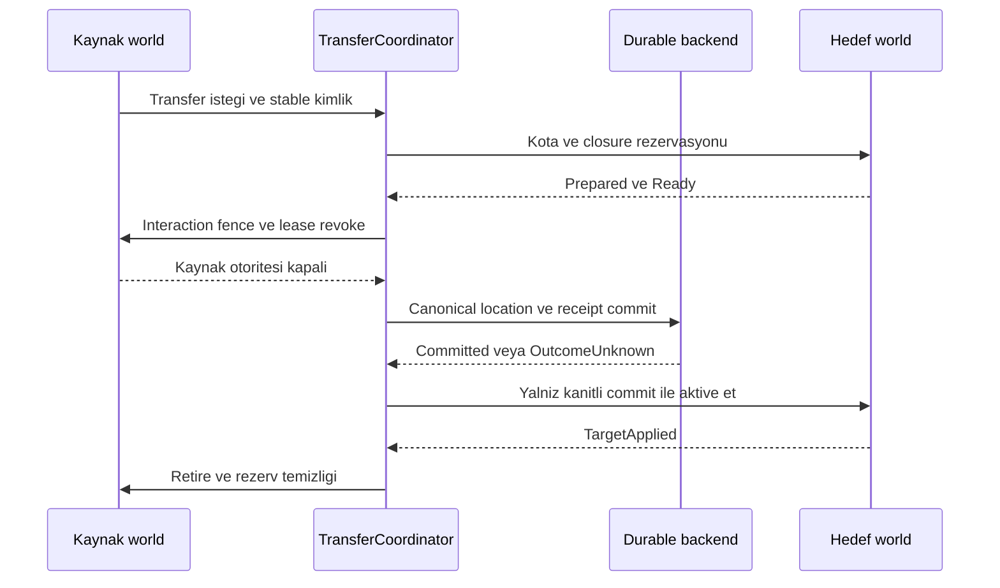

# Replikasyon onarımı ve dünyalar arası tekil geçiş

Durum: v0.5 normatif taslak, ADR-31/32; R-22/23 doğrulaması gerekli. [Protokol](protocol.md) · [Replikasyon](replication.md) · [Arıza/kurtarma](../architecture/failure-recovery.md) · [Aktivasyon](../architecture/activation-contracts.md)

## Sorumluluk ve veri sınırı

ReplicationService her peer'ın yetkili scope'una ait gönderim ve uygulanma kesitlerini tutar. ClientHost state'i staging alanında kurar; adapter native binding'i denetler. TransferCoordinator aynı server core ve desteklenen tek persistence backend'i içinde kalıcı bireyin canonical konumunu taşır. Bunların hiçbiri güvenilir mesaj teslimini gameplay uygulanmasıyla eşitlemez.

`WorldRevision` global yayın sırası, `ViewSequence` peer/scope reliable görünüm sırası, `StateRevision` aggregate sürümü, `MotionSequence` örnek sırasıdır. Sadece görünümden çıkan bir entity'nin silinmesi ile sunucuda gerçekten yok edilmesi farklı tombstone nedenleridir. Scope kapanınca o scope'a ait baseline/delta/repair işi iptal olur; eski sayfa yeni view içine eklenmez.

## Baseline'ın somut çerçevesi

| Alan / arayüz | Sözleşme |
|---|---|
| BaselineId | SessionId + WorldEpoch + ScopeEpoch içinde tek staging denemesi |
| SnapshotCut | WorldRevision, ServerTick ve bu kesitteki accepted motion; private state filtrelenir |
| ViewCut | Bu peer'ın scope'unda baseline sonrasındaki reliable catch-up başlangıcı |
| Closure | CatalogRevision, GameplayDigest, ContractDigest ve kullanılan definition digest seti |
| PageDescriptor | BaselineId, page index/count, sıkıştırılmış/açılmış byte sayısı, sayfa özeti ve toplam manifest özeti |
| BaselineApplied | Host state + gerekli native closure hazır; tam BaselineId/cut/digest içerir |
| JoinCommit / JoinApplied | Catch-up bariyerindeki geçerli state için gameplay açılışı; baseline ACK'ından ayrıdır |

Server aynı baseline'daki tüm sayfaları tek immutable snapshot kesitinden üretir. Client toplam byte/page/count/decode sınırını ilk descriptor'da kontrol eder; limite sığmayan baseline kabul edilmez. Her sayfa descriptor ile eşleşir; aynı index ve aynı digest tekrar gelirse idempotent, farklı içerik gelirse deneme iptal edilir. Sıkıştırma sonrası boyut sınırı da zorunludur. Eksik sayfa, çelişen entity generation veya closure mismatch ile kısmi state aktif hale getirilmez.

Baseline staging çok frame sürebilir; bütün dünyayı tek karede bind etmek gerekmez. Her aggregate'ın critical set'i güvenli swap noktasına hazırlanır. Catch-up buffer kesitin hemen sonrasından itibaren sınırlı tutulur. Retained history biterse client görünümünün doğrulanmamış delta zincirini sürdürmek yerine yeni BaselineId ile yeniden hazırlanır. Eski staging, pin ve callback'ler bırakılır; yeni deneme eski ACK'ları kabul etmez. Native apply başarılı olmadan `BaselineApplied` üretmek conformance ihlalidir.

## Delta tabanı, motion ve onarım

Reliable state delta; `ScopeEpoch, BaseViewSequence, TargetViewSequence`, etkilenen EntityRef ve component base/target StateRevision alanlarını taşır. Client ancak tam beklenen taban mevcutsa delta uygular. Duplicate target aynı sonuç özetiyle idempotenttir; daha eski ACK/delta state'i geri alamaz. GNS alındı bildirimi tabanı ilerletmez; yalnız doğrulanmış `StateAppliedAck` client'ın bilinen uygulanmış kesitini ilerletir. Sınırlı reliable pipeline'da sonraki batch önceki gönderilmiş target'ı base alabilir; bu provisional zincir tutulur ve Applied ACK gelmeden history bırakılmaz. Aynı eski base üzerinden birbirini dışlayan iki delta kuyruğa konmaz. ACK gönderilmiş target/cut ledger'ıyla doğrulanır. Server bellekte saklayamadığı bir tabana göre delta üretmez; tam aggregate state veya yeni baseline yollar. Ack taklidi authoritative hak vermez; client native doğruluğu ayrı kontroldür.

**V1 unreliable motion örnekleri bağımsızdır:** her biri quantize edilmiş absolute konum/yön/hız, MotionSequence, OwnerEpoch ve gerekli state revision taşır. Önceki unreliable paketteki transform'a uygulanacak fark değeri kullanılmaz. Böylece tek paket kaybı sonraki bütün örnekleri anlamsızlaştırmaz. Quantization ve alan seçimi codec araştırmasının parçasıdır; zincirli motion delta compression yeni capability/ADR gerektirir. Reliable create/state önkoşulu eksikse motion bounded tutulur veya atılır; motion bir entity yaratamaz.

Sessiz state sapmasını fark etmek için `ViewDigestChallenge` aynı yetkili scope ve aynı ViewSequence kesitindeki canonical logical alanları karşılaştırır. Sıralı ve şema tanımlı encoding kullanılır; private blackboard/seed, istemci interpolasyonu, yerel parçacıklar ve sampled motion bu hash'e girmez. Her peer için görünmeyen entity hash'i yayımlanmaz. Mismatch önce bounded aggregate repair, gerekli history yoksa baseline ile giderilir. Challenge zamanlaması jitter ve global budget'a tabidir; büyük dünyadaki her entity her tick hash'lenmez.

Logical digest'in eşit olması gerçek GTA collision binding'inin doğru olduğunu kanıtlamaz. Adapter için `AppliedBindingRevision`, beklenen model/body handle generation ve desteklenen native query gözlemleri ayrı conformance/diagnostic verisidir. Yanlış collider saptanınca ilgili interaction scope fence edilir, güvenli rebind denenir; kanıtlanamayan kritik binding'te gameplay açılmaz. Bu denetim hileli istemciyi tümüyle güvenilir yapmaz; server authority sınırı değişmez.

## Yavaş katılım ve yoğun değişimde ilerleme

İlk recovery ölçüm profili bir sync denemesi için 30 saniye ControlTime ve 60 saniyede en fazla 2 otomatik yeniden hazırlama kullanır. Asset indirme süresi ayrı launcher deadline'ıdır; warm join performans hedefi de bu timeout değildir. Toplam bekleyen peer/staging byte sınırı ayrıca vardır. Numaralar R-23 ile sınanacak başlangıç değerleridir.

Catch-up yetişmiyorsa önce gönderim önceliği ve daha küçük yetkili başlangıç scope'u kullanılır. Öncelik değişimi critical dependency closure'ı parçalayamaz. Zorunlu etkileşim kümesi minimum scope/bütçeye bile sığmıyorsa katılım açık hata ile reddedilir. Görünmeyen saldırgan, eksik collision veya korumasız portal ile “başarılı join” üretilmez. Deneme sınırı dolunca aktif oyuncuların hizmetini durdurmadan peer bekleme ekranına alınır/oturum sonlandırılır; yeniden deneme operatör politikasına ve rate limit'e tabidir. Sonsuz reset döngüsü otomatik iyileşme sayılmaz.

## Kalıcı entity transfer sınırı

**V1 destek sınırı:** aynı ServerCore içindeki world'ler ve aynı atomik persistence backend'i. Server'lar, farklı veritabanları veya bağımsız coordinator'lar arasında canlı entity transferi bu sürümde desteklenmez. Harici ekonomi servisleri için outbox bulunması bu desteği sağlamaz. Böyle bir hedef `unsupported_transfer_domain` ile hazırlama öncesi reddedilir. Gelecekte distributed transfer yeni ADR ve kurtarma deneyi ister.

`TransferRecord` şu alanları taşır: OperationKey/PayloadHash, PersistentEntityId, TransferGeneration, source/target world persistent kimliği, kaynak StateRevision, target ReservationId, participant/seat/group closure, gerekli DefinitionDigest, phase ve canonical location. Runtime EntityRef taşınmaz; hedefte yeni EntityRef üretilir. Transfer registry kalıcı birey başına en fazla bir unresolved transferi koşullu revision/unique constraint ile tutar. Hazırlık ve source-fence phase'leri recovery kaydında izlenir; restart bunları çözmeden bireyi otomatik aktive etmez. Tek DB transaction'ı canonical location, transfer receipt ve kaynak/hedef durable kayıtlarını günceller; iki world'ün WriterTerm guard'ları sabit world-kimliği sırasında kilitlenir. ControlDeadline geçerliliğini coordinator kendi clock domain'inde commit submission öncesi doğrular; backend phase/term/reservation generation CAS'iyle eşzamanlı iptali dışlar, başka makinenin monoton saatini karşılaştırmaz. Ağ yayınları iki dünyada aynı anda görünmek zorunda değildir; **aynı bireyin iki yerde etkileşimli olması yasaktır**.

1. `Requested`: owner/resource grant, hedef erişim, persistent identity, grup ve cooldown denetlenir. Araç yolcuları veya bağlı hayvanlar için transfer group açıkça belirlenir; oyuncunun izni hayvana otomatik geçmez.
2. `Prepared`: hedefte kota ve gereken controller/asset closure ayrılır; source StateRevision ile native hazırlık tekrar doğrulanır. DB transaction'ı client Ready beklerken açık kalmaz. Rezervin ControlDeadline'ı vardır.
3. `SourceFenced`: kaynak authoritative interaction ve eski owner lease'i kapanır; etkilenmiş local participant'lar uygulanma kanıtı verir veya world'den çıkarılır. Eski client modelinin hâlâ çizilmesi hasar/sahiplik yetkisi sağlamaz; karışık collider riski olan kapsam karantinada kalır.
4. `CommitSubmitted`: tek backend transaction'ı rezervin geçerli olduğunu ve source revision/WriterTerm'i kontrol eder. Canonical location atomik değişir. Sonuç belirsizse iki taraf da yeni gameplay kabul etmez; receipt sorgulanır. Sırf timeout ile kaynağı tekrar açmak yasaktır.
5. `Committed`: destination staging yeni referansla kurulur. Kaynak tombstone/retire ve hedef baseline yayınları tekrar teslim edilebilir. Hedefte katılımcı/grup için gerekli `TargetApplied` gelmeden birey etkileşimli olmaz.
6. `Completed`: hedef canonical birey olarak çalışır; kaynak runtime bağları bırakılır. Aynı TransferGeneration tekrar işlendiğinde yeni entity doğmaz. Transfer receipt'i, restart ve eski kaynak ACK'larından daha uzun tutulan durable state'in parçasıdır.

## Transfer hatası, kalıcılık ve genişleme

Kesin commit öncesi ret/iptalde kaynak revision, sahiplik ve policy yeniden doğrulanarak stay/kennel veya normal source davranışı sürer. Kaynak artık yoksa hayvan yaratılmaz; güncel ölüm/retire sonucu döner. Commit sonrası hedef kapanırsa birey hedef canonical location'da `pending activation` olarak saklanır; kaynakta yeniden doğurulmaz. Geri dönüş ayrı OperationId ve yeni transferdir. Hedef hazırlığı tekrar kurulana kadar oyuncuya açık pending durumu sunulur; admin çözümü audit edilmiş migration/transfer kullanır.

Reservation expiry yalnız kesin precommit adayını serbest bırakabilir. `CommitSubmitted/OutcomeUnknown/Committed` aşamasındaki kayıt fazına bakılmadan TTL ile silinmez; recovery işine dönüşür. Süresi dolan çalışma lease'i tekrar grant edilmez ama canonical occupancy rezervi receipt ile uzlaştırılır. Restart'ta hedef quota, persistent bireyler ve pending transferlerden yeniden kurulur; eksik RAM sayacı çift spawn'a izin vermez. Kapasite dolduysa yeni ambient üretim durur; sahipli birey silinmez.

Transient ambient bireyi world'ler arasında taşımak için v1 önce açık policy ile persistent transfer kimliğine yükseltir veya geçişi reddeder. Geçici entity'yi silip başka yerde benzerini oluşturma ayrı spawn işlemidir ve “aynı kalıcı bireyin transferi” API'si olarak sunulmaz. Resource transfer hook'u yalnız öneri/önkoşul üretir; canonical location'ı kendisi yazamaz.

Arayüzler `RequestBaselineRepair`, `StateAppliedAck`, `ViewDigestChallenge`, `RequestEntityTransfer`, `QueryTransfer`, `TargetApplied` olarak şemalanır. Yeni codec veya transfer backend'i bu kimlik/phase/quota/fencing kurallarını korur. AC-76/77 transfer crash/ret sınırını; AC-78–81 replikasyon onarımını; AC-87 expiry/kota yarışını; AC-88 fault soak'ı sınar. R-22 transfer backend'ini, R-23 baseline/delta/native repair'i doğrular. Protokolde daha çok alan bulunması tek başına tutarlılık kanıtı değildir.
