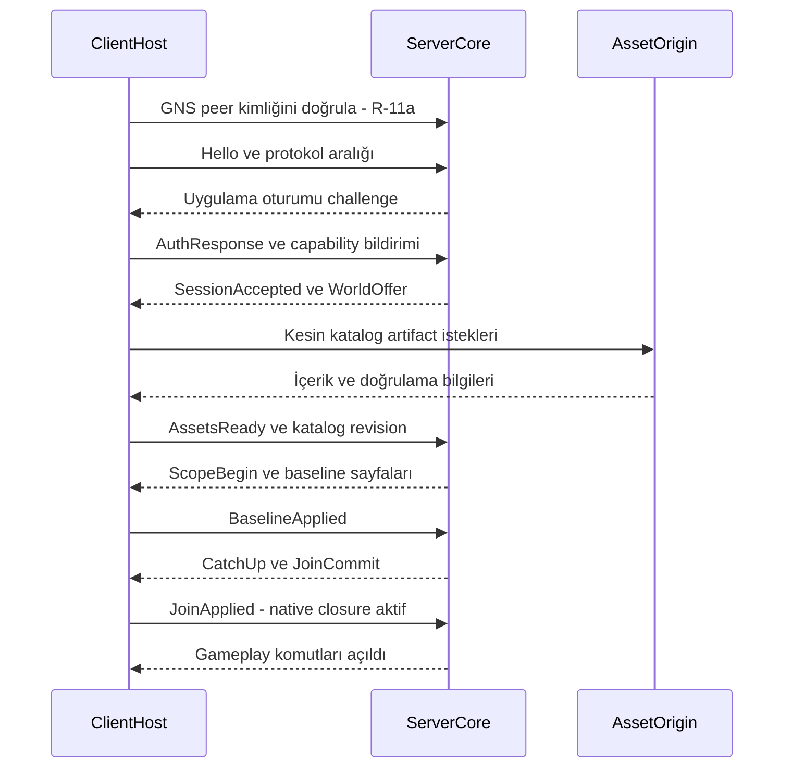

# Oyun protokolü ve bağlantı sözleşmesi

Durum: mantıksal protokol taslağı; byte düzeyinde wire ABI henüz sabit değil. [Replikasyon](replication.md) · [Kaynaklar](../sources.md)

## Taşıma ve güven

**V1 taşıması GameNetworkingSockets (GNS), doğrudan client/server UDP topolojisidir. ENet bağımlılığı veya otomatik fallback yoktur.** Karşılaştırma, süreç yerleşimi, lane eşlemesi ve gerekçe [ADR-07 ayrıntısındadır](../decisions/network-transport.md). Kütüphane kendiliğinden oyun yetkilendirmesi veya world replikasyonu sağlamaz; Steam hesabı veya Valve relay erişimi zorunlu kabul edilmez.

HTTPS bootstrap sunucu endpoint'ini ve beklenen kimliği keşfetmek içindir; UDP bağlantısına kendiliğinden kimlik doğrulaması eklemez. GNS peer kimliğinin güvenilen server kimliğine bağlanması R-11a'da, desteklenen sertifika/güven kökü entegrasyonuyla kanıtlanacaktır. Sadece IP veya şifreli bağlantı güvenilir server kanıtı değildir. R-11a geçmeden üretim katılımı açılmaz; credential kimliği doğrulanmamış oyun kanalına gönderilmez. [GNS'nin açık uyarısı](https://github.com/ValveSoftware/GameNetworkingSockets/blob/a424b7db649438acafb60c99cae6667587c42732/include/steam/isteamnetworkingsockets.h#L67-L84)

Asset bağlantısı ayrı HTTPS istemcisidir. İndirme origin'i, oyun server kimliği ve resource capability'leri farklı güven alanlarıdır. Oyun protokolünün içinde büyük asset blob'ları taşınmaz.

## Oturum aşamaları

Guest oyunlar da kimliği session'a bağlar; hesap sağlayıcısı ayrı adapter'dır. Platform çapında merkezi hesap zorunlu değildir. Yeni bağlantı yeni session epoch alır. Resume token tek kullanımlı/son kullanma süreli yetkilendirme girdisidir; eski paketin yeniden oynatılmasına izin vermez.

Hello'da protocol major/minor, build, engine profile ve capability set; WorldOffer'da world kimliği, gerekli kabiliyetler, katalog/lock revision ve başlangıç kapsamı vardır. Zorunlu capability yoksa açıklamalı ret; isteğe bağlı capability yoksa ilan edilmiş varyant.

V0.3 WorldOffer ayrıca ReleaseId, client ContractDigest ve GameplayDigest taşır; server-only plan/sırları dağıtılmaz. Bunlar [WorldPlan](../architecture/world-plans.md) ve [ContractSchema](../architecture/execution-contracts.md) sonucudur. Aynı isimli fakat farklı schema/gameplay içeriği ile join kabul edilmez. Şema anlaşması client'ın dürüstlüğünü veya native fiziğin doğruluğunu kanıtlamaz. İlk wire sürümü uygulamada sabitlenirken bu alanlar açık mandatory/capability kurallarına bağlanır.

## Mantıksal mesaj zarfı

| Alan | Anlam |
|---|---|
| protocol / message type | Negotiation sonucu seçilen sürüm ve şema |
| session epoch | Yeniden bağlantı ayrımı |
| world / world epoch | Dünya yaşamı ve izolasyon |
| scope epoch | Abonelik/instance geçişi ayrımı |
| stream sequence | İlgili akıştaki sıra; bütün kanallar tek sıraya zorlanmaz |
| RequestId / OperationId / EventId | Geçici korelasyon, kalıcı idempotency ve olay kimliği ayrı |
| entity reference / revision | Entity'ye özgü mesajlarda stale kontrolü |
| owner epoch | Fizik önerilerinde lease kontrolü |
| catalog / TransitionId / requiresStateRevision | Akışlar arası bağımlılık ve aktivasyon önkoşulu |
| payload length | Decode öncesi üst sınır doğrulaması |

Oturum anahtarıyla doğrulanan transport zarfı uygulama kimlik alanlarının doğruluğunu tek başına garanti etmez. Gereksiz alanlar her mesajda tekrar edilmek zorunda değildir; yukarıdaki mantıksal bağlam connection/stream üzerinden de taşınabilir.

## Akışlar ve bütçe varsayılanları

| Akış | İletim | Öncelik ve anlam |
|---|---|---|
| Oturum / izin / kontrol | Reliable | En yüksek; küçük ve oran sınırlı |
| World transaction / spawn / destroy | Reliable | İdempotent sonuç, view sırası |
| Baseline sayfaları | Reliable ayrı akış | Parçalı ve backpressure; kontrolü bloklamaz |
| Hareket / body örnekleri | Unreliable, uygulamada sequence | V1 bağımsız absolute örnek; kayıp önceki pakete bağlı delta yok |
| Resource network event | İlan edilen mod | Şema, alıcı ve oran sınırı zorunlu |
| Voice | Ayrı düşük gecikmeli akış | Ayrı bütçe; eski ses tekrar gönderilmez |
| Telemetry | Düşük öncelik | Taşmada düşürülebilir, gameplay'i bekletmez |

İlk mühendislik limitleri: küçük motion mesajı en çok 1.000 byte uygulama payload'u; baseline sayfası en çok 32 KiB; tek logical reliable mesaj en çok 64 KiB; bağlantı başına pending reliable içerik 4 MiB. Transport MTU/overhead R-11'de ayrıca ölçülür; bunlar UDP datagram büyüklüğü iddiası değildir. Daha büyük snapshot sayfalara bölünür.

Lane numarası ve ağırlıkları [ağ kararında](../decisions/network-transport.md) tanımlıdır. Reliable sıralama aynı lane içindir; ayrı lane'lerdeki create, event ve motion [nedensel bariyer](../architecture/activation-contracts.md) olmadan uygulanmaz. Toplam 4 MiB reliable bütçenin 64 KiB'ı kontrol rezervidir. Queue sınırı aşılırsa önce telemetry ve düşük öncelik azaltılır, baseline paced gönderilir. Kontrol kuyruğu sürekli doygunsa bağlantı yeniden senkronizasyona veya açıklamalı kapanışa gider. Bütün dünyayı limitsiz buffer'a doldurmak yasaktır.

## Hata ve sürüm geçişi

Bilinmeyen zorunlu mesaj/alan reddedilir; opsiyonel uzantı ancak uzunluğu ve atlama kuralı biliniyorsa atlanır. Kısmi, aşırı büyük, NaN, geçersiz enum, yanlış dünya ve stale epoch örnekleri decoder corpus'una girer. Log tam credential veya ses payload'u içermez.

Protocol major değişimi reconnect gerektirir. Minor eklemeler capability anlaşmasıyla açılır. Negotiation istemcinin seçtiği zayıf yetki modeline geri düşemez. Oyun mesaj codec seçimi R-11'de bounded parsing ve fuzz gereksinimleriyle sabitlenir; burada var olmayan opcode sayıları ilan edilmez.

V0.5 typed mesaj sözleşmeleri BaselineId/PageDescriptor, exact base/target ViewSequence, StateAppliedAck, ViewDigestChallenge ve TransferGeneration alanlarını [onarım/transfer belgesinde](consistency-recovery.md) tanımlar. Süreler [clockKind/ClockDomainId](../architecture/time-fencing.md) ile ayrılır. Codec bunları zorunlu schema/capability kapsamında müzakere eder; eski field'ın anlamı sessizce değiştirilmez. V1 wire henüz sabit olmadığı için bu dokümantasyon değişimi çalışan bir binary'yi güncellemez.

Kabul: AC-02/06/10/14/15/25/26/32/33 ve AC-78–81. Transport ACK, StateAppliedAck veya native binding kanıtının yerine geçmez.

## Population ve Agent şema aileleri

Yeni ayrı taşıma veya sınırsız event kanalı açılmaz. PopulationPolicyState, AgentTaskState, AnimalDefinitionBinding, GroupMembership ve OccupancyState mevcut ContractSchema/reliable state transaction yolunu kullanır. SpawnSlot ve private perception/blackboard/AI seed varsayılan server-only'dir; alıcıya yalnız gereken public alt küme gider.

MotionProposal/Sample mevcut unreliable sequence/owner epoch kuralını kullanır; TaskInstanceId ve gereken StateRevision/controller/catalog bağlamı doğrulanır. Görev değişiminden önce gelen motion veya action cue nedensel bariyeri aşamaz. Seat/driver/pilot spawn closure'ı tamamlanmadan observer callback'i çalışmaz. Policy update ve durable tame/transfer komutlarında ActorContext, expected revision ve OperationId semantiği korunur. Late join geçmiş AI event'lerini replay ederek dünya kurmaz. AC-48/50/51/58/61; [agent sözleşmesi](../gameplay/agents-navigation.md).
