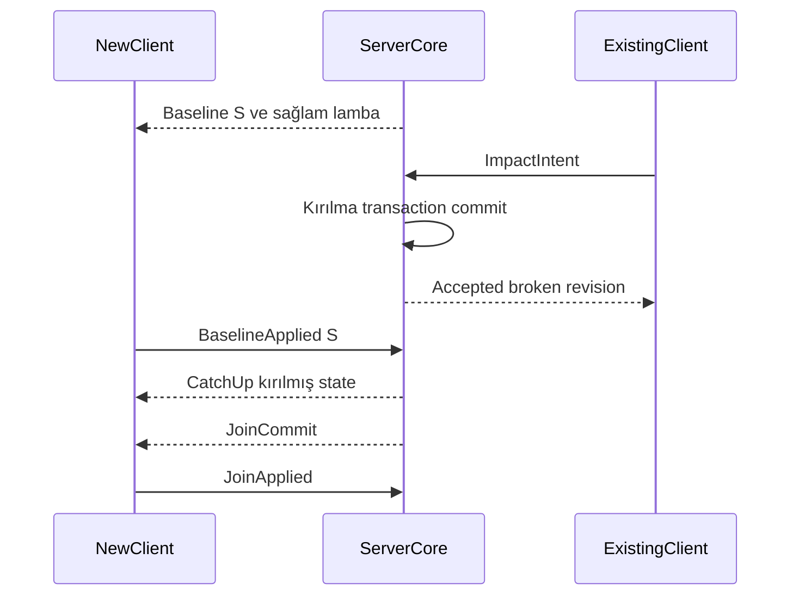

# Replikasyon, interest ve sonradan katılım

Durum: sözleşme taslağı. [Protokol](protocol.md) · [Kalıcılık](persistence.md)

## Neyi gönderiyoruz?

State, olaydan bağımsız geçerli sonucu taşır. Olay; ses, animasyon veya audit için meydana gelen olguyu anlatır. “Lamba kırıldı” olayını kaçıran oyuncu baseline'daki `broken` durumuyla doğru collision ve modeli kurabilir. Olay geçmişinin tamamını oynatmak zorunda değildir.

Private component'ler filtrelenir. Yakınlık tek başına envanter, hesap veya görev sırrını göndermeye izin vermez. Interest seti; dünya, mekânsal hücre, portal, attachment bağımlılığı, araç yolcusu, etkileşim ve yetki kurallarının birleşimidir.

## İlk interest profili

| Sınıf | Gönderim hedefi | Politika |
|---|---|---|
| Aktif etkileşim / kendi araç grubu | Motion 20 Hz'e kadar | Mesafe dışına çıksa da gerekli bağımlılıklar pinlenir |
| Yakın dinamik | 20 Hz'e kadar | Ekran ve hareket etkisine göre öncelik |
| Orta dinamik | 5 Hz | Daha seyrek snapshot/interpolation |
| Uzak temsil | 1 Hz veya özet | Gameplay gereksinimine göre |
| Durgun / kalıcı değişiklik | Değişince | Periyodik tüm-state yayınlanmaz |
| Yetkisiz / başka instance | Gönderilmez | Sonradan client'ta gizlemek yeterli değil |

Mesafe eşikleri world profiline bağlıdır; ilk açık alan örneği 150/350/800 metredir. Bunlar zorunlu görünürlük garantisi değildir. İlk ölçüm profili her banttan çıkışı girişten 50 metre daha uzakta ve minimum 2 saniye tutma ile değerlendirir; world/yetki kaybında beklemeden çıkarılır. MTA streamer'daki ayrı eşikler bu tercihin referansıdır, 50 metre SAEX için ölçülmüş optimum değildir. [Kaynak incelemesi](../references/mtasa-architecture.md)

World/yetki filtreli kaba hücre sorgusu → interest bağımlılık closure'ı → bant/frekans seçimi → client native admission sırası kullanılır. Client ekran dışında kalan entity'yi çizmemek için ağ state'ini silmez. Hızlı araç için ilerideki hücreler önceden hazırlanır. Farklı iç mekânlarda portal bilgisi kaba yarıçaptan daha önemlidir.

## Tutarlı baseline ve catch-up

1. Sunucu yeni `ScopeEpoch` üretir; katalog revision'ını sabitler.
2. Tutarlı canlı snapshot noktası `S = WorldEpoch + WorldRevision + ServerTick` seçilir. Scope'un saklanmayan state'i ve o tick'te kabul edilmiş son motion örnekleri de alınır; disk snapshot'ı kullanmak tek başına yeterli değildir.
3. `S` sonrasındaki ilgili transaction'lar bounded catch-up kuyruğunda tutulur.
4. İstemci sayfaları, asset closure'ı ve entity referanslarını hazırlar; collision etkinleştirilmez.
5. Mantıksal baseline staging'de kurulur; native hazırlık karelere bölünür, gameplay açılmaz. `BaselineApplied` bu hazırlanan kopyayı bildirir.
6. Sunucu view sırasındaki catch-up değişikliklerini yollar; istemci `JoinCommit` sınırına yetişir.
7. Kritik closure ve catch-up sınırı yerelde uygulanır; client `JoinApplied` yollar. Sunucu bu ACK'ı doğrulayınca katılım aktif olur. Buffer taşmış veya katalog değişmişse süreç deneme/kaynak bütçesi içinde yeni BaselineId ile başlar; sınırsız reset yoktur. [Onarım sözleşmesi](consistency-recovery.md) sayfa bütünlüğü, exact cut/closure, delta tabanı, Applied ACK, bağımsız motion ve native sapma davranışını tanımlar. [Aktivasyon sınırı](../architecture/activation-contracts.md), AC-78–81.

WorldRevision canlı snapshot/audit, JournalSequence disk kurtarma içindir. Filtrelenen/private transaction'lar istemcide “kayıp paket” sayılmaz: her scope için ayrı kesintisiz `ViewSequence` vardır. Motion ayrı akıştadır; CatalogRevision/StateRevision ve owner epoch koşullarını yine karşılamalıdır.

Yeni oyuncu etkileşime girebildiği anda lamba kırılmıştır. Yükleme ekranı sırasında kısa süreli hazırlanmış sağlam mesh'in görünmemesi için staging alanı kullanılır.

## Atomiklik ve eski veri

Yıkım transaction'ı parent collision değişimi, parça entity'leri ve ışık durumunu tek mantıksal işlem olarak taşır. Sayfaya bölünse bile transaction parçaları tamamlanmadan uygulanmaz. Asset/native hazırlık çok karede yapılır; görünür swap bounded aggregate içindir. Bütün baseline'ın tek karede native nesneye çevrilmesi gerekmez. İstemcinin transactional apply kapasitesi üst sınırını aşan prefab build aşamasında reddedilir; gerekli native swap yeteneği yoksa etkilenen etkileşim alanı geçişe alınır.

Entity state revision'ı geriye gitmez. Eski motion örneği yeni transform'a uygulanmaz. Yeni state'ten önce gelen motion için yalnız en yeni aday bounded tutulur; gerekli StateRevision kurulmadan native body'ye uygulanmaz. Farklı owner epoch veya scope epoch'tan gelen paket atılır. Silme tombstone'u ve generation bilgisi bir sonraki create'in önceki entity sanılmasını engeller. Remote event callback'leri için de aynı bağımlılık kuralı geçerlidir.

## Stream out ve görünürlük kaybı

GTA handle'ı ve GPU referansı bırakılabilir; platformun kalıcı placement farkı silinmez. Geri girişte mevcut state sorgulanır. Parent-child, yolcu-araç ve etkili debris closure'ı birlikte değerlendirilir. Kritik body'yi bütçe için yalnız bir client'ta collision'sız bırakmak geçerli optimizasyon değildir.

## Kabul ve ölçüm

AC-04 giriş/çıkış ve geç katılım, AC-10 instance, AC-11 içerik bariyeri, AC-12 referanslar. Metrikler: baseline byte/süre, catch-up derinliği, stale drop, transaction apply hatası, interested/materialized entity sayıları. Ağ gecikmesi ile streaming gecikmesi ayrı raporlanır.

## Projection ve RepresentationSet

Replike state, türetilmiş projection ve native/GPU RepresentationSet [ortak dünya değişimi](world-change-projections.md) sözleşmesine bağlıdır. Kaynak revision seti eskimiş nav/akustik/render cache sonucu reddedilir. Aynı GameplayDigest grubunda visual kalite değişebilir; critical interaction closure hazır olmadan client'ın yalnız görünümünü açmak gameplay readiness sayılmaz. Private component'lerden public diagnostic/projection yoluyla dolaylı sızıntı da filtrelenir.

## Yaşayan nüfusun kapsamı ve ilk etkileşim

Bir bölgeyi paylaşan oyuncular için sunucu tek population seti üretir. AOI, driver/vehicle/seats, etkileşilen hayvan, aktif attack/target ve gerekli hit/collision closure'ını birlikte değerlendirir. Sosyal grubun bütün private üyelik/algı bilgisi otomatik yayınlanmaz. Baseline; güncel task phase, accepted transform, life state, görünüm/tür/rig revision ve gerekli ilişki referanslarını taşır. Ölmüş sürücü veya evcilleşmiş hayvan ilk bağlanmada eski spawn tanımından kurulmaz.

Hızlı hava aracı ve koşan hayvan için prefetch, hız ve ölçülen hazırlık süresi/interaction menzilini hesaba katar. Abstract ajan görünmez hasar üretmez; interactive'a geçişte içerik/nav/controller ve scope readiness gerekir. Hazır olmayan collider'ı yalnız bir client'ta yok saymak çözüm değildir. [Population](../gameplay/population-traffic.md), [Agent tier'leri](../gameplay/agents-navigation.md); AC-50/52/61/64.
