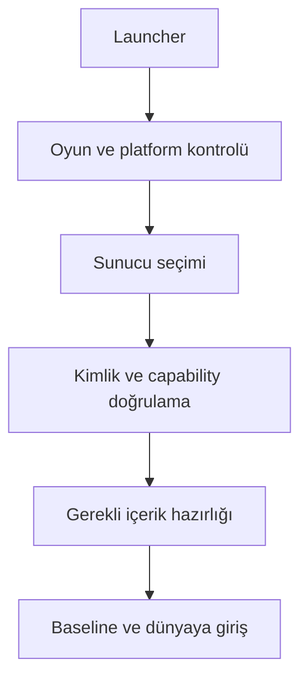

# Launcher, sunucu tarayıcısı ve işletim sözleşmesi

Durum: tasarım; herhangi bir launcher veya endpoint uygulanmamıştır. [Protokol](../networking/protocol.md)

## Oyuncu yolu

Launcher yerel GTA konumunu bulur veya kullanıcı seçiminden alır; engine profilini doğrular; platform sürümünü kontrol eder; seçilen server kimliğini ve gerekli world catalog'u gösterir. Game root'a server dosyalarını dağıtmak yerine platform cache kullanılır.

Hata aşaması belirgindir: oyun bulunamadı, engine profile uyumsuz, native başlatma hatası, kimlik/transport hatası, asset doğrulama, worker açılışı veya baseline. Bağlantı kurulmadan çöken GTA için yalnız sunucu loglarına bakılarak asset arızası sonucu çıkarılmaz.

V0.7 native başlatma alt akışı [SDK sözleşmesindeki](../architecture/native-sdk-integration.md) preflight → mapped-image → bindings → observing/active kapılarıdır. SDK'nin sürüm marker'ı launcher onayı yerine geçmez; seçilen dosya ile başlatılan image ve hook önkoşulları eşleşir. Oyuncuya uyumsuz sürüm veya başlatma hatası sade biçimde gösterilir; engine/dependency/adapter/loader kimlikleri destek log'unda bulunur. Sunucu dosyaları engine profilini veya platform SDK pinini değiştiremez. Installer, ASI loader seçimi ve oyun başlatma yolu D1-N2/N3'te kanıtlanacak; mevcut durumda çalışan launcher yoktur.

## Server browser

Favoriler ve doğrudan bağlantı merkezi liste hizmeti olmadan çalışmalıdır. İsteğe bağlı directory sağlayıcısı public endpoint metadata'sı sunar. Sunucu ilanı; kimlik, protocol/build, oyun profili, katalog boyutu tahmini, oyuncu sayısı ve capability bilgisi taşır.

Directory'nin oyuncu sayısı veya isim beyanı gameplay doğruluk kanıtı değildir. Liste sorguları oran sınırlı ve amplification'a dayanıklı olmalı; private yönetim bilgisi public response'a girmez. Bağlanmadan önce endpoint kimliği ayrıca doğrulanır.

## Yönetim arayüzü taslağı

REST okuma ve komut API'si, WebSocket olay akışı planlanır. UI bu API'nin istemcisidir; core'un belleğine doğrudan yazmaz.

| Örnek yüzey | Anlam |
|---|---|
| GET /v1/health | Readiness, world/DB durumları; hassas veri olmadan |
| GET /v1/worlds | Yetkili operatörün world/capacity görünümü |
| GET /v1/resources | Version, grants, health ve bütçe |
| POST /v1/resources/{id}/reload | RequestId korelasyonu, OperationId ve hedef release ile lifecycle komutu |
| POST /v1/worlds/{id}/releases | Hazırlanmış katalog aktivasyon isteği |
| POST /v1/sessions/{id}/disconnect | Kimlikli moderation komutu |
| GET /v1/operations/{id} | Pending/accepted/rejected sonucu |
| WS /v1/events | Cursor ile yetki filtreli operasyon akışı |

Bunlar public contract taslaklarıdır; çalışan URL değildir. TLS, role permission, resource/world scope, RequestId ve audit zorunludur. İnternet'e açık arbitrary shell/RCON eşdeğeri komut yürütme varsayılan değildir. Tarayıcı oturumunda kullanılan auth mekanizmasına uygun CSRF/origin denetimi gerekir.

Durable yönetim komutlarında OperationId gerekir; `/operations/{id}` domain/actor yetkisi altında bu kalıcı kimliği sorgular. HTTPS directory/bootstrap doğrulaması oyun UDP kanalını doğrulamaz: GNS peer identity bağı R-11a geçmeden üretim Join açılmaz. [Ağ güveni kararı](../decisions/network-transport.md)

## Operasyon sırası

Başlatma: config doğrula → identity yükle → artifact/catalog doğrula → persistence restore → resource prepare → health ready → oyuncu kabulü.

Bakım: yeni join'i durdur → gerekli world transaction'larını drain et → checkpoint/snapshot → resource stop → core kapanışı. Native/gameplay güncellemesi için restart gereksinimi release metadata'sında görünür.

Health liveness ile readiness'i ayırır. Process yaşıyor ama world restore başarısızsa ready değildir. Yönetim panelindeki “çalışıyor” etiketi oyuna katılabildiğinin kanıtı sayılmaz.

## Platform güncellemesi ve destek paketi

Launcher update manifesti platform yayın anahtarıyla doğrulanır. İndirme tamamlanmadan mevcut çalışan dosyalar değiştirilmez; versioned install ve geri dönüş kaydı kullanılır. Platform native güncellemesi resource hot reload'uyla karıştırılmaz.

Diagnostic paketinde build fingerprint, engine profile, son lifecycle aşaması, resource/catalog revision ve redacted crash bilgisi bulunur. Token, parola ve ham voice varsayılan olarak kaydedilmez. Otomatik dışarı log yükleme varsayılmaz; yerel paket üretimi ve kullanıcının paylaşması ayrıdır.

Kabul: AC-06 katılım hata türleri, AC-15 bağlantı öncesi crash, AC-18 restore, AC-22 admin yetkilendirme.

## Release ve destek profili

Launcher'ın production uygunluğu [ConformanceProfile](../validation/conformance-contracts.md) ve gerekli engine/contract/gameplay digest'leriyle değerlendirilir. Platform update'i için [TUF uyumlu metadata şartı](studio-release.md), R-16 doğrulamasına bağlıdır. Server asset/content anahtarı native platform update yetkisi vermez; update kaynağı güveni, GNS peer identity ve worker sandbox ayrı kontrollerdir. Uygulama henüz yoktur.

## Population ve tür yönetim operasyonları

Kavramsal API uzantıları: GET /v1/worlds/{id}/population, POST /v1/worlds/{id}/population-policy, POST /v1/worlds/{id}/population-retire ve GET /v1/worlds/{id}/animal-definitions. POST; actor/world permission, expected policy/target revision, OperationId, bounded patch ve audit taşır. Bunlar çalışan endpoint değildir. Zorla retire ayrı yetki/önkoşullara tabidir; policy off protected hedefleri silemez.

Response policy kabulü ile drain ilerlemesini ayırır; protected/blocked nedeni ve etkilenmiş sınıflar görünür. Tür ekleme catalog/release hattından geçer, endpoint keyfî model URL'si yüklemez. Launcher gereken creature/flight capability ve asset hazırlığını denetler; ilan edilen hayvan desteği R-19 kanıtı değildir. [Population işlemleri](../gameplay/population-traffic.md), AC-46/48/56/63/65.

## Health, belirsiz işlem ve kurtarma görünümü

Health API world/resource/client-scope ayrımında `healthy/degraded/draining/fenced/recovering/failed`, neden kodu, affected scope ve son ilerleme zamanını sunar. Kullanıcı akışı “Hazırlanıyor”, “İşlem sonucu doğrulanıyor” veya açıklamalı katılım hatası gösterir; iç WriterTerm/DB ayrıntısı normal oyuncu ekranına taşınmaz. Retry düğmesi aynı işlem kimliğini korur; durable pending sonucu başarısız gibi tekrar satın alma/sahiplenme başlatmaz.

Bakım/kapanış [bounded drain ve writer release](../architecture/failure-recovery.md) sırasına uyar. V1 otomatik server takeover yoktur; admin önce eski writer'ın kesin duruşunu doğrular. Transfer/kota/backup çözümü audit edilmiş operation ile yapılır; manuel SQL veya gizli entity silme kurtarma yolu sayılmaz. Yedek manifest exact artifact/schema closure ve failure türüne göre RPO/RTO kaydeder. AC-74/75/80/85/86.

## Kod 0.1.5 başlangıç teşhis aracı

[engine startup](../development/d1-native-startup.md), geliştirme ortamında üst seviye DLL/ASI hash/import/TLS ve yerel aday grafiğini üretir. Çalışan launcher değildir; engine/dependency eşleşmesi olsa bile canAdvanceToLoader=false kalır. Oyuncunun mod dosyaları taşınmaz/silinmez. Windows yükleme kuralları ve dinamik mod taraması ayrıca doğrulanmadan envanter temiz başlatma profili sayılmaz. CLI hata ve çıktı kapsamı rapordadır.

## Kod 0.1.6 geliştirme loader deneyi

[Saex engine loader probe](../development/d1-loader-observation.md) production launcher değildir. Açık --observe-loader komutu exact GTA preflight sonrasında kendi child'ını yaratır; üç tutulan x86 OS dosyası dışında mapping ilerlemesi reddedilir. İlk exception/bütçe/olay hatasında owned child sonlandırılır ve exit doğrulanır. Server veya indirilen resource allowlist veremez; kullanıcı modları silinmez. Gerçek apphelp.dll mapping'i için beklenen ret raporlandı; sade sonuç, initialization ortamının henüz onaylanmadığıdır. Statik engine startup komutu process yaratmadan kullanılmaya devam eder.

## Kod 0.1.7 reviewed loader ve launch context

[Ayrı reviewed flag](../development/d1-loader-policy.md) source profile'a gömülü engine ve 22 DLL hash'ini child öncesi doğrular. Bir DLL güncellendi veya eksikse failedPolicyModule ve typed ret döner; otomatik repair/download/allowlist yoktur. Eski üç pinli flag aynı kalır. Production launcher, desteklenen executable basename/root düzeni, CWD/environment, native mod/compatibility kümesi ve dependency profile'ı birlikte tanımlamak zorundadır.

Bu zorunluluğun gözlemi: orijinal GTA AcLayers'ta ret aldı; aynı hash'li, ayrı ad/dizin ve iki DLL'li kopya breakpoint adayına ulaştı. Birden fazla değişken farklı olduğu için sebep yalnız dosya adına bağlanmaz. Bu yerel kopya tam asset ağacını içermez, normal gameplay launcher deneyi değildir ve dağıtılmaz. Initialization/SAEX DLL girişi ayrıca kanıtlanır.

## V0.15 — Geliştirme observer bağlamı

[Yerel --observe-context-loader](../development/d1-launch-context.md) absolute cwd ve bir defa alınmış parent environment görüntüsünü açık kullanır. Değerleri veya registry/compatibility ayarını değiştirmez, key/value loglamaz; digest/count ve cwd kaydeder. Bu komut production launcher/server API'si değildir. Eski iki loader komutunun inheritance davranışı korunur. Dosya ağacı, registry ve Windows shim ortamı bu görüntüyle dondurulmuş sayılmaz.

0.1.8 explicit context gözleminde beklenmeyen OS debug olayının tanısı için loader çıktısına lastEventCode/lastEventThreadId eklendi. Son alınan olay metadata'sıdır; initialization kanıtı veya olayın devamına izin değildir. Child öncesi retlerde ikisi de sıfırdır. Unknown event terminal ret davranışı ve incelenmiş DLL policy değişmedi.

## V0.16 — Loader yaşam kayıtları

[0.1.9](../development/d1-loader-lifecycle.md) mevcut üç yerel CLI'da known-active UNLOAD'a koşullu devam ekler. modules/admitted tarihsel değerlerdir; mappingId/unloadEventIndex/activeAtObservationEnd ve toplam activeModuleCount/unloadCount ayrı raporlanır. lastEventAddress tanıdır. İlk exception'da kill-before-continue korunur; bu durum production launcher/native hot unload değildir.

## V0.18 — Açık entry-boundary deneyi

Yeni `--observe-entry-boundary <gta_sa.exe> <absolute-working-directory>` [dar initialization kapsamını](../development/d1-entry-boundary.md) açık seçer. Exact engine ve mevcut pinler child öncesi, main-thread entry byte/register koşulları ilk debugger olaylarında doğrulanır. DLL/TLS kodu çalışabilir; bu statik inspect veya sandbox değildir. Değişmiş giriş byte'larıyla da exit 3 tanısal sonuç olabilir; oyun/SAEX bootstrap/ABI başarısı sayılamaz. Legacy CLI'lar initialization'ı ilerletmez. Original dosya/registry/mod temizliği, download/rename veya stage deploy bu komuta eklenmez; son child stop zorunludur.

## Kod 0.1.11 — Entry supplement bağı

executionPolicySourceDigest ayrı entry JSON’u; policySourceDigest eski mapping kaynağıdır. Entry CLI bütün 23 pini child öncesi hazırlar; yeni DLL için otomatik onay/repair yoktur. Legacy 22/3 setleri aynı kalır. [Ayrıntı](../development/d1-entry-boundary.md).

## GitHub kaynak yayını — taşınabilirlik düzeltmesi

Own launch-context fixture artık cwd için raw yol metni yerine Windows volume/file ID eşitliğini sınar; kısa/uzun ad farklılığı yanlış ret üretmemelidir. Farklı mevcut klasör ve yanlış environment token negatifleri korunur. Production CLI, directory handle pin ve explicit snapshot davranışı değişmez; launcher uygulanmış sayılmaz.

### Hosted corpus tamamlaması

İkinci hosted tur Linux ve Windows x64'te geçti; x86 native 9/9 sonrasında Python cwd karşılaştırması runneradmin/RUNNER~1 yazım farkını reddetti. CLI testi artık pathlib.samefile ile dizin kimliğini sınar; bilinmeyen engine/child öncesi ret ve ortam redaction korunur. Bootstrap corpus da geçersiz reason için exact INTERNAL_ERROR ve bilinen ret değerlerini açık doğrular. Production API, profile/recipe ve oyun davranışı değişmez.

## Kod 0.1.12 — Proxy dönüş sınırı

Yeni açık geliştirme komutu --observe-proxy-return <exe> <absolute-cwd>, [ayrı compiled proxy execution policy](../development/d1-proxy-return.md) ve önceki 23 retained pin ile çalışır. Relative cwd/unknown exe child öncesi ret verir; arbitrary PID/RVA veya indirilen policy girişi yoktur. Exit 3 yalnız proxy_return_verified ve confirmed exit, 1 eksik/ret, 2 kullanımdır. Production launcher veya otomatik staging eklenmedi.

## Kod 0.1.13 — Startup çağrı sınırı

Yeni --observe-startup-call <exe> <absolute-cwd>, [compiled startup execution policy](../development/d1-startup-call.md) ile seçilir. Unknown EXE/invalid cwd child öncesi ret; mevcut 23 pin korunur, codec/ASI veya yeni system DLL otomatik kabul edilmez. Scope bounded-startup-call-observation; exit 3 yalnız startup_call_verified + confirmed exit, 1 ret/incomplete, 2 kullanım. Bir önceki proxy komutu entry’yi otomatik ilerletmez.

## Kod 0.1.14 — Codec dönüş kesiti

Development CLI --observe-codec-return, absolute EXE/cwd ve compiled 26 pin ile çalışır; codecObservation eski komutlarda null olur. Scope bounded-codec-return-observation; exit 3 yalnız codec_return_verified + confirmed exit. Bu bir production launcher modu değildir. [Sözleşme ve doğrulama](../development/d1-codec-return.md).

## Kod 0.1.15 — Codec fonksiyon bağları

Development --observe-codec-bindings scope bounded-codec-bindings-observation üretir. Exit 3 yalnız codec_bindings_verified + confirmed exit; partial verified=false çıktıları complete değildir. Production launcher/ASI aktivasyonu eklenmedi. [Sözleşme ve kanıt](../development/d1-codec-bindings.md).

## Kod 0.1.16 — ASI bootstrap yükleme

[ASI yükleme sözleşmesi](../development/d1-asi-bootstrap-load.md), iki ek call/return durağı ve boş tarama korumasını tanımlar. Yeni mod, build auditinden geçen aynı SAEX DLL bitlerini özel klasörde `.asi` adıyla yüklemeyi denetler; Release 28/Debug 31 exact pin, tam yol kontrolü ve owned child cleanup uygulanır. Önceki CLI durakları ve C ABI 1 korunur; `asiObservation` eski modlarda null olur. Initialize/Query/Stop çağrıları bu kesitte çalışmaz; N2/D1/D2 açık kalır. Test ve gerçek GTA kanıtı ilgili raporda ayrı izlenir.

## Kod 0.1.17 — Kontrollü bootstrap yaşam döngüsü

[Ayrı yaşam döngüsü sözleşmesi ve kanıtı](../development/d1-bootstrap-lifecycle.md): aynı build'in üç denetlenmiş export'u sekiz sabit çağrıyla, ASI dönüşünden sonra çalıştırılır. Yığın veri yazımı ve EIP/ESP yönlendirmesi ayrı izindir; eski komutların durakları korunur. C ABI 1, engine profili, GNS/HTTPS ve otorite değişmedi. Dört yerel Windows akışı, 24 test senaryosu + 12 tekrar ve gerçek GTA 12/12 koşuda 96/96 dönüş geçti. N2/N3 ve oynanabilir D2 açık; geçmiş sürüm başlıkları o kesitin kanıtını anlatır.

Export girişleri 20 byte'tır; PE32 HIGHLOW alanları metadata'dan tam dört byte olarak normalize edilir. Kısmi/çakışan fixup ve bilinmeyen tip reddedilir. Hiçbir prefix byte'ı karşılaştırmadan çıkarılmaz; C ABI 1 aynı kalır.

## Kod 0.1.18 bağlantısı

Geliştirici CLI --observe-frame-target <exe> <absolute-working-directory> bootstrap pinlerini ister; adres/PID girişi kabul etmez. frameTargetObservation eski modlarda null; nativeFunctionCalled/hookInstalled/runtimeAbiVerified false. Başarılı örnekleme exit 3 (unsupported runtime), ret 1, kullanım hatası 2 döndürür. [Aday ve doğrulama raporu](../development/d1-frame-target.md).

## Kod 0.1.19 bağlantısı

Yeni --observe-startup-return komutu absolute cwd ve ASI pinlerini ister; bootstrapInvoked=false, loaderProtectionChangeAllowed=true alanları izni ayırır. Başarı exit 3, canAttach/initializationVerified=false; önceki modlarda startupReturnObservation=null. [Sözleşme ve kanıt](../development/d1-startup-return.md).

## Kod 0.1.20 bağlantısı

Ayrı CRT startup modu I/O hazırlığının doğal dönüşünü ve initializer CALL önünü denetler. Önceki modların durakları korunur; crtStartupObservation eski modlarda null olur. C ABI 1, GNS/HTTPS ve otorite değişmez; initialized motor/N3/D2 açık kalır. [Sözleşme ve kanıt](../development/d1-crt-startup.md).

## Kod 0.1.21 bağlantısı

Ayrı `--observe-application-entry` modu başlatıcıların doğal dönüşünü, ikinci startup çağrısını ve uygulamanın ilk komutundan önce giriş yığınını denetler. Önceki CRT komutu başlatıcı CALL önünde durur; eski kanıtlar kendi artifact kapsamındadır. Yeni izin ve güncel doğrulama [uygulama giriş sözleşmesinde](../development/d1-application-entry.md) izlenir. C ABI 1 korunur; initialized dünya, doğal frame/N3 ve D1/D2 kapıları açık kalır.

## Kod 0.1.22 bağlantısı

Ayrı platform-startup modu uygulama prologue'unu ilerletir ve sistem ayarı çağrısından önce durur. Dört argüman, yığın/register ve pinned API hedefi doğrulanır; host ayarı değişmez, eski CLI sınırları korunur. [Sözleşme ve sonuç](../development/d1-platform-startup.md). C ABI 1/GNS/otorite aynı; sistem ayarı uyarlaması, pencere/renderer, doğal frame ve N2/N3/D1/D2 kapıları açık kalır.

## Kod 0.1.23 bağlantısı

Tek exact platform çağrısı için ayrı süreç içi bağlam uyarlaması eklendi: sentetik FALSE, last-error/yığın/register koruma ve bağlam geri alma; API çalıştırılmaz. Önceki doğal sınır komutları korunur. [Sözleşme ve sonuç](../development/d1-platform-suppression.md). C ABI 1/GNS/otorite aynı; instance/pencere/renderer ve N2/N3/D1/D2 kapıları açık.

## Kod 0.1.24 bağlantısı

Ayrı instance-startup modu platform bastırma dönüşünden gerçek named event oluşturma/açma ve doğal helper dönüşüne ilerler. Mevcut event veya NULL handle durumunda pencere kolundan önce ret verilir. Önceki suppression modu restore ederek bitmeye devam eder; yeni mod doğal API sonrası eski CALL bağlamını geri yazmaz. [Sözleşme ve doğrulama](../development/d1-instance-startup.md). Oturumdaki ortak event ömrü process-private değildir; observer sinyal durumunu değiştirmez. C ABI 1/GNS/otorite aynı; pencere/renderer/doğal frame ve N2/N3/D1/D2 kapıları açıktır.

## Kod 0.1.25 bağlantısı

Ayrı event-dispatch modu, instance dönüşünden doğal olay dağıtıcısı CALL/entry ve uygulama işleyicisi CALL önüne ilerler. Üç durakta argüman, dönüş adresi, register ve yaşayan caller stack doğrulanır; uygulama işleyicisi çalıştırılmaz. [Sözleşme ve sonuç](../development/d1-event-dispatch.md). Eski instance terminali, C ABI 1/GNS/otorite aynı; yeni bağımlılık/kalıcı migration yoktur. AppEventHandler gövdesindeki executable yönlendirmesi, renderer/window ve doğal frame sonraki kapılardır; N2/N3/D1/D2 açık kalır.

## Kod 0.1.26 bağlantısı

`--observe-application-routing` önceki event-dispatch kanıtından sonra yalnız rsINITIALIZE=24 rotasını yürütür: işleyici entry → executable detour → indirect JMP → ilk oyun initializer CALL öncesi. 39 index/11 hedef tablosu, rel32/absolute operand ve dört yığın/register sınırı doğrulanır. [Sözleşme ve sonuç](../development/d1-application-routing.md). Önceki mod kendi AppEventHandler CALL öncesi terminalini korur. Yeni modda `eventDispatchObservation.applicationHandlerCallAllowed=true`, routing nesnesinde initializer çağrı izni false olur; önceki stage/verified ara kanıtı korunur. C++ trace/API yeniden derlenir; C ABI 1/GNS/otorite aynı, yeni bağımlılık/kaldırılan özellik/kalıcı migration yoktur. Oyun initializer gövdesi, RsInitialize, renderer/window ve doğal frame sonraki kapılardır; N2/N3/D1/D2 açık kalır.

## Kod 0.1.27 bağlantısı

`--observe-game-prelude` ilk oyun initializer içine girer; exact boş Init ve üç yerelleştirme bayrağını yazan iki helper doğal olarak geri döner. Beş durak, stack/register/flags, yaşayan caller ve 16-byte veri penceresi denetlenir; yalnız üç veri byte değişebilir. CFileMgr CALL çalıştırılmaz. [Sözleşme ve sonuç](../development/d1-game-prelude.md). Önceki application-routing terminali korunur; yeni üst modda routing nesnesinin initializerCallAllowed alanı true, prelude nesnesinin fileManagerCallAllowed ve initializerReturnVerified alanları false olur. C++ observer yeniden derlenir; C ABI 1/GNS/otorite aynı, yeni dependency/kaldırma/kalıcı migration yoktur. CFileMgr, streaming/pad, initializer dönüşü, RsInitialize, renderer ve doğal frame ile N2/N3/D1/D2 açık kalır.

## Kod 0.1.28 bağlantısı

`--observe-file-manager-entry` CFileMgr içine doğal CALL ve ilk üç PUSH komutunu açar; 0x5386FB CRT cwd CALL önünde durur. İki durakta buffer/maxlen=128 ABI, nested return stack, register/flags, 136-byte root/guard ve localisation korunumu denetlenir. [Sözleşme ve sonuç](../development/d1-file-manager-entry.md). Önceki prelude terminali korunur; yeni üst modda prelude fileManagerCallAllowed=true, manager cwdCallAllowed=false/fileManagerReturnVerified=false olur. CRT lock/SEH/OS/copy yolu henüz açılmaz. Gelecekte suffix yazımından önce NUL en geç buffer offset 126, başarılı dönüş ve ANSI byte uzunluğu kanıtı gerekir. C++ observer yeniden derlenir; C ABI 1/GNS/otorite/IPC aynı, yeni dependency/kaldırma/kalıcı migration yoktur. Manager/initializer dönüşü, streaming/pad, RsInitialize, renderer ve doğal frame ile N2/N3/D1/D2 açık kalır.

## Kod 0.1.29 bağlantısı

`--observe-cwd-seh` CRT wrapper ve SEH prologue içine doğal CALL açar; kayıt kurulup yardımcı döndüğünde 0x836E9D noktasında durur. Üç durakta 80-byte stack, 28-byte NT_TIB, önceki kayıt ve caller/buffer/localisation korunumu denetlenir. [Sözleşme ve sonuç](../development/d1-cwd-seh.md). Önceki manager terminali korunur; yeni üst modda manager cwdCallAllowed=true, cwdSeh lockPathAllowed/directoryApiAllowed/cwdReturnVerified/unwindVerified=false olur. Handler veya kilit/OS/copy yolu açılmaz; owned child sonunda kapatılır, eski TEB/context rollback yapılmaz. C++ observer yeniden derlenir; C ABI 1/GNS/otorite/IPC aynı, yeni dependency/kaldırma/kalıcı migration yoktur. Kilit/cwd, SEH sökümü, manager/initializer dönüşü, renderer/doğal frame ve N2/N3/D1/D2 açıktır.

## Kod 0.1.30 bağlantısı

`--observe-cwd-lock` lock(7) selector CALL ve ilk 17-byte gövdeyi doğal yürütür; CMP tamamlandığında 0x82ADCF JNE önünde durur. [Sözleşme ve sonuç](../development/d1-cwd-lock.md). 100-byte stack, 16-byte slot penceresi, NT_TIB/önceki kayıt/caller/buffer korunur; slot değeri dereference edilmez. SlotPresent yalnız sıfırdan farklı word demektir, kritik bölüm veya kilit alma kanıtı değildir. Üst modda cwdSeh.lockPathAllowed=true yalnız selector iznidir; yeni branchAllowed/lazyInitializationAllowed/criticalSectionCallAllowed/lockAcquiredVerified=false. Önceki SEH terminali korunur; DR0 dışında yeni observer müdahalesi ve TEB/context rollback yoktur. C++ trace yeniden derlenir; C ABI 1/GNS/otorite/IPC aynı, dependency/kaldırma/kalıcı migration yoktur. Mevcut/lazy dal, OS kilidi, cwd/SEH dönüşü ve N2/N3/D1/D2 açıktır.

## Kod 0.1.31 bağlantısı

`--observe-cwd-acquire` mevcut/unowned lock(7) nesnesi için doğal dal, admitted ntdll API entry/return ve CRT selector dönüşünü açar; 0x836EA4 terminalinde durur. [Sözleşme ve sonuç](../development/d1-cwd-acquire.md). Beş durakta object/slot/84-byte caller/SEH korunumu ve API sonrası thread sahipliği doğrulanır. x86 24-byte kritik bölüm düzeni pinned Windows uygulamasına aittir; VOID dönüşte EAX başarı kodu sayılmaz. Heap veya aynı GTA image nesnesi için sınır/koruma denetimi vardır. Üst modda branch/criticalSectionCallAllowed=true, acquired readback ile ayrıdır; lazy/directory/unlock kapalı kalır. Önceki lock terminali korunur; kilit tutulurken bütün owned child kapatılır, observer veri/TEB/context rollback yapmaz. C++ trace yeniden derlenir; C ABI 1/GNS/otorite/IPC aynı, dependency/kaldırma/kalıcı migration yoktur. Cwd/SEH/manager dönüşü ve N2/N3/D1/D2 açıktır.

## 14 Eylül 2026 — Windows fixture taşınabilirliği

Startup-return ve devamındaki fixture zinciri, sistem DLL reçetelerini test makinesinin diskte tutulan PE dosyalarından çıkarır. Ortak okuyucu ve negatif doğrulamalar [test kapsamı notunda](../development/d1-startup-return.md#14-eylül-2026--windows-fixture-taşınabilirliği) açıklanır; üretim policy/hash kuralları ve bu belgedeki gerçek GTA kanıtının sınırları aynıdır.

## Kod 0.1.32 — Cwd query bağlantısı

Ayrı --observe-cwd-query komutu mutlak explicit çalışma diziniyle geliştirme child sürecini açar. Bu process sonlandırılırken CRT kilidi tutulabilir; normal oyun kapanışı, reconnect veya production launcher değildir. Windows hash farkı child öncesi ret verir. [Sözleşme, kaynak ve güncel kanıt](../development/d1-cwd-query.md).

## 0.1.33 — Windows profil bağı

[26200.9445 incelemesi](../development/d1-system-profile-9445.md), bu bileşenin bağlı olduğu OS pinleri/API reçeteleri ve parent SHA-256 zincirini günceller. Bileşenin GTA durak/izin sınırı aynı kalır; önceki runtime sonuçları eski profil bağlamındadır. Yeni dosyalarla fixture ve gerçek GTA kanıtının kapsamı profil raporunda ayrıca izlenir. Eski OS pinlerine otomatik fallback yoktur; kaynak ve generated policy birlikte yeniden derlenir.

## 0.1.34 — Doğal cwd copy bağı

[Ayrı copy kesiti](../development/d1-cwd-copy.md), query'den sonra native kontrol/CALL/dönüş ve gerçek hedef içerik kanıtını ekler. Önceki komutların terminali korunur; helper/unlock/SEH sökümü yeni izin kapsamına girmez. Source/guard, caller/SEH/kilit/cookie denetimleri ve yeni test/GTA kanıtının kapsamı ilgili rapordadır. C ABI 1, OS modül pinleri, GNS/otorite ve production kapıları aynı kalır; C++ observer yeniden derlenir.

## 0.1.35 — Cwd helper dönüş bağı

[Ayrı return kesiti](../development/d1-cwd-return.md) copy sonrasındaki iki POP, cookie checker eşitliği ve doğal LEAVE/RET'i açar. Önceki terminal izinleri korunur; wrapper/unlock/SEH işlemleri henüz açılmaz. Kaynak stack ömrü, CALL ile değişen saved slot, hedef/caller/kilit/SEH ve hata retleri sözleşmede açıklanır. C++ trace yeniden derlenir; C ABI 1, OS pinleri, GNS/otorite ve production kapıları aynı kalır. Yeni fixture/gerçek GTA kanıtı ilgili raporda ayrı izlenir.

## 0.1.36 — Dosya yöneticisinin tamamlanması

`tools/Run-SAEX.ps1` yerel D1 doğrulama girişidir: kaynak hash → ayrı yedi dosya kopyası → tek bounded probe → evre/child exit → hash tekrar kontrolü → HTML/JSON. Ürün launcher/server-browser kapsamı değişmez. Başarı kodu 0 yalnız probe=3, ready/exit ve girdi korunumu birlikteyse üretilir; kısmi başarısızlık raporda gösterilir. Gizli veya indirilmiş kod için sandbox iddiası yoktur. [Sözleşme, kullanıcı komutu ve doğrulama](../development/d1-file-manager-ready.md).

0.1.36 araç doğrulama düzeltmesi: Run-SAEX hash okuması .NET SHA256/FileStream kullanır; Windows PowerShell Get-FileHash modül keşfine bağlı değildir. UTF-8 BOM/konsol ve kısmi hata raporu ile Windows PowerShell 5.1 üzerinde Debug/Release pozitif akış ve eksik klasör/bilinmeyen exe retleri geçti. Native izin ve başarı koşulları değişmedi.

## Kod 0.1.37 — Streaming tablo kesitiyle bağlantı

[CdStream tablo sözleşmesi](../development/d1-cd-stream-tables.md) ortak observer/CLI ve fixture zincirine ayrı bir üst mod ekler. Bu belgenin eski komut ve checkpoint sınırı korunur; yalnız `--observe-cd-stream-tables` tam manager dönüşünden sonra iki tablo döngüsünü ve disk argüman hazırlığını açar. Sonuç yeni `cdStreamTablesObservation` alanında izlenir; eski kayıtlar final durum değil önceki checkpoint snapshot'ıdır. C++ trace tüketicileri yeniden derlenir; C ABI 1, GNS, OS pinleri ve production IPC sınırı değişmez. Yeni portable/native testler ile eski mod regresyonları standart build'e dahildir; gerçek GTA ve platform bazındaki final kanıt ana raporda tutulur.

`Run-SAEX.ps1` artık streaming tablo terminaline ulaşır ve dokuz kontrol sunar; disk okuma/thread başlatma bu kullanıcı komutunun kapsamında değildir. [Yerel Ghidra aracı](../references/ghidra-bridge.md) opt-in araştırmadır; normal build ek runtime kurmaz.

## Kod 0.1.38 — Disk sonucu ve allocation önkoşulu

[Disk hazırlığı sözleşmesi](../development/d1-cd-stream-disk.md) önceki native zincire ayrı `--observe-cd-stream-disk` modu ekler. BOOL başarısızsa dört output kullanılmadan ret; başarılı ve kabul edilen mantıksal geometride doğal bayrak/argüman hazırlığı, 0x406BF4 allocation CALL önünde doğrulanır. Eski modların terminal ve snapshot anlamı korunur. C++ trace tüketicileri yeniden derlenir; bootstrap C ABI 1, OS pinleri, GNS/HTTPS, network otoritesi ve sandbox kapsamı değişmez. Gerçek allocation, fiziksel hizalama, dosya okuma ve thread/renderer hazır kanıtı bu değişiklikten çıkarılamaz. Portable hata kararı ile native/gerçek GTA kanıtının ayrımı yeni raporun kabul tablosunda izlenir.

## Kod 0.1.39 — Hizalı tamponun doğal dönüşü

[Allocation sözleşmesi](../development/d1-cd-stream-allocation.md) ayrı `--observe-cd-stream-allocation` API/CLI ile MallocAlign → CRT → HeapAlloc → back-pointer → 0x406BF9 doğal dönüşünü ekler. Heap modu/new-handler/SBH dalı yürütmeden önce denetlenir; NULL, taşma, metadata ve payload bütünlüğü guard'ları vardır. Eski alt modların terminalleri ve snapshot anlamı korunur; yeni mod 160, eskiler 128 olay üst sınırındadır. C++ trace tüketicileri yeniden derlenir; bootstrap C ABI 1, OS pinleri, GNS/HTTPS ve sandbox kapsamı değişmez. İlk gerçek GTA allocation geçti; güncel toplu kanıt yeni sözleşmede izlenir. Native free, I/O/thread, renderer ve D1/D2 hazır kabul edilmez.

## Kod 0.1.40 — Kanal belleği kesiti

[Yeni sözleşme](../development/d1-cd-stream-channels.md) `run_cd_stream_channels` / `--observe-cd-stream-channels` ile SetLastError ve LocalAlloc doğal yolunu, 5 × 48 sıfır byte ve global pointer kaydını ekler. Terminal 0x406C34, arşiv CALL önüdür. Önceki allocation/parent kayıtları kendi duraklarının snapshot anlamını korur; canlı tabloda yalnız kanal sayısı/etkin sayı DWORD çifti değişebilir. C++ trace tüketicileri yeniden derlenir; C ABI 1 ve mevcut OS pinleri aynıdır. Allocation ve yeni mod 160, daha eski modlar 128 olay sınırındadır. Native free, dosya açma/okuma, thread, renderer ve D1/D2 kapıları açıktır. Güncel test ve GTA kanıtı yeni sözleşmede tutulur.

## 14 Eylül 2026 — Linux fixture derleme düzeltmesi

0.1.40 GitHub yayınında GCC strict uyarısı, file-manager portable testindeki tek satırlık döngü/terminator yazımını reddetti. Döngü gövdesi süslü parantezle açıklaştırıldı ve terminator ayrı satıra alındı; test koşulları, üretim davranışı ve strict -Werror aynı kaldı. İlk hosted ret [yayın raporunda](../development/github-publication.md) tutulur.
