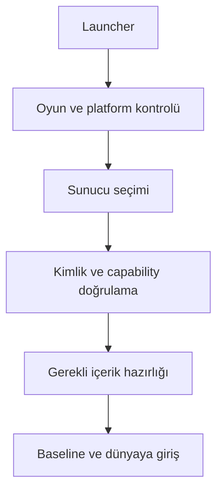

# Launcher, sunucu tarayıcısı ve işletim sözleşmesi

Durum: tasarım; herhangi bir launcher veya endpoint uygulanmamıştır. [Protokol](../networking/protocol.md)

## Oyuncu yolu

Launcher yerel GTA konumunu bulur veya kullanıcı seçiminden alır; engine profilini doğrular; platform sürümünü kontrol eder; seçilen server kimliğini ve gerekli world catalog'u gösterir. Game root'a server dosyalarını dağıtmak yerine platform cache kullanılır.

Hata aşaması belirgindir: oyun bulunamadı, engine profile uyumsuz, native başlatma hatası, kimlik/transport hatası, asset doğrulama, worker açılışı veya baseline. Bağlantı kurulmadan çöken GTA için yalnız sunucu loglarına bakılarak asset arızası sonucu çıkarılmaz.

V0.7 native başlatma alt akışı [SDK sözleşmesindeki](../architecture/native-sdk-integration.md) preflight → mapped-image → bindings → observing/active kapılarıdır. SDK'nin sürüm marker'ı launcher onayı yerine geçmez; seçilen dosya ile başlatılan image ve hook önkoşulları eşleşir. Oyuncuya uyumsuz sürüm veya başlatma hatası sade biçimde gösterilir; engine/dependency/adapter/loader kimlikleri destek log'unda bulunur. Sunucu dosyaları engine profilini veya platform SDK pinini değiştiremez. Installer, ASI loader seçimi ve oyun başlatma yolu D1-N2/N3'te kanıtlanacak; mevcut durumda çalışan launcher yoktur.

## Server browser

Favoriler ve doğrudan bağlantı merkezi liste hizmeti olmadan çalışmalıdır. İsteğe bağlı directory sağlayıcısı public endpoint metadata'sı sunar. Sunucu ilanı; kimlik, protocol/build, oyun profili, katalog boyutu tahmini, oyuncu sayısı ve capability bilgisi taşır.

Directory'nin oyuncu sayısı veya isim beyanı gameplay doğruluk kanıtı değildir. Liste sorguları oran sınırlı ve amplification'a dayanıklı olmalı; private yönetim bilgisi public response'a girmez. Bağlanmadan önce endpoint kimliği ayrıca doğrulanır.

## Yönetim arayüzü taslağı

REST okuma ve komut API'si, WebSocket olay akışı planlanır. UI bu API'nin istemcisidir; core'un belleğine doğrudan yazmaz.

| Örnek yüzey | Anlam |
|---|---|
| GET /v1/health | Readiness, world/DB durumları; hassas veri olmadan |
| GET /v1/worlds | Yetkili operatörün world/capacity görünümü |
| GET /v1/resources | Version, grants, health ve bütçe |
| POST /v1/resources/{id}/reload | RequestId korelasyonu, OperationId ve hedef release ile lifecycle komutu |
| POST /v1/worlds/{id}/releases | Hazırlanmış katalog aktivasyon isteği |
| POST /v1/sessions/{id}/disconnect | Kimlikli moderation komutu |
| GET /v1/operations/{id} | Pending/accepted/rejected sonucu |
| WS /v1/events | Cursor ile yetki filtreli operasyon akışı |

Bunlar public contract taslaklarıdır; çalışan URL değildir. TLS, role permission, resource/world scope, RequestId ve audit zorunludur. İnternet'e açık arbitrary shell/RCON eşdeğeri komut yürütme varsayılan değildir. Tarayıcı oturumunda kullanılan auth mekanizmasına uygun CSRF/origin denetimi gerekir.

Durable yönetim komutlarında OperationId gerekir; `/operations/{id}` domain/actor yetkisi altında bu kalıcı kimliği sorgular. HTTPS directory/bootstrap doğrulaması oyun UDP kanalını doğrulamaz: GNS peer identity bağı R-11a geçmeden üretim Join açılmaz. [Ağ güveni kararı](../decisions/network-transport.md)

## Operasyon sırası

Başlatma: config doğrula → identity yükle → artifact/catalog doğrula → persistence restore → resource prepare → health ready → oyuncu kabulü.

Bakım: yeni join'i durdur → gerekli world transaction'larını drain et → checkpoint/snapshot → resource stop → core kapanışı. Native/gameplay güncellemesi için restart gereksinimi release metadata'sında görünür.

Health liveness ile readiness'i ayırır. Process yaşıyor ama world restore başarısızsa ready değildir. Yönetim panelindeki “çalışıyor” etiketi oyuna katılabildiğinin kanıtı sayılmaz.

## Platform güncellemesi ve destek paketi

Launcher update manifesti platform yayın anahtarıyla doğrulanır. İndirme tamamlanmadan mevcut çalışan dosyalar değiştirilmez; versioned install ve geri dönüş kaydı kullanılır. Platform native güncellemesi resource hot reload'uyla karıştırılmaz.

Diagnostic paketinde build fingerprint, engine profile, son lifecycle aşaması, resource/catalog revision ve redacted crash bilgisi bulunur. Token, parola ve ham voice varsayılan olarak kaydedilmez. Otomatik dışarı log yükleme varsayılmaz; yerel paket üretimi ve kullanıcının paylaşması ayrıdır.

Kabul: AC-06 katılım hata türleri, AC-15 bağlantı öncesi crash, AC-18 restore, AC-22 admin yetkilendirme.

## Release ve destek profili

Launcher'ın production uygunluğu [ConformanceProfile](../validation/conformance-contracts.md) ve gerekli engine/contract/gameplay digest'leriyle değerlendirilir. Platform update'i için [TUF uyumlu metadata şartı](studio-release.md), R-16 doğrulamasına bağlıdır. Server asset/content anahtarı native platform update yetkisi vermez; update kaynağı güveni, GNS peer identity ve worker sandbox ayrı kontrollerdir. Uygulama henüz yoktur.

## Population ve tür yönetim operasyonları

Kavramsal API uzantıları: GET /v1/worlds/{id}/population, POST /v1/worlds/{id}/population-policy, POST /v1/worlds/{id}/population-retire ve GET /v1/worlds/{id}/animal-definitions. POST; actor/world permission, expected policy/target revision, OperationId, bounded patch ve audit taşır. Bunlar çalışan endpoint değildir. Zorla retire ayrı yetki/önkoşullara tabidir; policy off protected hedefleri silemez.

Response policy kabulü ile drain ilerlemesini ayırır; protected/blocked nedeni ve etkilenmiş sınıflar görünür. Tür ekleme catalog/release hattından geçer, endpoint keyfî model URL'si yüklemez. Launcher gereken creature/flight capability ve asset hazırlığını denetler; ilan edilen hayvan desteği R-19 kanıtı değildir. [Population işlemleri](../gameplay/population-traffic.md), AC-46/48/56/63/65.

## Health, belirsiz işlem ve kurtarma görünümü

Health API world/resource/client-scope ayrımında `healthy/degraded/draining/fenced/recovering/failed`, neden kodu, affected scope ve son ilerleme zamanını sunar. Kullanıcı akışı “Hazırlanıyor”, “İşlem sonucu doğrulanıyor” veya açıklamalı katılım hatası gösterir; iç WriterTerm/DB ayrıntısı normal oyuncu ekranına taşınmaz. Retry düğmesi aynı işlem kimliğini korur; durable pending sonucu başarısız gibi tekrar satın alma/sahiplenme başlatmaz.

Bakım/kapanış [bounded drain ve writer release](../architecture/failure-recovery.md) sırasına uyar. V1 otomatik server takeover yoktur; admin önce eski writer'ın kesin duruşunu doğrular. Transfer/kota/backup çözümü audit edilmiş operation ile yapılır; manuel SQL veya gizli entity silme kurtarma yolu sayılmaz. Yedek manifest exact artifact/schema closure ve failure türüne göre RPO/RTO kaydeder. AC-74/75/80/85/86.

## Kod 0.1.5 başlangıç teşhis aracı

[engine startup](../development/d1-native-startup.md), geliştirme ortamında üst seviye DLL/ASI hash/import/TLS ve yerel aday grafiğini üretir. Çalışan launcher değildir; engine/dependency eşleşmesi olsa bile canAdvanceToLoader=false kalır. Oyuncunun mod dosyaları taşınmaz/silinmez. Windows yükleme kuralları ve dinamik mod taraması ayrıca doğrulanmadan envanter temiz başlatma profili sayılmaz. CLI hata ve çıktı kapsamı rapordadır.

## Kod 0.1.6 geliştirme loader deneyi

[Saex engine loader probe](../development/d1-loader-observation.md) production launcher değildir. Açık --observe-loader komutu exact GTA preflight sonrasında kendi child'ını yaratır; üç tutulan x86 OS dosyası dışında mapping ilerlemesi reddedilir. İlk exception/bütçe/olay hatasında owned child sonlandırılır ve exit doğrulanır. Server veya indirilen resource allowlist veremez; kullanıcı modları silinmez. Gerçek apphelp.dll mapping'i için beklenen ret raporlandı; sade sonuç, initialization ortamının henüz onaylanmadığıdır. Statik engine startup komutu process yaratmadan kullanılmaya devam eder.

## Kod 0.1.7 reviewed loader ve launch context

[Ayrı reviewed flag](../development/d1-loader-policy.md) source profile'a gömülü engine ve 22 DLL hash'ini child öncesi doğrular. Bir DLL güncellendi veya eksikse failedPolicyModule ve typed ret döner; otomatik repair/download/allowlist yoktur. Eski üç pinli flag aynı kalır. Production launcher, desteklenen executable basename/root düzeni, CWD/environment, native mod/compatibility kümesi ve dependency profile'ı birlikte tanımlamak zorundadır.

Bu zorunluluğun gözlemi: orijinal GTA AcLayers'ta ret aldı; aynı hash'li, ayrı ad/dizin ve iki DLL'li kopya breakpoint adayına ulaştı. Birden fazla değişken farklı olduğu için sebep yalnız dosya adına bağlanmaz. Bu yerel kopya tam asset ağacını içermez, normal gameplay launcher deneyi değildir ve dağıtılmaz. Initialization/SAEX DLL girişi ayrıca kanıtlanır.

## V0.15 — Geliştirme observer bağlamı

[Yerel --observe-context-loader](../development/d1-launch-context.md) absolute cwd ve bir defa alınmış parent environment görüntüsünü açık kullanır. Değerleri veya registry/compatibility ayarını değiştirmez, key/value loglamaz; digest/count ve cwd kaydeder. Bu komut production launcher/server API'si değildir. Eski iki loader komutunun inheritance davranışı korunur. Dosya ağacı, registry ve Windows shim ortamı bu görüntüyle dondurulmuş sayılmaz.

0.1.8 explicit context gözleminde beklenmeyen OS debug olayının tanısı için loader çıktısına lastEventCode/lastEventThreadId eklendi. Son alınan olay metadata'sıdır; initialization kanıtı veya olayın devamına izin değildir. Child öncesi retlerde ikisi de sıfırdır. Unknown event terminal ret davranışı ve incelenmiş DLL policy değişmedi.

## V0.16 — Loader yaşam kayıtları

[0.1.9](../development/d1-loader-lifecycle.md) mevcut üç yerel CLI'da known-active UNLOAD'a koşullu devam ekler. modules/admitted tarihsel değerlerdir; mappingId/unloadEventIndex/activeAtObservationEnd ve toplam activeModuleCount/unloadCount ayrı raporlanır. lastEventAddress tanıdır. İlk exception'da kill-before-continue korunur; bu durum production launcher/native hot unload değildir.

## V0.18 — Açık entry-boundary deneyi

Yeni `--observe-entry-boundary <gta_sa.exe> <absolute-working-directory>` [dar initialization kapsamını](../development/d1-entry-boundary.md) açık seçer. Exact engine ve mevcut pinler child öncesi, main-thread entry byte/register koşulları ilk debugger olaylarında doğrulanır. DLL/TLS kodu çalışabilir; bu statik inspect veya sandbox değildir. Değişmiş giriş byte'larıyla da exit 3 tanısal sonuç olabilir; oyun/SAEX bootstrap/ABI başarısı sayılamaz. Legacy CLI'lar initialization'ı ilerletmez. Original dosya/registry/mod temizliği, download/rename veya stage deploy bu komuta eklenmez; son child stop zorunludur.

## Kod 0.1.11 — Entry supplement bağı

executionPolicySourceDigest ayrı entry JSON’u; policySourceDigest eski mapping kaynağıdır. Entry CLI bütün 23 pini child öncesi hazırlar; yeni DLL için otomatik onay/repair yoktur. Legacy 22/3 setleri aynı kalır. [Ayrıntı](../development/d1-entry-boundary.md).

## GitHub kaynak yayını — taşınabilirlik düzeltmesi

Own launch-context fixture artık cwd için raw yol metni yerine Windows volume/file ID eşitliğini sınar; kısa/uzun ad farklılığı yanlış ret üretmemelidir. Farklı mevcut klasör ve yanlış environment token negatifleri korunur. Production CLI, directory handle pin ve explicit snapshot davranışı değişmez; launcher uygulanmış sayılmaz.
