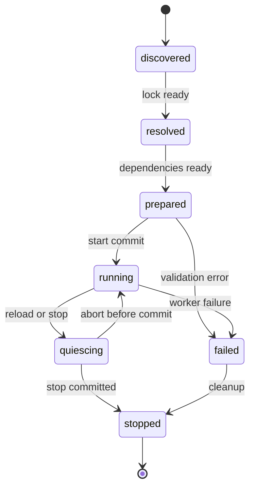

# Resource yaşam döngüsü ve güvenli canlı güncelleme

Durum: sözleşme taslağı. [Manifest](manifest.md) · [Asset sürümleri](../assets/versioning-overrides.md)

## Yaşam döngüsü

Prepare hiçbir görünür gameplay yan etkisi üretmez; başlangıçta gereken entity/abonelikler staged bildirim olarak toplanır. Prepare callback'i hata verirse staging temizlenir. Commit sonrası activation callback hatası running worker arızasıdır; durable dünya işlemlerini otomatik geri almaz. Grant, epoch ve lease'ler supervisor tarafından izlenir.

## Kaynak sahipliği

Core/broker; timer, subscription, asset lease, UI scene, voice route ve entity ownership'i oluşturduğu anda resource epoch'una kaydeder. Cleanup, worker'ın kendi bildirimini başarıyla göndermesine bağlı değildir. Worker içi transient işler process kill ile sonlanır. Stop önce grant/epoch'u revoke eder, sonra iptal/drain/retire uygular. Core'a kabul edilmiş durable işlem worker lifetime'ından bağımsızdır; committed receipt atılmaz, belirsiz sonuç fence/reconcile yoluna gider. Migration snapshot'ı bu sonuçlar uygulanmadan alınmaz. [Kurtarma sözleşmesi](../architecture/failure-recovery.md), AC-73/74. Native handle'lar script'e verilmez.

MTA'nın resource element grubu ve ertelenmiş restart akışı referans alındı; SAEX bunu broker-owned registry ve process arızasına dayanıklı retirement ile tamamlar. Callback sırasında silme önce `retiring` durumunu kurar; gerçek native free frame/tick sonunda olur. [Kaynak incelemesi](../references/mtasa-architecture.md)

Entity ömürleri: resource-owned olanlar stop politikasına göre kaldırılır; session-owned olanlar session süresine bağlıdır; persistent-world olanlar world service'e devredilir. Kalıcı entity'nin sahibi kayboldu diye kayıt silinmez.

## Hot reload işlemi

1. TransitionId, etkilenen dependency grubu, katılımcılar, kesin asset lock seti ve grant planı oluşturulur.
2. Client ve server yeni worker'ları ayrı epoch ile prepare eder; gereken UI/asset/native closure staging'de ve bütçe rezerviyle hazırlanır. Yan etki commit edilemez.
3. Etkilenen resource/entity grubu quiesce olur; eski owner lease'leri durur, yeni mutasyonlar bounded kuyrukta bekler.
4. İşler drain edilir; son schema'lı state snapshot alınır ve migration doğrulanır. Native pointer taşınmaz. Prepare sırasında değişmiş state yeniden doğrulanır.
5. Server collider dahil tüm zorunlu bağımlılıklar ve ilgili client'lar TransitionId/catalog/epoch ile Ready bariyerini tamamlar. Timeout'ta abort veya hazır olmayan katılımcının server tarafında fence edilmesi gerekir.
6. Gerekli durable migration commit edilir; core güvenli tick'te routing/grant/epoch/state adoption değişimini yayımlar.
7. Client bounded apply sonrası Applied ACK verir; ACK'ı olmayan client gameplay'e açılmaz. Yeni resource event'leri ilgili entity state'i kurulmadan teslim edilmez.
8. Eski worker ve lease'ler referans/fence tamamlanınca retirement ile kapanır.

Bu sıralamanın ortak tanımı [aktivasyon sözleşmesidir](../architecture/activation-contracts.md). Client Ready **commit öncesi**, Applied ACK **commit sonrası** aşamadır. Dağıtık makinelerin eşzamanlı tek fizik adımı yaptığı varsayılmaz.

İlk drain timeout hedefi 5 saniye monoton ControlTime'dır; timeout kesinleşmiş işlemi geri almaz. Eski artifact için en az son iki başarılı release başlangıç retention tabanıdır. Aktif/persistent/backup/operation closure kökleri daha eski içeriği tutmayı zorunlu kılabilir; salt yaş/sürüm sayısıyla silinmez. [Kurtarma sözleşmesi](../architecture/failure-recovery.md) restart circuit, global worker bütçesi ve shutdown sırasını da tanımlar. AC-82/85/86.

## Geri alma sınırı

Commit öncesi hata: yeni worker durdurulur, eski resource devam eder, bekleyen komutlar eski epoch'a göre yeniden değerlendirilir.

Commit sonrası hata: yeni resource'un üretmiş olduğu durable işlemler sihirli biçimde silinmez. Ters migration ve uyumlu state adoption varsa kontrollü eski sürüme geçilir. Yoksa resource durdurulur, world durumu korunur ve operatöre forward-fix gereksinimi bildirilir. “Atomic reload”, dış sistemlerdeki bütün yan etkilerin otomatik geri alınacağı anlamına gelmez.

## Yeniden başlatma gerektiren değişiklikler

Engine adapter/ABI, runtime major, uyumsuz collision/physics catalog veya taşınamayan component schema değişiklikleri affected world restart/reconnect sınıfındadır. UI rengi gibi cosmetic değişiklikler daha hafif yoldan uygulanabilir. Dependency grubunun yalnız yarısını yeni sürüme geçirmek kabul edilmez.

.NET assembly unload kooperatiftir; yaşayan referanslar unload'ı engelleyebilir. Bu yüzden hot reload'un son temizlik güvencesi worker sürecinin geri dönüştürülmesidir. [Microsoft unloadability](https://learn.microsoft.com/en-us/dotnet/standard/assembly/unloadability)

## Kabul

AC-08; start/migration/drain/commit sonrası hata enjeksiyonu, sahipsiz timer/abonelik kontrolü, eski epoch komutlarının reddi. AC-07; yeni client sürümü hazır değilken world katalog geçişinin engellenmesi. Kesintisiz güncelleme bütün native değişiklikler için vaat edilmez.

## Population ve AI provider yaşam döngüsü

Resource stop, PopulationPolicy kanalını kapatmakla aynı değildir. Kanal off olurken provider korunmuş sürücü/hayvan görevlerini yönetmeye devam edebilir. Provider stop/reload ise pending spawn rezervlerini, task/path/perception işlerini, group üyelik callback'lerini ve asset/animation lease'lerini core registry üzerinden ele alır. Native GTA trafiği geri açılmaz.

Eski TaskInstanceId/resource epoch sonuçları ret olur. Korunan/persistent hayvan ve kullanılan araç sağlıklı uyumlu provider'a kontrollü devredilir veya ilan edilmiş güvenli sınırlı duruma geçer. Sırf worker öldü diye kaydı silinmez; bu koruma resource Lifetime politikasına gerektiğinde yetkili state adoption ile bağlanır. Yeni behavior graph/rig geçişi son state'i yeniden doğrular; incompatible controller/skeleton major restart'tır. [Agent arızası](../gameplay/agents-navigation.md), AC-48/51/62/63.
