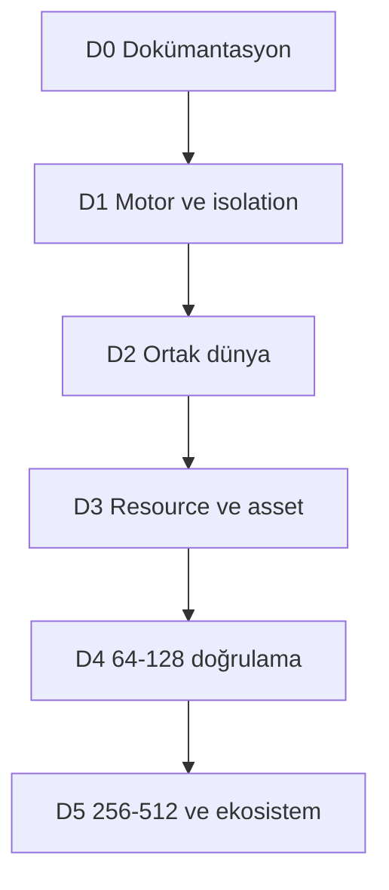

# Geliştirme yol haritası ve ilerleme kapıları

Durum: D0 v0.5 tarihsel belge teslimatı tamamlandı; kullanıcı onayıyla D1 foundation kodlaması başladı. D1 kapısı henüz kapanmadı. [Güncel kod/kanıt durumu](development/status.md) · [Kabul senaryoları](validation/scenarios.md)

[GitHub yayın kurgusu](development/github-publication-plan.md), **SAEX — San Andreas Extended** markasıyla ilk public kaynak aktarımını planlar: organizasyon vitrini ve mevcut monorepo, ardından bağımsızlaşan ürün depoları. Kaynakların GitHub'da yayımlanması D1/D2 veya oynanabilir release kapısı değildir; aşağıdaki teknik sıra korunur. Kullanıcı uygulamayı onayladı; [yayın uygulaması](development/github-publication.md) sürüyor. Kaynak yayın kapıları teknik D1/D2 sırasını değiştirmez.

V0.7, [Plugin-SDK entegrasyon kararını](architecture/native-sdk-integration.md) ve [D1-N1–N7 uygulama planını](development/d1-engine-integration.md) ekler. V0.8'de [D1-N1 kaynak/patch/recipe kilidi ve x86 probe](development/d1-native-dependency.md) uygulandı; gerçek adapter/Host henüz yoktur. V0.9'da [N2 preflight alt kümesi](development/d1-engine-preflight.md) eklendi: dosya ve çalıştırılmayan image gözlemi vardır; V0.10'da [SDK bağımsız x86 bootstrap DLL](development/d1-bootstrap-module.md) oyun dışı host'ta sınandı. V0.11'de [ilk create-debug process görüntüsü](development/d1-suspended-process.md) doğrulandı; unpack/symbol/ABI ve gerçek DLL load sırası kapısı açıktır. N3 henüz açılmadı. Aşama bağımlılıkları korunur.

## D0 — Dokümantasyon temeli

Çıktı: Türkçe mimari, asset/resource sözleşmeleri, diyagramlar, kaynak/karar/araştırma kayıtları, kapsam eşlemesi ve kabul senaryoları. Kaynak kod veya executable yok.

Kapı: dosya/link/JSON/Mermaid doğrulaması; otorite, kalıcılık, asset readiness ve hot reload belgelerinin birbirini tutması; her kullanıcı fikrinin bir kapsam kaydı olması. [İnceleme raporu](validation/documentation-review.md) bu kapının kanıtıdır.

## D1 — Motor ve süreç uygulanabilirliği

Önkoşul: D0. R-01/02/03/04/11 başlangıç denemeleri. Gerçek GTA profili, x86 adapter/x64 host, kısıtlı C# IPC ve bounded asset load/unload doğrulanır. Transport kimliği ve decoder temel testleri yapılır.

Çıktı hedefi: minimal yerel harness ve engine conformance raporu. İlk [D1 foundation](development/d1-foundation.md) kesitinde core lease/clock/inbox, metadata plan validator, kimlik generator'ı ve iki süreçli fixture kodlandı. Oyun executable'ı incelendi; gerçek adapter/Host/sandbox/GNS entegrasyonu henüz yapılmadı.

Native uygulama sırası: **N1 kaynak/build lock → N2 executable ve bootstrap → N3 hook/frame gözlemi ve temiz stop → N4 Host/IPC/watchdog → N5 entity lifecycle → N6 asset lease → N7 kanıt/upgrade incelemesi**. R-01a/b/c, R-02a/b/c, R-04a ve AC-89–96 bu sıranın ölçülebilir alt kapılarıdır. Dinamik native DLL unload ayrı capability'dir; temel D1 temiz session/process stop ister. Oyun dosyaları değiştirilmez ve SDK'nin event remove çağrısı tek başına hook unload kanıtı sayılmaz.

V0.3 temel alt kümesi: R-13 için bir world/tekil provider/schema/asset closure çözümleme ve küçük C++/C# binding fixture'ı; R-14 için ingress/snapshot/command/commit/retire sırası. Geniş authoring editörü veya genel action kütüphanesi D1 önkoşulu değildir.

Kapı: tanınmayan oyun sürümü güvenli ret, temiz başlat/kapat, grant revoke, basit asset lease; main thread/IPC bütçesi. GNS seçimi sabittir; R-11a peer identity bağı üretim katılımından önce, R-11b/c temel platform/codec testleri D2 entegrasyonundan önce gerekir. Bu sonuçlar yokken 128 oyuncu geliştirmesine geçilmez.

V0.5 temel kapısı: R-21 clock domain, monoton control deadline, tick stall/suspend/resume ve checked sayaç fixture'ı; AC-71/72/86'nın adapter/clock alt kümesi. Her controller için özel fallback kendi ürün kolunda doğrulanır. Genel watchdog kanıtı bütün uçuş/hayvan kabiliyetlerini otomatik açmaz.

## D2 — İki istemci ve ortak yıkım

Önkoşul: D1 + R-06/12; R-05 özel sahne kapsamı. İki aktif oyuncu ve üçüncü late join ile Harbor Sandbox. Entity kimliği, authority, snapshot/catch-up, server collision ve durable yıkım birlikte çalışır.

Kapı: AC-01–06, AC-12/13/16/17/18, AC-25/26/27/31/32; beş prefabın desteklenen alt kümesi ayrı raporlanır. Başlangıç özel sahneyle olabilir; stok harita yıkımı ancak R-05 geçerse etiketi genişler. WorldRevision/disk journal ayrımı ve reconnect OperationId bu kesitte kanıtlanır.

V0.3 kapısı: AC-34/35/36/37/45'in kullanılan temel schema/scheduler alt kümesi, tek yıkım ChangeSet'inin kritik state ve stale projection denemesi. R-13/14 temel kanıtı olmadan “üst sistem sonra doğrular” gerekçesiyle authority atlanmaz.

V0.5 kapısı: R-21 guarded world writer, R-22 admitted operation/CommitReceipt/OutcomeUnknown, R-23 temel baseline cut/delta/motion. AC-73/74/75/78/79 ve shutdown'ın durable alt kümesi iki client kesitine dahildir. Aynı core/backend transferi bu temel yıkım örneğinin önkoşulu değildir; kullanıldığı feature kapısına bağlanır.

## D3 — Resource ve asset dikey kesiti

Önkoşul: D2, R-03 tam client sandbox kabulü, R-04 dağıtım/cook. İki taraf C# SDK, resource resolver, HTTPS artifact cache, lifecycle, izinler ve editör/inspector temeli tamamlanır.

Kapı: AC-07/08/09/11/14/19/22, AC-28/29/30/33. Resource/event readiness, lease registry, hysteresis ve toplam worker bütçesi de dikey kesite dahildir. Yarım update ve bozuk paket normal hata akışlarıdır. Renderer/voice başlangıcı R-09'a bağlıdır; başarısızlık gameplay core'un kanıtını gizlemez.

V0.3 kapsamı: R-13 prefab provenance ve schema araçları; R-15 için isteğe bağlı onarım/yakıt aksiyonları ve desteklenen nav/audio projection örnekleri; R-16 headless RehearsalWorld, metadata ve conformance kayıtları. AC-38–44 ilgili özellik için gereklidir. Native/nav/audio örnekleri R-06/09/10 yetenekleri açıldıkça test edilir; unsupported olanlar başarı sayılmaz. Otomatik updater/release yalnız R-16 geçtiğinde açılır.

V0.5 kapsamı: R-22 reload/restart/admission/backup; R-23 slow join ve logical/native repair. AC-73/80/81/82/83/85/86 gereklidir. RecoveryProfile eksik veya ölçülmemişken platform kararlı kabul edilmez. Operasyonel RPO/RTO gerçek backend/backup failure profiliyle raporlanır.

## D3 sonrası paralel ürün kolları: nüfus ve hayvan temeli

Buradaki paralellik gelecekteki ürün kollarının bağımsızlığını anlatır. Kodlama D1 foundation aşamasındadır; bu geniş oyun kolları henüz uygulanmadı. Temel Harbor D2 yıkım kanıtı bu paketleri beklemez. Her world yalnız kullandığı kabiliyetlerin kapısını geçer.

| Kol | Önkoşul ve ilk çıktı | Geçiş şartı |
|---|---|---|
| Ground population | D3 + R-02/05/08/10/11/14/17; iki client/late join, yaya ve sürücülü trafik, sinyal/slot/policy | AC-46–54/63/68 kullanılan ground alt kümesi; protected drain, owner devri, çift üretim yok |
| Ground animals | D3 + R-04/07/10/12/14/19; bir test edilmiş quadruped rig, iki cins/görünüm ve farklı beden fixture'ı | AC-56–65/67/68 temel alt kümesi; model/animasyon/hit/locomotion/sync birlikte kanıt |
| Sahipli hayvan | Ground animals + ownership/persistence ve R-20 restore; transfer açılacaksa R-22 transfer alt kümesi | AC-58/59/61/63; transfer için AC-66/76/77/87; aynı core/backend tekil birey |
| Air traffic | Agent/vehicle temeli + R-18 | Önce seyir sonra kalkış/iniş; AC-51/52/55 her controller/görev için ayrı; owner-loss fallback zorunlu |

## D4 — 64–128 oyunculuk doğrulama

Önkoşul: D3; ihtiyaç duyulan R-07/08/09/10. Belirlenmiş P1 sahnesi, ağ gecikmesi/kaybı, cache-cold/cache-warm ve yoğun bölge senaryoları.

Kapı: [performans hedefleri](validation/performance.md), AC-20 soak ve AC-23/24 reference profilleri. Gerçek client render ölçümü ile headless bağlantı testi ayrı raporlanır. 128 bağlantı başarılı diye aynı noktada 128 yüksek detay ped garanti edilmez.

V0.3 genişlemesi: aynı planı kullanan kontrollü world gruplarında release provası, gerçek client quality equivalence, Explain/inspector akışı ve ilk görsel Studio. R-15/16'nın üretimde kullanılan bütün alt özellikleri kanıt gerektirir; tool overhead kapasite ölçümünden saklanmaz.

V0.4 kapısı: yayın profilinde seçilmiş kanallar ve türler [living yük karışımı](validation/performance.md) ile AC-70'i geçer. Yaya/sürücü/pilot/hayvan ayrı maliyetle raporlanır; yeni cins, provider crash, policy toggle ve species update testleri soak'a girer. Kanıtlanmamış hava/creature alt sınıfı kapsam dışında açık gösterilir; boş veya yalnız bot sunucusu bu kapıyı karşılamaz.

V0.5 kapısı: AC-88 için [F0–F5 arıza profilleri](validation/performance.md), ilgili AC-71–87 invariant'ları, recovery süreleri ve unavailable scope maliyeti raporlanır. R-21–23'ün yayın profilinde kullanılan tüm alt özellikleri kanıt ister. Sayısal tavanı aşmak veya hatalı entity'yi sessizce silmek performans başarısı değildir.

## D5 — 256–512 ve platform ekosistemi

Önkoşul: D4. Interest, CPU/GC/IPC, asset budgets ve local yoğunluk için optimizasyon; operasyon araçları, SDK referansı ve migration rehberleri olgunlaştırılır.

Kapı: P2 workload ve aynı kabul senaryolarının tekrarı; yalnız değişiklikten etkilenen benchmark'lar genişletilir. Dağıtık tek-world simülasyon, yeni dil, Android, yeni renderer veya gerçek zamanlı fracture ancak yeni ADR ile ayrı çalışma olur.

Hayvan genişleme kolu: farklı rig aileleri, flying/aquatic creature, binme/yük/constraint ve gelişmiş ecology/üreme ancak R-19/20 alt kanıtlarıyla eklenir. AC-57/60/66/67/69/70; offline ilerleme varsayılan kapalıdır. Bunlar temel ground hayvan desteğinin örtülü vaadi veya D5'e gelince otomatik açılan özellikler değildir.

## Bağımlılık özeti

## Öncelik, tahmin ve sorumluluk

Sıralama feature sayısına göre değil bilinmeyen riske göre yapılır: engine/sandbox/collision önce; sonra state tutarlılığı; sonra içerik ve geliştirici deneyimi; en son kapasite ve geniş kit kataloğu. Native, networking, runtime security, asset toolchain ve gameplay uzmanlıkları ayrı sorumluluk alanlarıdır; bu belgede mevcut ekip varmış gibi kişi ataması yapılmaz.

Takvim veya bütçe için ekip kapasitesi ve D1/R sonuçları gerekir. Burada ay/hafta tahmini uydurulmaz. Her kapı çalışma miktarı ve risk kaydıyla tahminlenebilir; başarısız kapı geçilmiş sayılmaz.

## Kod 0.1.4 — N2 süreç gözlem adımı

[Askıda process observer](development/d1-suspended-process.md), dosya ile gerçek owned process image kimliğini ilk create-debug olayında karşılaştırır ve oyun kodu yürütülmeden çıkışı doğrular. N2'nin sıradaki adımı unpack/başlatma fazı, kullanılan symbol/ABI ve gerçek başlangıç DLL yükleme sırasıdır; bu alt gözlem N3 frame/hook veya D2 multiplayer kapısını açmaz.

## Kod 0.1.5 — Başlatma ortamının envanteri

[Statik native başlangıç aracı](development/d1-native-startup.md), N2'nin exe dışındaki DLL/ASI/import/TLS girdilerini görünür kılar. Sonraki runtime deneyi bu çevreyi hesaba katan kontrollü kurulum/başlatma politikası ve gerçek loaded-module kimlikleriyle ilerler. Modlu kullanıcı kurulumunu otomatik temizlemek veya yalnız exe profiliyle N3 açmak yoktur. N2 unpack/ABI/DLL load ve D1'in bağımsız GNS/sandbox/asset kapıları açık kalır.

## V0.13 — N2 loader ilerlemesi

[V0.12 statik envanter](development/d1-native-startup.md) sonrasında [kod 0.1.6 bounded loader gözlemi](development/d1-loader-observation.md) eklendi. Kendi fixture'ında DLL/TLS/main başlamadan durma ve gerçek GTA'da unpinned apphelp mapping ret/exit alt sonuçları vardır. N2'nin gerçek load sırası artık kısmi mapping evidence içerir; tam initialization, SAEX bootstrap yükleme ve unpack/ABI henüz yoktur. Compatibility başlangıç ortamı incelenmeden N3 hook deneyi açılmaz. D1 ve sonraki ürün kollarının kapıları korunur.

## V0.14 — N2 incelenmiş mapping recipe

[Kod 0.1.7](development/d1-loader-policy.md), hash/origin/bütçe uyumunu child öncesi tamamlayan source policy ve generator ekler. Original-context AcLayers reddi ve bit eşitliğinde private-context Debug 22/Release 21 DLL/breakpoint adayı ayrı kanıtlardır. Sıradaki N2 adımı kontrollü launch context/dynamic proxy initialization ve gerçek bootstrap/entry-unpack/symbol-ABI'dir. Bu profil N3 lifecycle, production launcher, worker sandbox veya GNS kapısını açmaz; sonraki oyun/AI/hayvan kollarının bağımlılıkları değişmez.

## V0.15 — N2 açık launch context

[Kod 0.1.8](development/d1-launch-context.md) bounded environment snapshot ve explicit cwd'yi observer'a ekler. Sonraki N2 işi dynamic proxy/initializer incelemesi, gerçek bootstrap yükleme ve entry-unpack/symbol/ABI kanıtıdır. Bu kesit 0.1.7'nin mapping policy'sini initialization'a genişletmez; D1 ve D2 kapıları açıktır.

0.1.8 son gerçek gözlem UNLOAD_DLL_DEBUG_EVENT (7) terminal ret verdi. Bu nedenle sıradaki N2 kesit, bounded module unload/remap yaşamını ve adres/kimlik emekliliğini test ederek tanımlamalıdır; ardından proxy initialization/SAEX bootstrap ve ABI çalışması sürer. Aynı context'te başarılı breakpoint adayı görülmesi bu ret yolunu veya N2 kapısını kapatmaz.

## V0.16 — N2 modül yaşamı

[Kod 0.1.9](development/d1-loader-lifecycle.md) bounded known-active unload ve yeni mapping ID'lerini observer'a bağlar. Bu alt davranışın metadata, Windows fixture ve gerçek GTA kanıtları ayrıdır. Sıradaki N2 hedef proxy initialization/SAEX bootstrap ve unpack/symbol/ABI; başka unsupported OS olayı çıkarsa mevcut kapı güvenli ret olarak korunur. N3 ve D1/D2 açık kalır.

0.1.9 son kanıtı: 12 private GTA koşusu breakpoint adayına ulaştı, 11 bilinen unload işlendi; original AcLayers ret korundu. Gerçek same-base remap görülmediğinden bu başlığın kanıtı metadata corpus ile sınırlıdır. Sonraki N2 araştırması proxy/dinamik başlangıç, gerçek bootstrap ve entry-unpack/symbol/ABI'dir. Bu sonuç N3'ü açmaz.

## Kod 0.1.10 — Sıradaki N2 deneyinin girdisi

[Statik sembol karşılaştırması](development/d1-native-linkage.md) uygulanmıştır; iki farklı adayın GTA için gerekli yedi ismi sağlaması gerçek DLL seçimi/ABI sonucu değildir. Yol sırası dynamic proxy/initializer ve ilgili fonksiyon ABI incelemesi, incelenmiş bounded initialization, gerçek SAEX bootstrap/entry-unpack/symbol kanıtı, sonra N3 olarak korunur. Otomatik DLL rename/staging, yeni pin kabulü veya ilk exception'dan ileri yürütme bu kesitte yoktur. Oyuncu/NPC/araç/hayvan ölçek hedefleri hâlâ kendi sonraki kapılarındadır.

## Kod 0.1.11 — N2 initializer sınırının uygulanması

[Kontrollü entry durağı](development/d1-entry-boundary.md) ayrı explicit modda DLL/TLS initialization'ı ilerletir; ana thread PE entry'si tutulur. Bunun kanıtı entry byte mutation ve exit ile sınırlıdır. Sonraki N2 işi proxy yönlendirmesi/dynamic dependency ve unpack aşamasını çözmek, ardından SAEX bootstrap'ı loader lock dışında gerçek process'te doğrulamaktır. N3–N7, sandbox/GNS ve D2 sırası değişmez; kodlanmış/test edilmiş/gerçek GTA sonuçları status'ta ayrı tutulur.

0.1.11 son çıktısı: x86 Debug/Release ve x64 Debug standardı geçti; 12/12 private GTA girişinde aynı DLL RVA'sına yönlendirme ölçüldü. Sıradaki N2 adımı bu entry sonrası proxy/dinamik yükleme ve unpack yolunun incelenmesi, ardından gerçek SAEX bootstrap/ABI çağrısıdır. Mevcut first-exception araçları ve original ret politikası ayrı korunur.

## Public iş takibi

[SAEX geliştirme panosu](https://github.com/orgs/saex-platform/projects/1), D1/D2/D3 milestone'larına bağlı yedi başlangıç işiyle yayımlandı. Planlandı, Çalışılıyor, İncelemede, Doğrulama bekliyor ve Tamamlandı sütunları bu belgedeki kabul kapılarının yerini almaz. İlk kaynak yayını ve beş platform/yapılandırma CI kanıtı [yayın raporundadır](development/github-publication.md); oynanabilir sürüm yayımlanmış sayılmaz.

## Kod 0.1.12 — Proxy dönüş sınırı

[0.1.12 proxy dönüşü](development/d1-proxy-return.md), 0.1.11’de ölçülen yönlendirmenin restorasyon ve IAT değişimini gözlemler. Sonraki N2 adımı GetStartupInfoA yönlendirmesinin gerçek çağrı zamanı/dinamik bağımlılıkları ve unpack aşamasını çözmek, ardından gerçek SAEX bootstrap C ABI’sini loader lock dışında doğrulamaktır. N3 frame/hook, GNS, sandbox ve D2–D5 kapıları değişmez.

0.1.12 son kanıtı: 12/12 private GTA koşusunda proxy dönüşü ve entry restorasyonu ve IAT yönlendirmesi doğrulandı; üç legacy/original regresyon korundu. Dört Windows standart akışı geçti. Sıradaki iş IAT yönlendirmesinin çağrılma zamanı/dinamik yükleme ve unpack, ardından gerçek bootstrap C ABI; bu sıçrama ve SAEX DLL yüklemesi henüz yürütülmedi.

## Kod 0.1.13 — Startup çağrı sınırı

[0.1.13 startup-call](development/d1-startup-call.md) orijinal entry’nin proxy IAT hedefini çağırdığı noktayı ölçer; fonksiyon gövdesi üçüncü durakta yürütülmez. Sıradaki N2 işi dinamik codec/ASI yükleme yolu, unpack kanıtının kapsamı ve loader lock dışında gerçek SAEX bootstrap C ABI çağrısıdır. GNS/sandbox ve N3 frame/pool/collision, sonra D2 ortak dünya kapıları aynı sırada kalır.

0.1.13 son kanıtı: 12/12 private GTA ilk startup-call hit, dört original/legacy regresyon ve dört Windows standart akışı başarılı. Sıradaki N2 işi dinamik codec/ASI yolu ile gerçek SAEX bootstrap C ABI; mevcut wrapper gövdesi ve tam unpack/engine initialization henüz doğrulanmadı.
